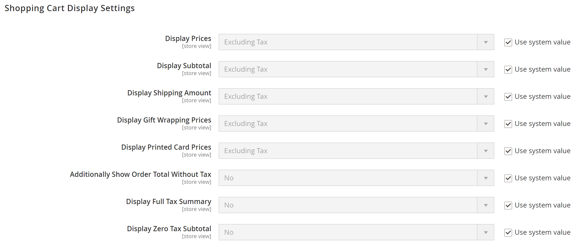

# [!UICONTROL Sales] > [!UICONTROL Tax]

>[!NOTE]
>
>Adobe Commerce和Magento Open Source版本2.4.0到2.4.3包含由Vertex廠商開發的擴充功能，用於整合 [!UICONTROL Vertex Cloud]. 從2.4.4版開始，此擴充功能不再與核心版本搭配，必須從Commerce Marketplace安裝和更新。 此Marketplace也可讓您存取擴充功能開發人員提供的目前檔案。
>  
>如果您已啟用並設定隨附的擴充功能，則必須在2.4.4升級程式中更新composer.json檔案，並管理後續的擴充功能更新。 另請參閱 [升級模組和擴充功能](https://experienceleague.adobe.com/docs/commerce-operations/upgrade-guide/modules/upgrade.html) 在 _升級指南_ 以取得詳細資訊。

{{config}}

## [!UICONTROL Tax Classes]

<!-- zoom -->

如需有關變更這些設定的詳細資訊，請參閱 [稅捐類別](../../stores-purchase/tax-class.md) 在 _商店和購買體驗指南_.

| 欄位 | [範圍](../../getting-started/websites-stores-views.md#scope-settings) | 說明 |
|--- |--- |--- |
| [!UICONTROL Tax Class for Shipping] | 網站 | 識別用於出貨的稅捐類別。 選項包含所有可用的產品稅捐類別： `None` / `Taxable Goods` / `Shipping` / `Tax Exempt` |
| [!UICONTROL Tax Class for Gift Options] | 網站 |  (僅限Adobe Commerce)識別用於贈與選項的預設稅捐類別。 |
| [!UICONTROL Default Tax Class for Product] | 全域 | 識別用於產品的預設稅捐類別。 |
| [!UICONTROL Default Tax Class for Customer] | 全域 | 識別用於客戶的預設稅捐類別。 |

{style="table-layout:auto"}

## [!UICONTROL Calculation Settings]

<!-- zoom -->

| 欄位 | [範圍](../../getting-started/websites-stores-views.md#scope-settings) | 說明 |
|--- |--- |--- |
| [!UICONTROL Tax Calculation Method Based On] | 網站 | 決定用於計算訂單稅捐的方法。 選項： **`Unit Price`**— 稅捐計算是以每個產品的單價為基礎。 **`Row Total`**  — 稅捐計算是以明細行專案總計為基礎。  **`Total`**— 稅捐計算是以訂單總計為基礎。  _**&#x200B;注意：**_如果從「市集」安裝稅捐計算延伸模組，例如 _頂點雲_，擴充功能服務會列為選項。 |
| [!UICONTROL Tax Calculation Based On] | 網站 | 決定稅捐的計算是根據送貨地址、帳單地址或送貨來源。 選項： `Shipping Address` / `Billing Address` / `Shipping Origin` |
| [!UICONTROL Catalog Prices] | 網站 | 決定型錄價格是否包含或排除稅捐。 選項： `Excluding Tax` / `Including Tax` |
| [!UICONTROL Shipping Prices] | 網站 | 決定出貨價格是否包含稅捐。 選項： `Excluding Tax` / `Including Tax` |
| [!UICONTROL Apply Customer Tax] | 網站 | 決定稅捐是在折扣之前或之後套用。 選項： `Before Discount` / `After Discount` |
| [!UICONTROL Apply Discount on Prices] | 網站 | 決定折扣價格是否包含或排除稅捐。 選項： `Excluding Tax` / `Including Tax` |
| [!UICONTROL Apply Tax On] | 網站 | 決定稅捐是套用至原始價格，還是套用至自訂價格（若有的話）。 選項： `Custom price if available` / `Original price only` |
| [!UICONTROL Enable Cross Border Trade] | 網站 | 啟用時，會跨不同稅率的地區套用一致的定價。 選項： `Yes` / `No`   **_注意：_**使用跨境交易會依稅率調整利潤率。 |

{style="table-layout:auto"}

## [!UICONTROL Default Tax Destination Calculation]

<!-- zoom -->

| 欄位 | [範圍](../../getting-started/websites-stores-views.md#scope-settings) | 說明 |
|--- |--- |--- |
| [!UICONTROL Default Country] | 存放區檢視 | 決定稅捐計算所依據的國家/地區。 |
| [!UICONTROL Default State] | 存放區檢視 | 決定稅捐計算所依據的州。 星號(*)可作為萬用字元來表示所選國家/地區內的所有狀態。 |
| [!UICONTROL Default Post Code] | 存放區檢視 | 識別稅捐計算所依據的郵遞區號。 星號(*)可作為萬用字元來表示所選州內的所有郵遞區號。 |

{style="table-layout:auto"}

## [!UICONTROL Price Display Settings]

<!-- zoom -->

如需有關變更這些設定的詳細資訊，請參閱 [設定價格顯示設定](../../stores-purchase/display-settings.md#configure-price-display-settings) 在 _商店和購買體驗指南_.

| 欄位 | [範圍](../../getting-started/websites-stores-views.md#scope-settings) | 說明 |
|--- |--- |--- |
| [!UICONTROL Display Product Prices in Catalog] | 存放區檢視 | 決定目錄中所發佈的產品價格是否包含或排除稅捐，或顯示兩個版本的價格；一個包含稅捐，另一個不含稅捐。 選項： `Excluding Tax` / `Including Tax` / `Including and Excluding Tax`   **_注意：_**如果您將「顯示產品價格」欄位設為 `Including Tax`，只有當有符合稅捐來源的稅捐規則，或是有符合稅捐規則的客戶地址時，才會顯示稅捐。 可觸發比對的事件包括客戶帳戶建立、登入，或在購物車中使用稅務和送貨預估工具。 |
| [!UICONTROL Display Shipping Prices] | 存放區檢視 | 決定出貨價格是否包含或排除稅捐，或顯示兩個版本的出貨價格；一個包含稅捐，另一個不含稅捐。 選項： `Excluding Tax` / `Including Tax` / `Including and Excluding Tax` |

{style="table-layout:auto"}

## [!UICONTROL Shopping Cart Display Settings]

<!-- zoom -->

如需有關變更這些設定的詳細資訊，請參閱 [設定購物車顯示設定](../../stores-purchase/display-settings.md#step-2-configure-shopping-cart-display-settings) 在 _商店和購買體驗指南_.

| 欄位 | [範圍](../../getting-started/websites-stores-views.md#scope-settings) | 說明 |
|--- |--- |--- |
| [!UICONTROL Display Prices] | 存放區檢視 | 決定購物車價格是否包含或排除稅金，或顯示兩個版本的價格；一個包含稅金，另一個不含稅金。 選項： `Excluding Tax` / `Including Tax` / `Including and Excluding Tax` |
| [!UICONTROL Display Subtotal|Store View] | 決定購物車小計是否包含或排除稅捐，或顯示小計的兩個版本；一個包含稅捐，另一個不含稅捐。 選項： `Excluding Tax` / `Including Tax` / `Including and Excluding Tax` |
| [!UICONTROL Display Shipping Amount] | 存放區檢視 | 決定購物車送貨金額是否包含或排除稅金，或顯示兩個版本的送貨金額；一個含稅，另一個不含稅。 選項： `Excluding Tax` / `Including Tax` / `Including and Excluding Tax` |
| [!UICONTROL Additionally Show Order Total Without Tax] | 存放區檢視 | 決定購物車中是否會顯示額外的一行，其中包含不含稅的總金額。 選項： `Yes` / `No` |
| [!UICONTROL Display Full Tax Summary] | 存放區檢視 | 決定購物車是否包含完整的稅捐彙總。 選項： `Yes` / `No` |
| [!UICONTROL Display Zero Tax Subtotal] | 存放區檢視 | 決定稅捐為零時，購物車是否包含稅捐小計。 選項： `Yes` / `No` |

{style="table-layout:auto"}

## [!UICONTROL Orders, Invoices, Credit Memos Display Settings]

<!-- zoom -->

如需有關變更這些設定的詳細資訊，請參閱 [設定訂單、商業發票及銷退折讓單顯示設定](../../stores-purchase/display-settings.md#step-3-configure-order-invoice-and-credit-memo-display-settings) 在 _商店和購買體驗指南_.

| 欄位 | [範圍](../../getting-started/websites-stores-views.md#scope-settings) | 說明 |
|--- |--- |--- |
| [!UICONTROL Display Prices] | 存放區檢視 | 決定銷售檔案上的價格是否包含或排除稅捐，或每個檔案是否顯示兩個版本的價格；一個包含稅捐，另一個不含稅捐。 選項： `Excluding Tax` / `Including Tax` / `Including and Excluding Tax` |
| [!UICONTROL Display Subtotal] | 存放區檢視 | 決定銷售檔案的小計是否包含或排除稅捐，或每個檔案是否顯示兩個小計版本；一個含稅，另一個不含稅捐。 選項： `Excluding Tax` / `Including Tax` / `Including and Excluding Tax` |
| [!UICONTROL Display Shipping Amount] | 存放區檢視 | 決定銷售檔案的出貨金額是否包含或排除稅捐，或每個檔案是否顯示兩個小計版本；一個含稅，另一個不含稅捐。 選項： `Excluding Tax` / `Including Tax` / `Including and Excluding Tax` |
| [!UICONTROL Additionally Show Order Total Without Tax] | 存放區檢視 | 決定是否在銷售檔案上顯示含不含稅總金額的額外明細行。 選項： `Yes` / `No` |
| [!UICONTROL Display Full Tax Summary] | 存放區檢視 | 決定銷售檔案上是否顯示完整的稅捐彙總。 選項： `Yes` / `No` |
| [!UICONTROL Display Zero Tax Subtotal] | 存放區檢視 | 決定銷售檔案小計區段在未扣除稅捐時顯示的。 選項： `Yes` / `No` |
| [!UICONTROL Display Gift Wrapping Prices] | 存放區檢視 |  (僅限Adobe Commerce)決定是否將禮品包裝價格納入小計。 選項： `Excluding Tax` / `Including Tax` / `Including and Excluding Tax` |
| [!UICONTROL Display Printed Card Prices] | 存放區檢視 |  (僅適用於Adobe Commerce)決定小計中是否包含印刷卡價。 選項： `Excluding Tax` / `Including Tax` / `Including and Excluding Tax` |

{style="table-layout:auto"}

## [!UICONTROL Fixed Product Taxes]

<!-- zoom -->

如需有關變更這些設定的詳細資訊，請參閱 [固定產品稅金(FPT)](../../stores-purchase/fixed-product-tax.md) 在 _商店和購買體驗指南_.

| 欄位 | [範圍](../../getting-started/websites-stores-views.md#scope-settings) | 說明 |
|--- |--- |--- |
| [!UICONTROL Enable FPT] | 網站 | 判斷FPT是否可用。 選項： `Yes` / `No` |
| [!UICONTROL Display Prices in Product Lists] | 網站 | 控制產品清單中FPT的顯示。 選項：  **`Including FPT Only`**  — 顯示的價格包含固定產品稅捐。 FPT金額不會單獨顯示。 **`Including FPT and FPT description`**— 顯示的價格包含固定產品稅捐。 FPT金額會個別顯示。 **`Excluding FPT. Including FPT description and final price`**  — 顯示的價格不包含固定產品稅捐。 FPT金額會個別顯示。 **`Excluding FPT`**— 顯示的價格不包含固定產品稅捐。 FPT金額不會單獨顯示。 |
| 在產品檢視頁面上顯示價格 | 網站 | 控制產品頁面上FPT的顯示。 選項：  **`Including FPT Only`**  — 顯示的價格包含固定產品稅捐。 FPT金額不會單獨顯示。 **`Including FPT and FPT description`**— 顯示的價格包含固定產品稅捐。 FPT金額會個別顯示。 **`Excluding FPT. Including FPT description and final price`**  — 顯示的價格不包含固定產品稅捐。 FPT金額會個別顯示。 **`Excluding FPT`**— 顯示的價格不包含固定產品稅捐。 FPT金額不會單獨顯示。 |
| [!UICONTROL Display Prices in Sales Modules] | 網站 | 控制購物車和結帳期間FPT的顯示。 選項：  **`Including FPT Only`**  — 顯示的價格包含固定產品稅捐。 FPT金額不會單獨顯示。 **`Including FPT and FPT description`**— 顯示的價格包含固定產品稅捐。 FPT金額會個別顯示。 **`Excluding FPT. Including FPT description and final price`**  — 顯示的價格不包含固定產品稅捐。 FPT金額會個別顯示。 **`Excluding FPT`**— 顯示的價格不包含固定產品稅捐。 FPT金額不會單獨顯示。 |
| [!UICONTROL Display Prices in Emails] | 網站 | 控制電子郵件中快顯視窗的顯示。 選項：  **`Including FPT Only`**  — 顯示的價格包含固定產品稅捐。 FPT金額不會單獨顯示。 **`Including FPT and FPT description`**— 顯示的價格包含固定產品稅捐。 FPT金額會個別顯示。 **&#x200B;排除FPT。 包含FPT說明與最終價格&#x200B;**— 顯示的價格不包含固定產品稅捐。 FPT金額會個別顯示。 **`Excluding FPT`**  — 顯示的價格不包含固定產品稅捐。 FPT金額不會單獨顯示。 |
| [!UICONTROL Apply Discounts to FPT] | 網站 | 決定折扣是否可套用至折扣金額。 選項： `Yes` / `No` |
| [!UICONTROL FPT Tax Configuration] | 網站 | 決定如何計算FPT稅捐。 選項：  **`Not Taxed`**— 如果您的課稅管轄區不對FPT課稅，請選取此選項。 （例如，加州。） **`Taxed`**  — 如果您的稅捐管轄區對稅捐課稅起始點徵稅，請選取此選項。 （例如，加拿大。）  **`Loaded and Displayed with Tax`**— 如果在套用稅捐之前將FPT加入訂單總計，請按一下此選項。 （例如，歐盟國家。） |
| [!UICONTROL Include FPT in Subtotal] | 網站 | 判斷購物車小計中是否包含FPT。 選項：  **`Yes`**— 在購物車小計中包含FPT。 **`No`** - FPT不包含在小計中，而是放置在購物車中的小計之後。 |

{style="table-layout:auto"}
