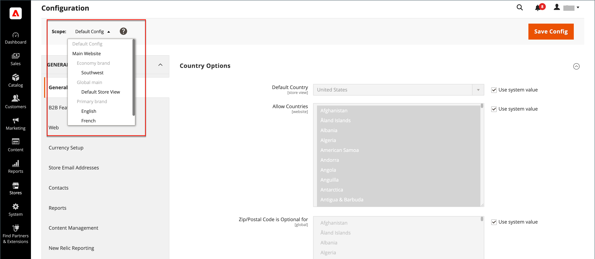

# 設定範圍

許多設定頁面左上角的「商店檢視」選擇器會篩選特定範圍的頁面檢視，並設定Commerce所使用的一些實體的值。 它會依名稱列出階層中的每個層級，並用來將範圍變更為另一個層級。 任何代表目前範圍的設定都會呈現灰色，因此只有代表目前範圍設定的設定才可使用。 範圍最初設定為 _預設設定_. 對於存取許可權受限的管理員使用者，可用的商店檢視清單僅包含該使用者擁有的商店 [許可權](../systems/permissions.md) 以存取。

| 平準 | 說明 |
|--- |--- |
| [!UICONTROL Default Config] | 預設系統組態。 |
| [!UICONTROL Main Website] | 位於階層頂端的網站名稱。 |
| [!UICONTROL Main Website Store] | 與上層網站相關聯的預設商店名稱。 |
| [!UICONTROL Default Store View] | 與上層存放區相關聯的預設存放區檢視名稱。 |
| [!UICONTROL Stores Configuration] | 跳至「商店」格線，與選擇 [!UICONTROL Stores] > [!UICONTROL All Stores] 從管理員側邊欄。 |

{style="table-layout:auto"}

{width="700" zoomable="yes"}

## [!UICONTROL Use system value]

此 _[!UICONTROL Use System Value]_許多組態設定右邊的核取方塊可用來套用或覆寫目前組態範圍內的預設欄位值。 選取核取方塊時，無法變更預設欄位值。 若要變更值，請清除核取方塊並輸入新值。 每當您變更系統值時，系統都會提示您確認。

核取方塊標籤會根據目前範圍而變更，且一律會參照在範圍階層中往上一步的父項層級。 由於父層級是該層級以下所有專案的容器，因此會繼承父層級的範圍設定，除非將其覆寫。

## 預設值選項

| 核取方塊 | 說明 |
|--- |--- |
| [!UICONTROL Use system value] | 當設定範圍設定為時，會出現此核取方塊 `Default Config`. |
| [!UICONTROL Use Default] | 當設定範圍設定為[主要]時，就會出現此核取方塊 `Website`，且是指指派給網站的預設商店。 |
| [!UICONTROL Use Website] | 當設定範圍設定為特定存放區檢視時，此核取方塊就會顯示。 選取後，系統會使用與商店檢視相關聯的父網站設定。 在此情況下，系統會略過商店層級，因為系統理解此層級會套用至與網站相關聯的預設商店。 |

{style="table-layout:auto"}

## 設定範圍

進行僅套用至特定網站、商店或商店檢視的組態設定前，請先執行下列動作：

1. 在 _管理員_ 側邊欄，執行下列任一項作業：

   - 如需大部分的組態設定，請前往 **[!UICONTROL Stores]** > _[!UICONTROL Settings]_>**[!UICONTROL Configuration]**.

   - 的 [設計相關設定](../content-design/configuration.md)，前往 **[!UICONTROL Content]** > _[!UICONTROL Design]_>**[!UICONTROL Configuration]**. 然後在格線中，選擇適用的存放區檢視。

1. 瀏覽至要變更的組態設定，然後執行下列動作：

   - 在左上角，設定 **[!UICONTROL Store View]** 至套用組態的特定檢視。 提示確認範圍切換時，按一下 **[!UICONTROL OK]**.

     每個欄位後面都會顯示核取方塊，其他欄位可能會變得可用。

   - 清除 **[!UICONTROL Use system value]** 核取方塊，位於您要編輯的任何欄位之後。 然後，更新檢視的值。

   - 對頁面上需要更新的每個欄位重複此程式。

   {width="700" zoomable="yes"}

1. 完成後，按一下 **[!UICONTROL Save Config]**.

## 範圍快速參考

| 範圍 | 說明 |
|--- |--- |
| **[!UICONTROL Global]** |  |
| 管理員 | 安裝中的所有網站、商店和商店檢視都是從相同的管理員進行管理。 |
| 預設設定 | 全域 [預設設定](../getting-started/websites-stores-views.md#scope-settings) 設定會透過商店階層使用，除非在較低層級將其覆寫。 |
| 目錄 | 詞語 _目錄_ 是指整個產品資料庫，並可在整個安裝過程中使用。 |
| 產品價格 | 產品價格可設定為適用於全球或網站層級的應用程式。 |
| 產品組態 | 使用的屬性 [可設定的產品](../catalog/product-create-configurable.md) 選項必須有全域範圍。 |
| 客戶 | 客戶帳戶可設定為可在全域或網站層級應用程式。 每個網站可以有單獨的 [客戶帳戶](../customers/customer-account-scope.md) 或是在安裝中與其他網站共用客戶帳戶。 |
| **[!UICONTROL Website]** |  |
| 網域 | 其他 [網站](../stores-purchase/introduction.md#store-structure) 可以設定為主要網域的子網域，或擁有個別的IP位址和專用網域。 |
| 客戶 | 客戶帳戶可設定為可在全域或網站層級應用程式。 每個網站可以有單獨的 [客戶帳戶](../customers/customer-account-scope.md) 或是在安裝中與其他網站共用客戶帳戶。 |
| 貨幣 | 每個網站都可以指派不同的 [基本貨幣](../stores-purchase/currency-configuration.md). 雖然根據商店檢視的地區設定，客戶可能會看到不同的顯示貨幣，但基本貨幣仍用於處理所有交易。 |
| 產品 | 個別產品會指派至網站層級的階層。 「產品」格線會列出目錄中的所有產品，以及可使用這些產品的網站。 此 [網站中的產品](../catalog/settings-basic-websites.md) 設定可識別可使用該產品的每個網站。 |
| 產品價格 | [產品價格](../catalog/catalog-price-scope.md) 可以在全域或網站層級設定應用程式。 |
| 付款方法 | [付款方法](../stores-purchase/payments.md) 在網站層級設定，不過標題和指示可針對每個商店檢視進行設定。 |
| 簽出 | 此 [結帳程式](../stores-purchase/checkout-process.md) 雖然可以為每個商店檢視設定某些顯示選項，但會在網站層級進行。 所有與網站相關的商店都需具備相同的 [簽出設定](../stores-purchase/checkout-process.md#checkout-options). |
| 允許的國家/地區 | 您可以在網站層級設定允許的國家/地區。 此 [允許的國家/地區](../getting-started/store-details.md#country-options) 結帳時會使用設定，來限制客戶的來。 |
| **[!UICONTROL Store]** |  |
| 網域 | 如果有多個商店，每個商店可以有相同的網域、子網域或明顯不同的網域。 如需詳細資訊，請參閱 [新增存放區](../stores-purchase/stores.md#add-stores). |
| 根類別 | 每個商店可以有獨立的產品集和基於「根」類別和子類別的主功能表。 每個目錄都有 [根類別](../catalog/category-root.md) 在存放區層級指派的專案。 |
| **[!UICONTROL Store View]** |  |
| 子類別 | 此 [子類別](../catalog/category-create.md#category-structure) 構成主選單（在根下）的物件會在存放區檢視層級進行指派。 |
| 地區設定 | 可為每個商店檢視指派不同的檢視 [地區設定](../getting-started/store-details.md#locale-options). 顯示貨幣、度量單位和管理介面都特定於地區設定。 |
| 語言 | 若要支援多種語言，所有內容（包括產品說明）必須 [已翻譯](../stores-purchase/store-localize.md#localize-products) 適用於每個商店檢視。 |
| 顯示貨幣 | 不同的 [顯示貨幣](../stores-purchase/currency-configuration.md) 可用於每個商店檢視，不過交易是在網站層級使用基本貨幣處理。 |

{style="table-layout:auto"}
