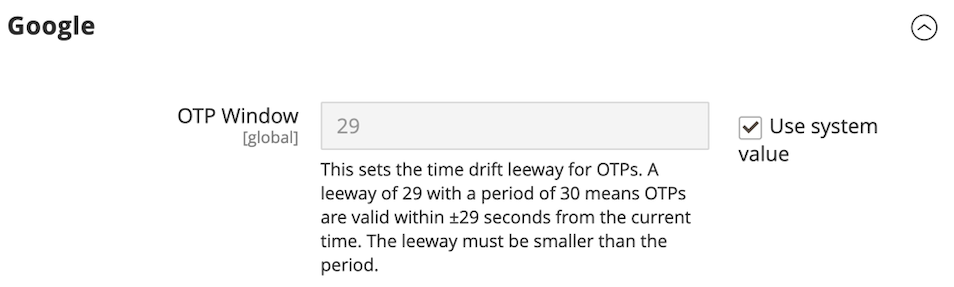

# [!UICONTROL Security] > [!UICONTROL 2FA]

>[!NOTE]
>
>已啟用Adobe Systems Identity Management服務 （IMS） 身份驗證的商店已原生禁用Adobe Systems商務和Magento Open Source雙因素驗證 （2FA）。 使用Adobe Systems憑據登錄到其 Adobe Systems Commerce 執行個體 的管理員使用者不需要對許多管理員任務重新進行身份驗證。 當管理員用戶登入其目前會話時，Authentication IMS 會處理Adobe Systems。 請參閱 [將 Adobe Systems Commerce 與 IMS 整合Adobe Systems 概述](https://experienceleague.adobe.com/docs/commerce-admin/start/admin/ims/adobe-ims-integration-overview.html)。

{{config}}

有關更改這些設置的詳細資訊，請參閱[管理系統指南&#x200B;_中的_&#x200B;雙因素身份驗證 （2FA）。](../../systems/security-two-factor-authentication.md)

## [!UICONTROL General]

<!-- zoom -->

| 田 | [範圍](../../getting-started/websites-stores-views.md#scope-settings) | 說明 |
|--- |--- |--- |
| [!UICONTROL Providers to use] | 全域 | 指示您需要的雙因素驗證方法。 如果您選取多個提供者，則每個使用者在下次登入時都必須設定每個2FA方法。 |
| [!UICONTROL Configuration Email URL for Web API] | 全域 | For custom implementations, the URL for an alternate email configuration link that is sent to _Admin_ users at first login. 在電子郵件範本中，使用預留位置`:tfat`來指示代號插入的位置。 |
| [!UICONTROL Retry attempt limit for Two-Factor Authentication] | 全域 | 決定在暫時停用帳戶之前，系統管理員可以輸入[!DNL one-time password (OTP)]的次數。 預設： `10` |
| [!UICONTROL Two-Factor Authentication lockout time (seconds)] | 全域 | 決定管理員在其帳戶暫時停用之前可以等待多久輸入[!DNL one-time password (OTP)] （以秒為單位）。 預設： `300` |

{style="table-layout:auto"}

## [!UICONTROL Google]

<!-- zoom -->

| 田 | [範圍](../../getting-started/websites-stores-views.md#scope-settings) | 說明 |
|--- |--- |--- |
| [!UICONTROL OTP Window] | 全球 | 確定系統在管理員過期後接受管理員的時間 [!DNL one-time-password (OTP)] 長度（以秒為單位）。 不能高於單個OTP的期限（通常為30秒）。 違約： `29` |

{style="table-layout:auto"}

## [!UICONTROL Duo Security]

<!-- zoom -->

| 田 | [範圍](../../getting-started/websites-stores-views.md#scope-settings) | 說明 |
|--- |--- |--- |
| [!UICONTROL Client Id] | 全域 | 來自您[!DNL Duo Security]帳戶的使用者端ID。 |
| [!UICONTROL Client Secret] | 全域 | The Client Secret from your [!DNL Duo Security] account. |
| [!UICONTROL Integration Key] | 全域 | 來自您[!DNL Duo Security] API帳戶的整合金鑰。 |
| [!UICONTROL Secret Key] | 全域 | [!DNL Duo Security] API帳戶的秘密金鑰。 |
| [!UICONTROL API Hostname] | 全域 | [!DNL Duo Security]帳戶的API主機名稱。 |

{style="table-layout:auto"}

## [!UICONTROL Authy]

<!-- zoom -->

| 田 | [範圍](../../getting-started/websites-stores-views.md#scope-settings) | 說明 |
|--- |--- |--- |
| [!UICONTROL API Key] | 全球 | [!DNL Authy]帳戶的API金鑰。 |
| [!UICONTROL OneTouch Message] | 全球 | 登入時[!DNL Authy]驗證者中顯示的訊息。 預設： `Login request to your Magento Admin` |

{style="table-layout:auto"}

## [!UICONTROL U2F Key]

<!-- zoom -->

| 欄位 | [領域](../../getting-started/websites-stores-views.md#scope-settings) | 說明 |
|--- |--- |--- |
| [!UICONTROL WebApi Challenge Domain] | 全域 | 用來為自訂WebAPI實作發出及處理[!DNL WebAuthn]挑戰的網域。 |

{style="table-layout:auto"}
