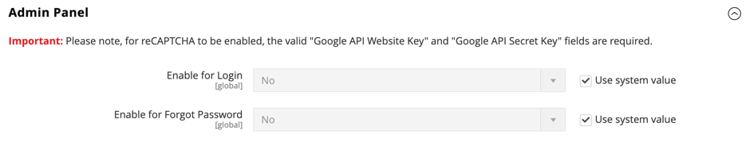

# [!UICONTROL Security] > [!UICONTROL Google reCAPTCHA Admin Panel]

>[!IMPORTANT]
>
>在設定Google reCAPTCHA之前，您必須確定您的`PHP.ini`檔案包含下列設定： `allow_url_fopen = 1`。 這可能需要開發人員協助。 請參閱&#x200B;_安裝指南_&#x200B;中的[必要的PHP設定](https://experienceleague.adobe.com/docs/commerce-operations/installation-guide/prerequisites/php-settings.html)。

{{config}}

如需有關變更這些設定的詳細資訊，請參閱&#x200B;_管理系統指南_&#x200B;中的[Google reCAPTCHA](../../systems/security-google-recaptcha.md)。

## [!UICONTROL reCAPTCHA v2 ("I am not a robot")]

<!-- zoom -->

| 欄位 | [領域](../../getting-started/websites-stores-views.md#scope-settings) | 說明 |
|--|--|--|
| [!UICONTROL Google API Website Key] | 全域 | 註冊Google reCAPTCHA帳戶時建立的網站金鑰。 |
| [!UICONTROL Google API Secret Key] | 全域 | 與您的Google reCAPTCHA帳戶相關聯的秘密金鑰。 |
| [!UICONTROL Size] | 全域 | 登入期間顯示的Google reCAPTCHA方塊大小。 選項： `Normal` （預設） / `Compact` |
| [!UICONTROL Theme] | 全域 | 決定Google reCAPTCHA方塊的樣式。 選項： `Light Theme` （預設） / `Dark Theme` |
| [!UICONTROL Language Code] | 全域 | [雙字元代碼](https://developers.google.com/recaptcha/docs/language)，指定用於Google reCAPTCHA文字與訊息的語言。 |

{style="table-layout:auto"}

## [!UICONTROL reCAPTCHA v2 Invisible]

<!-- zoom -->

| 欄位 | [領域](../../getting-started/websites-stores-views.md#scope-settings) | 說明 |
|--|--|--|
| [!UICONTROL Google API Website Key] | 全域 | 註冊Google reCAPTCHA帳戶時建立的網站金鑰。 |
| [!UICONTROL Google API Secret Key] | 全域 | 與您的Google reCAPTCHA帳戶相關聯的秘密金鑰。 |
| [!UICONTROL Invisible Badge Position] | 全域 | 每個頁面上隱藏的reCAPTCHA徽章的位置。 選項： `Inline` / `Bottom Right` / `Bottom Left` |
| [!UICONTROL Theme] | 全域 | 決定Google reCAPTCHA方塊的樣式。 選項： `Light Theme` （預設） / `Dark Theme` |
| [!UICONTROL Language Code] | 全域 | [雙字元代碼](https://developers.google.com/recaptcha/docs/language)，指定用於Google reCAPTCHA文字與訊息的語言。 |

{style="table-layout:auto"}

## [!UICONTROL reCAPTCHA v3 Invisible]

<!-- zoom -->

| 欄位 | [領域](../../getting-started/websites-stores-views.md#scope-settings) | 說明 |
|--|--|--|
| [!UICONTROL Google API Website Key] | 全域 | 註冊Google reCAPTCHA帳戶時建立的網站金鑰。 |
| [!UICONTROL Google API Secret Key] | 全域 | 與您的Google reCAPTCHA帳戶相關聯的秘密金鑰。 |
| [!UICONTROL Minimum Score Threshold] | 全域 | 將使用者互動識別為潛在風險的最低分數，其中1.0是典型的使用者互動，0.0可能是機器人。 預設： `0.5` |
| [!UICONTROL Invisible Badge Position] | 全域 | 每個頁面上隱藏的reCAPTCHA徽章的位置。 選項： `Inline` / `Bottom Right` / `Bottom Left` |
| [!UICONTROL Theme] | 全域 | 決定Google reCAPTCHA方塊的樣式。 選項： `Light Theme` （預設） / `Dark Theme` |
| [!UICONTROL Language Code] | 全域 | [雙字元代碼](https://developers.google.com/recaptcha/docs/language)，指定用於Google reCAPTCHA文字與訊息的語言。 |

{style="table-layout:auto"}

## [!UICONTROL reCAPTCHA Failure Messages]

<!-- zoom -->

| 欄位 | [領域](../../getting-started/websites-stores-views.md#scope-settings) | 說明 |
|--|--|--|
| [!UICONTROL reCAPTCHA Validation Failure Message] | 全域 | 驗證失敗時顯示在管理員中的訊息。 預設文字： `reCAPTCHA verification failed.` |
| [!UICONTROL reCAPTCHA Technical Failure Message] | 全域 | 如果reCAPTCHA無法傳回驗證結果，管理員中顯示的訊息。 預設文字： `Something went wrong with reCAPTCHA. Please contact the store owner.` |

{style="table-layout:auto"}

## [!UICONTROL Admin Panel]

<!-- zoom -->

>[!NOTE]
>
>您選擇的reCAPTCHA型別必須符合與Google reCAPTCHA帳戶中的API金鑰相關聯的型別。

>[!WARNING]
>
>使用reCAPTCHA版本3時，低分數的正版使用者無法繼續。 對於版本2，分數較低的正版使用者會收到挑戰。 若是低分的真正使用者應該有機會解決挑戰（版本2）或遭到封鎖（版本3），請仔細考慮。

| 欄位 | [領域](../../getting-started/websites-stores-views.md#scope-settings) | 說明 |
|--|--|--|
| [!UICONTROL Enable for Login] | 全域 | 決定為[管理員登入](https://experienceleague.adobe.com/docs/commerce-admin/start/admin/admin-signin.html)啟用的reCAPTCHA型別。 選項： **`No`**- （預設）不會驗證管理員登入。 **`reCAPTCHA v2 ("I am not a robot")`**  — 要求使用者選取&#x200B;_我不是自動機制_&#x200B;核取方塊。 **`Invisible reCAPTCHA v2`**— 在背景驗證使用者行為，不需要根據分數進行互動。 **`Invisible reCAPTCHA v3`** - （建議）根據互動分數，在背景驗證使用者行為。 |
| [!UICONTROL Enable for Forgot Password] | 全域 | 決定啟用以要求[管理員密碼重設](https://experienceleague.adobe.com/docs/commerce-admin/start/admin/admin-signin.html#reset-your-password)的reCAPTCHA型別。 選項：  **`No`**- （預設）無法驗證密碼重設要求。 **`reCAPTCHA v2 ("I am not a robot")`**  — 要求使用者選取&#x200B;_我不是自動機制_&#x200B;核取方塊。 **`Invisible reCAPTCHA v2`**— 在背景驗證使用者行為，不需要根據分數進行互動。 **`Invisible reCaptcha v3`** - （建議）根據互動分數，在背景驗證使用者行為。 |

{style="table-layout:auto"}
