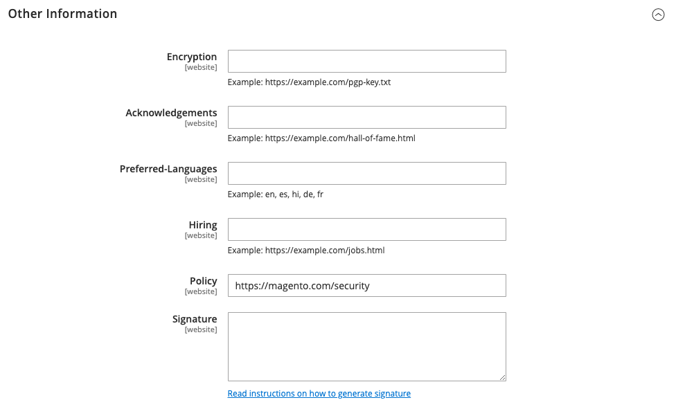

# [!UICONTROL Security] > [!UICONTROL Security.txt]

如需有關變更這些組態設定的詳細資訊，請參閱[安全性問題報告](../../systems/security-issue-reporting.md)。

{{config}}

## [!UICONTROL General]

<!-- zoom -->

| 欄位 | [領域](../../getting-started/websites-stores-views.md#scope-settings) | 說明 |
|--- |--- |--- |
| [!UICONTROL Enable] | 網站 | 啟用後，會儲存`security.txt`檔案，其中包含安全性研究人員回報您潛在漏洞所需的資訊。 選項： **`Yes`**— 根據&#x200B;_連絡人資訊_與&#x200B;_其他資訊_區段中輸入的資訊，建立`security.txt`檔案。 **`No`** - （預設）不建立`security.txt`檔案。 |

{style="table-layout:auto"}

## [!UICONTROL Contact information]

<!-- zoom -->

| 欄位 | [領域](../../getting-started/websites-stores-views.md#scope-settings) | 說明 |
|--- |--- |--- |
| [!UICONTROL Email] | 網站 | 可傳送安全性報告的電子郵件地址。 |
| [!UICONTROL Phone] | 網站 | 可用來回報安全性問題的電話號碼。 |
| [!UICONTROL Contact Page] | 網站 | 網站上列出安全性連絡人的網頁URL，或您的&#x200B;_連絡我們_&#x200B;網頁。 範例：  `https://mystore.com/security-contact.html` `https://mystore.com/contact/` |

{style="table-layout:auto"}

## [!UICONTROL Other information]

<!-- zoom -->

| 欄位 | [領域](../../getting-started/websites-stores-views.md#scope-settings) | 說明 |
|--- |--- |--- |
| [!UICONTROL Encryption] | 網站 | URL，指向安全性研究人員可用來傳送加密通訊的加密金鑰位置。 _**請勿在此欄位中輸入加密金鑰。**_   研究人員有責任確認金鑰來自可靠的來源。 研究人員不得假設金鑰與用來產生數位簽名的金鑰相同。 範例： 來自網頁伺服器的OpenPGP金鑰 — `https://mystore.com/pgp-key.txt` |
| [!UICONTROL Acknowledgments] | 網站 | URL會指向您商店中安全性研究人員獲得認可的頁面，例如`https://mystore.com/hall-of-fame.html`。 為了防止日後的攻擊，請僅包含一般說明，但不顯示有關漏洞問題的特定資訊。 範例： 我們要感謝以下研究人員： (yyyy/mm/dd) Justin Thyme - SQL插入 |
| [!UICONTROL Preferred Languages] | 網站 | 指定至少一個偏好的安全性報告語言。 請使用逗號分隔多個雙字元[語言代碼](https://en.wikipedia.org/wiki/List_of_ISO_639-1_codes)。 所有指定的語言都有相同的優先順序。 例如，若要指定英文、西班牙文和法文，請輸入`en, es, fr`。 |
| [!UICONTROL Hiring] | 網站 | 網站上列出安全性相關職位之頁面的URL。 範例： `https://mystore.com/jobs.html` |
| [!UICONTROL Policy] | 網站 | 說明您的安全性原則和弱點報告作法的頁面URL。 範例： `https://mystore.com/security-reporting.html`預設： `https://mystore.com/security` |
| [!UICONTROL Signature] | 網站 | 數位簽名檔案的連結。 數位簽章必須從命令列產生，並儲存在伺服器的`.well-known`資料夾中。 如需詳細資訊，請參閱GitHub上的[Security.txt](https://github.com/magento/security-package/blob/1.0-develop/Securitytxt/README.md)。 範例： `https://mystore.com/.well-known/security.txt.sig` |

{style="table-layout:auto"}
