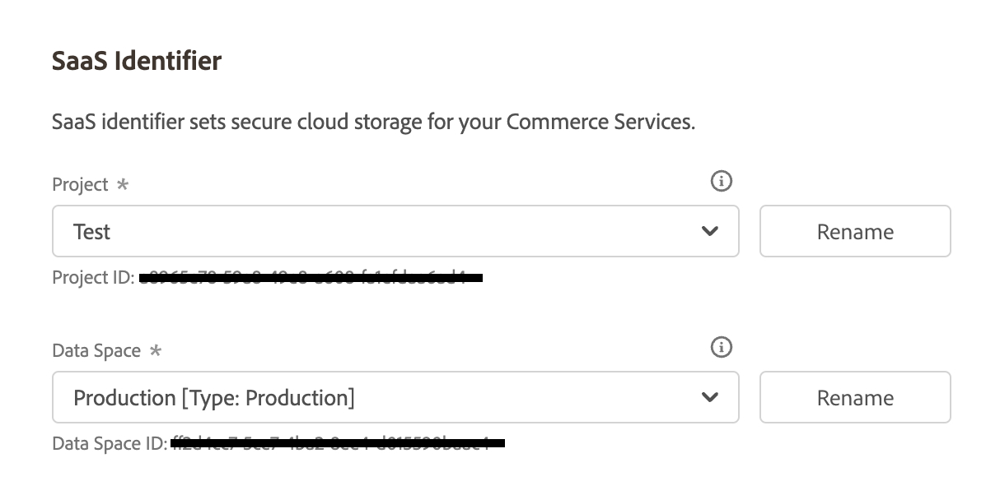

# [!UICONTROL Services] > [!UICONTROL Commerce Services Connector]

若要瞭解如何將您的商店連結至Adobe Commerce服務，請參閱[Commerce服務](https://experienceleague.adobe.com/docs/commerce/user-guides/integration-services/saas.html)。

{{config}}

## [!UICONTROL Sandbox API Keys]

<!-- zoom -->

| 欄位 | [領域](../../getting-started/websites-stores-views.md#scope-settings) | 說明 |
|--- |--- |--- |
| [!UICONTROL Sandbox public API key] | 全域 | 識別作者及其權益（若有）的API金鑰。 |
| [!UICONTROL Sandbox private API key] | 全域 | 與API金鑰相關聯的私密金鑰。 |

{style="table-layout:auto"}

## [!UICONTROL Production Keys]

<!-- zoom -->

| 欄位 | [領域](../../getting-started/websites-stores-views.md#scope-settings) | 說明 |
|--- |--- |--- |
| [!UICONTROL Production public API key] | 全域 | 識別作者及其權益（若有）的API金鑰。 |
| [!UICONTROL Production private API key] | 全域 | 與API金鑰相關聯的私密金鑰。 |

{style="table-layout:auto"}

## [!UICONTROL SaaS Identifier]

<!-- zoom -->

| 欄位 | [領域](../../getting-started/websites-stores-views.md#scope-settings) | 說明 |
|--- |--- |--- |
| [!UICONTROL Project] | 全域 | 將所有SaaS資料空間分組的SaaS專案名稱。 如果沒有任何SaaS專案，則會顯示&#x200B;_建立專案_&#x200B;按鈕。 |
| [!UICONTROL Data Space] | 全域 | 列出指定SaaS專案中的SaaS資料空間。 SaaS資料空間的數目取決於您的[Commerce授權](https://experienceleague.adobe.com/docs/commerce/user-guides/integration-services/saas.html)： Adobe Commerce — 一個生產資料空間；兩個測試資料空間； Magento Open Source — 一個生產資料空間；無測試資料空間 |

{style="table-layout:auto"}

## [!UICONTROL IMS Organization]

<!-- zoom -->

| 欄位 | 說明 |
|--- |--- |
| [!UICONTROL Sign in using Adobe ID] | 您的Adobe ID通常是您開始成為會員或購買Adobe應用程式或服務時第一次使用的電子郵件地址。 您的Adobe ID是存取Adobe帳戶所需的金鑰。 |

{style="table-layout:auto"}
