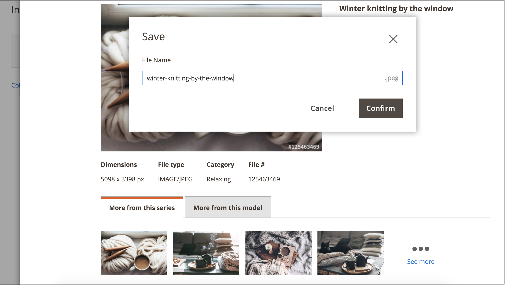

# 授權Adobe Stock影像

您想要用於生產Adobe Commerce和Magento Open Source商店的Adobe Stock資產應該獲得授權。 此授權確保您擁有合法存取影像的許可權，並消除所有[影像預覽](./adobe-stock-save-preview.md)上出現的Adobe Stock浮水印。 若要授權影像或儲存已授權的影像，您必須登入您的Adobe帳戶。

新的[[!DNL Media Gallery]](media-gallery.md)提供與Adobe Stock的直接整合，讓您能夠輕鬆地直接從相簿頁面授權您的影像。

>[!BEGINSHADEBOX]

**必要條件**

必須安裝並設定[Adobe Stock整合](./adobe-stock.md)，才能使用Adobe Stock授權功能。 授權[Adobe Stock][adobe-stock]影像需要付費Adobe Stock計畫和[Adobe帳戶][adobe-signin]。

>[!ENDSHADEBOX]

## 從新[!DNL Media Gallery]授權影像

1. 在&#x200B;_管理員_&#x200B;側邊欄上，移至&#x200B;**[!UICONTROL Content]** > _[!UICONTROL Media]_>**[!UICONTROL Media Gallery]**。

1. 依照[使用Adobe Stock影像](./adobe-stock-manage.md)上的步驟登入並將預覽影像儲存到[媒體儲存空間](./media-storage.md)。

   {width="600" zoomable="yes"}

1. 按一下影像下方的三個點（{width="10" zoomable="no"}），然後按一下&#x200B;**[!UICONTROL License]**。

   {width="600" zoomable="yes"}

   >[!NOTE]
   >
   >如果您未登入，則會顯示登入表單。 如需登入的詳細資訊，請參閱[使用Adobe Stock影像](./adobe-stock-manage.md)。

1. 在授權確認對話方塊中，按一下&#x200B;**[!UICONTROL Confirm]**&#x200B;以授權影像。

   {width="350" zoomable="yes"}

   >[!NOTE]
   >
   >您的帳戶中必須有[個Adobe Stock積分][stock-credits]，才能授權此影像。

## 從標準媒體儲存空間授權影像

1. [存取Adobe Stock搜尋格線][access-search]。

1. 若要[檢視影像詳細資料][view-details]，請按一下搜尋格線中的影像。

1. 請根據影像目前的授權狀態，執行下列任一項作業：

   - 如果影像已經授權，請按一下&#x200B;**[!UICONTROL Save]**。

   - 如果影像&#x200B;_未_&#x200B;授權，請按一下&#x200B;**[!UICONTROL License and Save]**。

     >[!NOTE]
     >
     >您的帳戶中必須有[個Adobe Stock積分][stock-credits]，才能授權此影像。

   此動作會顯示提示，讓您指定用來將影像儲存至[媒體儲存空間](./media-storage.md)的檔案名稱。 預設檔案名稱已提供，但您可以根據您的偏好自訂名稱。

   {width="550" zoomable="yes"}

1. 按一下&#x200B;**[!UICONTROL Confirm]**。

   頁面會重新導向至媒體儲存空間，並顯示您儲存的預覽。

[access-search]: adobe-stock-manage.md#access-the-adobe-stock-search-grid
[view-details]: adobe-stock-manage.md#view-image-details
[stock-credits]: https://helpx.adobe.com/stock/help/credit-packs.html
[adobe-stock]: https://stock.adobe.com
[adobe-signin]: https://helpx.adobe.com/manage-account/using/access-adobe-id-account.html
