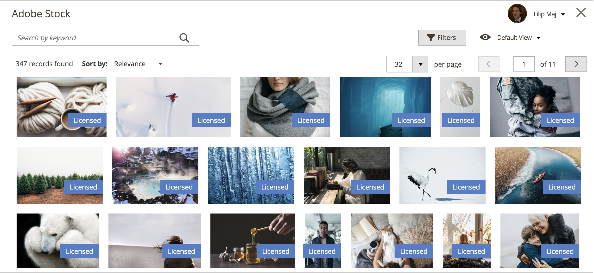
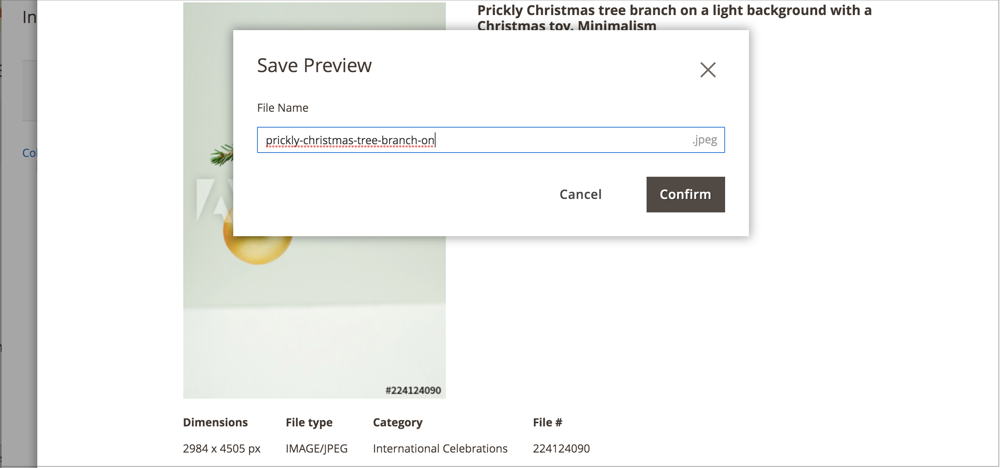

# 使用Adobe Stock影像

可以使用[Adobe Stock](https://stock.adobe.com)影像來取代上傳您自己的影像內容。 一個常見的使用案例是在建立頁面時上傳並放置影像內容。

[[!DNL Media Gallery]](media-gallery.md)提供與Adobe Stock的直接整合，讓您能夠輕鬆地直接從相簿頁面授權您的影像。

## 存取Adobe Stock搜尋格線

當您[新增或編輯頁面](page-add.md)、[建立或編輯類別](../catalog/category-create.md)或透過內容編輯器[插入影像](editor-insert-image.md)時，可存取Adobe Stock搜尋面板。

**_若要搜尋Adobe Stock資產並將庫存影像新增至頁面：_**

1. 在&#x200B;_管理員_&#x200B;側邊欄上，移至&#x200B;**[!UICONTROL Content]** > _[!UICONTROL Elements]_>**[!UICONTROL Pages]**。

1. 按一下&#x200B;**[!UICONTROL Add a New Page]**。

   若要編輯現有頁面，您可以使用&#x200B;_[!UICONTROL Action]_&#x200B;欄按一下&#x200B;**[!UICONTROL Select]**&#x200B;並選擇&#x200B;**[!UICONTROL Edit]**。

1. 展開 **[!UICONTROL Content]**&#x200B;區段，然後執行下列動作：

   - 如果您已啟用[WYSIWYG編輯器](editor.md)，請按一下&#x200B;**[!UICONTROL Show/Hide Editor]**，然後按一下&#x200B;**[!UICONTROL Insert Image]**。

   - 如果您已啟用[頁面產生器](../page-builder/setup.md)，請展開&#x200B;**[!UICONTROL Media]**&#x200B;面板，並將&#x200B;**[!UICONTROL Image]**&#x200B;預留位置拖曳至目標容器。 然後按一下&#x200B;**[!UICONTROL Select from Gallery]**。

     {width="600" zoomable="yes"}

1. 按一下&#x200B;**[!UICONTROL Search Adobe Stock]**。

**_若要搜尋Adobe Stock資產並將庫存影像新增至類別：_**

1. 在&#x200B;_管理員_&#x200B;側邊欄上，移至&#x200B;**[!UICONTROL Catalog]** > **[!UICONTROL Categories]**。

1. 按一下&#x200B;**[!UICONTROL Add Root Category]**&#x200B;或&#x200B;**[!UICONTROL Add Subcategory]**。

   如果要將影像新增到現有類別，請按一下左側清單中的類別名稱。

1. 展開&#x200B;**[!UICONTROL Content]**&#x200B;區段，並在&#x200B;_[!UICONTROL Category Image]_&#x200B;底下按一下&#x200B;**[!UICONTROL Select from Gallery]**。

1. 按一下&#x200B;**[!UICONTROL Search Adobe Stock]**。

若要搜尋Adobe Stock資產並從WYSIWYG編輯器新增庫存影像：

1. 按一下&#x200B;**[!UICONTROL Show/Hide Editor]**。

1. 按一下&#x200B;**[!UICONTROL Insert Image]**。

1. 按一下&#x200B;**[!UICONTROL Search Adobe Stock]**。

   {width="600" zoomable="yes"}

## 篩選和搜尋Adobe Stock資產

[Adobe Stock搜尋格線](#access-the-adobe-stock-search-grid)提供查詢和篩選功能，協助您尋找[!DNL Commerce]存放區的最佳影像。

依預設，顯示的搜尋結果來自Adobe Stock組織的數百個結果庫。 當您套用自己的關鍵字搜尋時，您會透過Adobe Stock搜尋數百萬個可用的資產。

### 依關鍵字搜尋Adobe Stock資產

1. [存取Adobe Stock搜尋格線](#access-the-adobe-stock-search-grid)。

1. 在左上方的&#x200B;**[!UICONTROL Search by keyword]**&#x200B;輸入欄位中輸入關鍵字搜尋，然後按一下放大鏡或按&#x200B;**Enter**。

   「芒果」關鍵字的{width="600" zoomable="yes"}

### 篩選Adobe Stock資產

1. [執行Adobe Stock資產的關鍵字搜尋](#search-for-adobe-stock-assets-by-keywords)。

1. 按一下&#x200B;**[!UICONTROL Filters]**。

   有數個篩選器可用來縮小您的搜尋結果：

   | 篩選 | 說明 |
   |---|---|
   | [!UICONTROL Subcategory] | 篩選&#x200B;**像片**&#x200B;或&#x200B;**插圖**&#x200B;的影像 |
   | [!UICONTROL Orientation] | 依大小、形狀和外觀篩選影像 |
   | [!UICONTROL Color] | 使用調色盤依顏色篩選影像 |
   | [!UICONTROL Price] | 根據成本篩選影像 |
   | [!UICONTROL Safe search] | 啟用或停用安全搜尋 |
   | [!UICONTROL Isolated Assets] | 將顯示限製為僅顯示&#x200B;_個孤立的資產_，這些資產的主體會單獨顯示在純色背景中 |

   {style="table-layout:auto"}

   {width="600" zoomable="yes"}

1. 按一下&#x200B;**[!UICONTROL Apply Filters]**。

   搜尋結果格線會以您精細的搜尋更新。

## 檢視影像詳細資料

每個影像都有可檢視的詳細資料。 其他特定影像的動作，例如[儲存影像預覽](adobe-stock-save-preview.md)或[儲存（並可選擇授權）影像](adobe-stock-license-image.md)，可透過此詳細檢視取得。

1. [存取Adobe Stock搜尋格線](#access-the-adobe-stock-search-grid)。

1. 按一下搜尋結果中的影像。

   系統會顯示進一步的影像詳細資料，例如：

   - 影像的較大版本
   - 影像中繼資料，例如&#x200B;_[!UICONTROL Dimensions]_、_[!UICONTROL File type]_、_[!UICONTROL Category]_、_[!UICONTROL File]_&#x200B;和&#x200B;_關鍵字_
   - 相關影像，例如來自相同&#x200B;_系列_&#x200B;或&#x200B;_模型_&#x200B;的影像
   - 動作按鈕，例如[[!UICONTROL Save Preview]](adobe-stock-save-preview.md)和[[!UICONTROL Save (and optionally license) Image]](adobe-stock-license-image.md)

     {width="600" zoomable="yes"}

## 登入您的Adobe帳戶

若要取得影像的完整存取權並消除Adobe Stock浮水印，您必須[使用Adobe帳戶登入](https://helpx.adobe.com/manage-account/using/access-adobe-id-account.html)，並購買使用影像的許可權積分。

1. [存取Adobe Stock搜尋格線](#access-the-adobe-stock-search-grid)。

1. 按一下右上方的&#x200B;**[!UICONTROL Sign In]**。

   新的瀏覽器視窗會引導您完成[Adobe登入程式](https://helpx.adobe.com/manage-account/using/access-adobe-id-account.html)。

   完成登入程式後，影像的授權狀態會在搜尋結果中顯示為標籤。

   {width="600" zoomable="yes"}

### 檢視搜尋結果的授權狀態

[登入您的Adobe帳戶](#log-in-to-your-adobe-account)。

與您的Adobe帳戶相關聯的所有授權影像都會顯示標籤，讓您清楚瞭解哪些影像已授權。

{width="600" zoomable="yes"}

### 將影像儲存至媒體儲存空間

使用Adobe Stock整合搜尋的影像可以儲存到[!DNL Commerce] [媒體儲存空間](media-storage.md)，以便在您的[!DNL Commerce]存放區中重複使用。

您可以儲存兩種型別的影像： [影像預覽](adobe-stock-save-preview.md)或[授權的影像](adobe-stock-license-image.md)。

#### 儲存影像預覽

影像預覽是Adobe Stock資產的水印版本。 影像預覽是免費的，而且在您決定購買特定影像的授權，並在生產環境商店中使用它們之前，可以嘗試不同影像。

1. [存取Adobe Stock搜尋格線](#access-the-adobe-stock-search-grid)。

1. 若要[檢視影像詳細資料](#view-image-details)，請按一下搜尋格線中的影像。

1. 按一下&#x200B;**[!UICONTROL Save Preview]**。

   這個動作會顯示提示，讓您指定用來將影像儲存至媒體儲存裝置的檔案名稱。 預設檔案名稱已提供，但您可以根據您的偏好自訂名稱。

   {width="500" zoomable="yes"}

1. 按一下&#x200B;**[!UICONTROL Confirm]**。

   頁面會重新導向至媒體儲存空間，並顯示您儲存的預覽。

#### 儲存授權的影像

您想要用於生產[!DNL Commerce]存放區的Adobe Stock資產應該獲得授權。 授權可確保您擁有合法存取影像的許可權，並消除所有[影像預覽](adobe-stock-save-preview.md)上出現的Adobe Stock浮水印。 若要授權影像或儲存已獲得授權的影像，您必須登入您的Adobe帳戶。

1. [登入您的Adobe帳戶](#log-in-to-your-adobe-account)。

1. 若要[檢視影像詳細資料](#view-image-details)，請按一下搜尋格線中的影像。

1. 請根據影像目前的授權狀態，執行下列任一項作業：

   - 如果影像已經授權，請按一下&#x200B;**[!UICONTROL Save]**。

   - 如果影像&#x200B;_未_&#x200B;授權，請按一下&#x200B;**[!UICONTROL License and Save]**。

     >[!NOTE]
     >
     >您的帳戶中必須有[個Adobe Stock積分](https://helpx.adobe.com/stock/help/credit-packs.html)，才能授權此影像。

   此動作會顯示提示，讓您指定用來將影像儲存至[媒體儲存空間](media-storage.md)的檔案名稱。 預設檔案名稱已提供，但您可以根據您的偏好自訂名稱。

1. 按一下&#x200B;**[!UICONTROL Confirm]**。

   頁面會重新導向至媒體儲存空間，並顯示您儲存的預覽。
