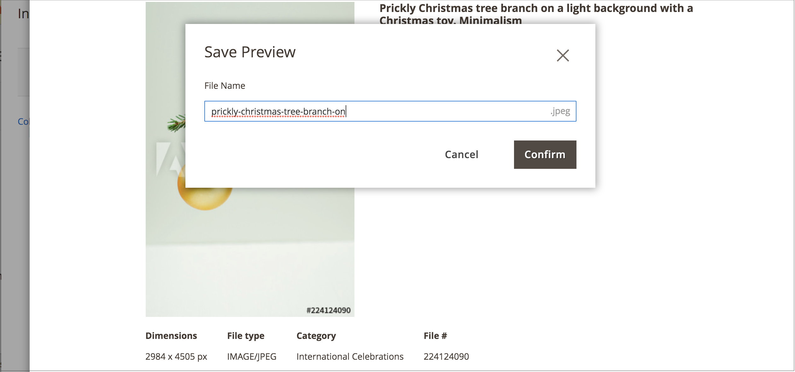

# 儲存Adobe Stock影像預覽

影像預覽是Adobe Stock資產的水印版本。 影像預覽是免費的，是您嘗試不同影像的好方法，然後再決定[購買特定影像的授權](./adobe-stock-license-image.md)，並在您的生產商店使用。

當您準備好授權影像時，新的[[!DNL Media Gallery]](media-gallery.md)提供與Adobe Stock的直接整合，讓您能夠輕鬆地直接從相簿頁面授權影像。

## 先決條件

此功能需要[Adobe Stock整合](./adobe-stock.md)模組與組態。

## 儲存預覽影像

1. [存取Adobe Stock搜尋格線](./adobe-stock-manage.md#access-the-adobe-stock-search-grid)。

1. 若要[檢視影像詳細資料](./adobe-stock-manage.md#view-image-details)，請按一下搜尋格線中的影像。

1. 按一下&#x200B;**[!UICONTROL Save Preview]**。

   此動作會顯示提示，讓您指定用來將影像儲存至[媒體儲存空間](./media-storage.md)的檔案名稱。 預設檔案名稱已提供，但您可以根據您的偏好自訂名稱。

   {width="500" zoomable="yes"}

1. 按一下&#x200B;**[!UICONTROL Confirm]**。

   頁面會重新導向至媒體儲存空間，並顯示您儲存的預覽。
