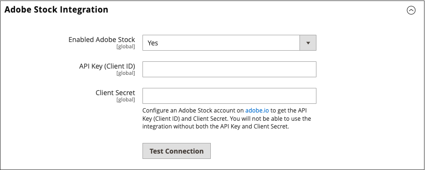

# Adobe Stock整合

若要存取您商店中使用的無數媒體資產，請將[Adobe Stock](https://stock.adobe.com)與[!UICONTROL Commerce]整合。

{width="700" zoomable="yes"}

Adobe Stock服務可讓企業針對其所有創意專案，存取數百萬張高品質、精心策劃、免版稅的像片、向量、插圖、影片、範本和3D資產。 [!DNL Commerce]個使用者能快速尋找、預覽及授權Adobe Stock資產。 使用者也可以將檔案儲存至[媒體儲存空間](./media-storage.md)，無需離開管理工作區。

## 先決條件

這項整合需要：

- [Adobe Developer](https://developer.adobe.com/console/home)帳戶
- Adobe Commerce或Magento Open Source、2.3.4或更新版本

授權Adobe Stock影像需要：

- [Adobe帳戶](https://helpx.adobe.com/manage-account/using/access-adobe-id-account.html)
- 與帳戶相關聯的付費[Adobe Stock](https://stock.adobe.com)計畫

## 整合[!DNL Commerce]與Adobe Stock

為Adobe Commerce設定Adobe Stock整合有兩個步驟：

1. [建立adobe.developer整合](#create-an-adobe-developer-integration)以產生API金鑰
1. [在Commerce管理員中設定Adobe Stock整合](#configure-the-adobe-stock-integration)

### 建立Adobe Developer整合

1. 導覽至[Adobe Developer Console](https://developer.adobe.com/console/home)。

1. 在&#x200B;_[!UICONTROL Quick Start]_&#x200B;底下，按一下&#x200B;**[!UICONTROL Create new project]**。

1. 在&#x200B;_[!UICONTROL Project overview]_&#x200B;區塊中，按一下&#x200B;**[!UICONTROL Add API]**。

1. 從整合清單中選取&#x200B;**[!UICONTROL Adobe Stock]**&#x200B;並按一下&#x200B;**[!UICONTROL Next]**。

1. 選取OAuth 2.0 **[!UICONTROL Web App]**。

1. 指定&#x200B;**[!UICONTROL redirect URI]**。

   預設重新導向URI的格式為`${HOST}/${ADMIN_URI}/adobe_ims/oauth/callback/`，例如`https://store.myshop.com/admin_hgkq1l/adobe_ims/oauth/callback/`，其中：

   - `${HOST}`是您的[!DNL Commerce]完整網域名稱（例如，`https://store.myshop.com`）。
   - `${ADMIN_URI}`是您的[!DNL Commerce]管理員URI （例如`admin_hgkq1l`），可透過執行`magento info:adminuri`來擷取。

1. 指定&#x200B;**[!UICONTROL Redirect URI pattern]**，它與您的重新導向URI相同，但有兩個差異：

   - 任何句號(`.`)都必須以兩個反斜線(`\\`)逸出。
   - 將`.*`新增到模式的結尾。

   使用先前預設重新導向URI的範例，它將是`https://store\\.myshop\\.com/admin_hgkq1l/adobe_ims/oauth/callback/.*`。

1. 按一下&#x200B;**[!UICONTROL Next]**。

1. 檢閱可用的範圍並按一下&#x200B;**[!UICONTROL Save configured API]**。

1. 在接下來的頁面上，複製您的&#x200B;**[!UICONTROL Client ID]** （API金鑰）和&#x200B;**[!UICONTROL Client secret]**。

   此資訊將用於下一節的步驟中。

### 設定Adobe Stock整合

若要在您的[!DNL Commerce]系統管理員中設定系統組態，請使用&#x200B;_上一節_&#x200B;中產生的&#x200B;_API金鑰_&#x200B;和[使用者端密碼](#create-an-adobeio-integration)。

1. 在&#x200B;_管理員_&#x200B;側邊欄上，移至&#x200B;**[!UICONTROL Stores]** > _[!UICONTROL Settings]_>**[!UICONTROL Configuration]**。

1. 在左側面板中，展開&#x200B;**[!UICONTROL Advanced]**&#x200B;並選擇&#x200B;**[!UICONTROL System]**。

1. 展開 **[!UICONTROL Adobe Stock Integration]**&#x200B;並執行下列動作：

   - 將&#x200B;**[!UICONTROL Enabled Adobe Stock]**&#x200B;設為`Yes`。

   - 輸入您的&#x200B;**[!UICONTROL API Key (Client ID)]**。

   - 輸入您的&#x200B;**[!UICONTROL Client Secret]**。

   - 按一下&#x200B;**[!UICONTROL Test Connection]**&#x200B;以驗證您的金鑰。

   {width="600" zoomable="yes"}

   提供驗證幾秒鐘。 如果您的認證有效，您應該會看到綠色的&#x200B;_連線成功！_&#x200B;訊息。

1. 完成時，按一下&#x200B;**[!UICONTROL Save Config]**。
