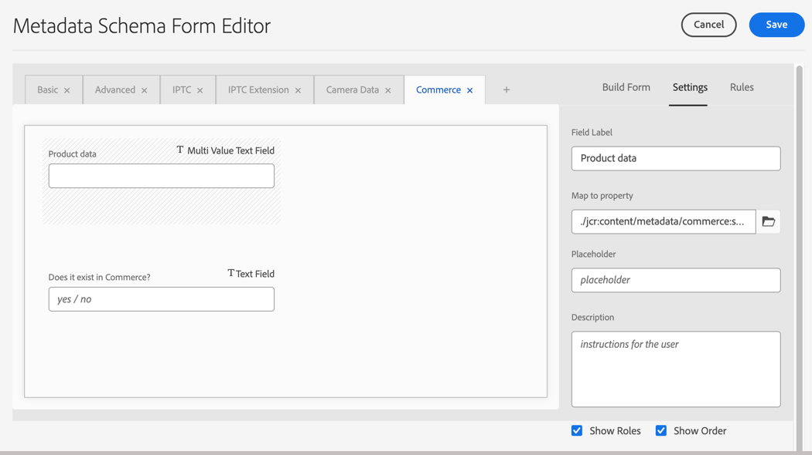

# 設定Experience Manager Assets

準備AEM as a Cloud Service環境以管理Commerce資產，方法是更新環境設定，並設定Assets中繼資料以識別和管理Commerce資產。

整合需要新增自訂`Commerce`名稱空間和其他[設定檔中繼資料](https://experienceleague.adobe.com/en/docs/experience-manager-cloud-service/content/assets/manage/metadata-profiles)和[結構描述中繼資料](https://experienceleague.adobe.com/en/docs/experience-manager-cloud-service/content/assets/manage/metadata-schemas)。

Adobe提供AEM專案範本，以將名稱空間和中繼資料結構資源新增到AEM Assetsas a Cloud Service環境設定。 範本新增：

- [自訂名稱空間](https://github.com/ankumalh/assets-commerce/blob/main/ui.config/jcr_root/apps/commerce/config/org.apache.sling.jcr.repoinit.RepositoryInitializer~commerce-namespaces.cfg.json)，`Commerce`可識別Commerce相關屬性。

- 具有標籤`Does it exist in Commerce?`的自訂中繼資料型別`commerce:isCommerce`可標籤與Adobe Commerce專案相關聯的Commerce資產。

- 自訂中繼資料型別`commerce:productmetadata`與對應的UI元件以新增&#x200B;*[!UICONTROL Product Data]*&#x200B;屬性。 產品資料包含中繼資料屬性，以將Commerce資產與產品SKU建立關聯，並指定資產的影像`role`和`position`屬性。

  {width="600" zoomable="yes"}

- 中繼資料結構表單具有Commerce索引標籤，其中包含用於標籤Commerce資產的`Does it exist in Adobe Commerce?`和`Product Data`欄位。 此表單也提供在AEM Assets UI中顯示或隱藏`roles`和`order` （位置）欄位的選項。

  AEM Assets中繼資料結構表單的{width="600" zoomable="yes"}

- [範例已標籤並核准Commerce資產](https://github.com/ankumalh/assets-commerce/blob/main/ui.content/src/main/content/jcr_root/content/dam/wknd/en/activities/hiking/equipment_6.jpg/.content.xml) `equipment_6.jpg`，以支援初始資產同步化。 只有已核准的Commerce資產才能從AEM Assets同步到Adobe Commerce。

如需Commerce-Assets AEM專案的詳細資訊，請參閱[讀我檔案](https://github.com/ankumalh/assets-commerce)。

## 自訂AEM Assets環境設定

>[!BEGINSHADEBOX]

**必要條件**

- [存取具有計畫和部署管理員角色的AEM Assets Cloud Manager計畫和環境](https://experienceleague.adobe.com/en/docs/experience-manager-cloud-service/content/onboarding/journey/cloud-manager#access-sysadmin-bo)。

- [本機AEM開發環境](https://experienceleague.adobe.com/en/docs/experience-manager-learn/cloud-service/local-development-environment-set-up/overview)，而且熟悉AEM本機開發程式。

- 瞭解[AEM專案結構](https://experienceleague.adobe.com/zh-hant/docs/experience-manager-cloud-service/content/implementing/developing/aem-project-content-package-structure)以及如何使用Cloud Manager部署自訂內容套件。

>[!ENDSHADEBOX]

### 將Commerce-Assets AEM專案部署至AEM Assets編寫環境

1. 如有需要，可從Cloud Manager建立AEM Assets專案的生產和中繼環境。

1. 視需要設定部署管道。

1. 從GitHub下載[Commerce-Assets AEM專案](https://github.com/ankumalh/assets-commerce)的範本程式碼。

1. 從您的[本機AEM開發環境](https://experienceleague.adobe.com/en/docs/experience-manager-learn/cloud-service/local-development-environment-set-up/overview)，將自訂程式碼作為Maven套件安裝在您的AEM Assets環境設定中，或手動將程式碼複製到現有的專案設定中。

1. 提交變更，並將本機開發分支推送到Cloud Manager Git存放庫。

1. 從Cloud Manager [部署您的程式碼以更新AEM環境](https://experienceleague.adobe.com/en/docs/experience-manager-cloud-service/content/implementing/using-cloud-manager/deploy-code#deploying-code-with-cloud-manager)。

## 設定中繼資料設定檔

透過建立中繼資料設定檔，設定Commerce資產中繼資料的預設值。 設定後，將此設定檔套用至AEM Asset資料夾，以自動使用這些預設值。 此選擇性設定可減少手動步驟，有助於簡化資產處理。

1. 在Adobe Experience Manager工作區中，按一下Adobe Experience Manager圖示以前往AEM Assets的作者內容管理工作區。

   {width="600" zoomable="yes"}

1. 選取槌子圖示，開啟「管理員」工具。

   {width="600" zoomable="yes"}

1. 按一下&#x200B;**[!UICONTROL Metadata Profiles]**&#x200B;開啟設定檔設定頁面。

1. **[!UICONTROL Create]** Commerce整合的中繼資料設定檔。

   {width="600" zoomable="yes"}

1. 新增Commerce中繼資料的索引標籤。

   1. 按一下左側的&#x200B;**[!UICONTROL Settings]**。

   1. 按一下索引標籤區段中的&#x200B;**[!UICONTROL +]**，然後指定&#x200B;**[!UICONTROL Tab Name]**、`Commerce`。

1. 將`Does it exist in Commerce?`欄位新增至表單，並將預設值設為`yes`。

   {width="600" zoomable="yes"}

1. 儲存更新。

1. 將`Commerce integration`中繼資料設定檔套用至儲存Commerce資產的資料夾。

   1. 從[!UICONTROL  Metadata Profiles]頁面，選取Commerce整合設定檔。

   1. 從動作功能表中選取&#x200B;**[!UICONTROL Apply Metadata Profiles to Folder(s)]**。

   1. 選取包含Commerce資產的資料夾。

      建立Commerce資料夾（如果沒有）。

   1. 按一下&#x200B;**[!UICONTROL Apply]**。

>[!TIP]
>
>您可以更新中繼資料設定檔，將&#x200B;_[!UICONTROL Review Status]_欄位的預設值設為`Approved`，藉此在上傳至Commerce環境時自動同步AEM Assets資產。 `Review Status`欄位的屬性型別是`./jcr:content/metadata/dam:status`。

## 後續步驟

更新AEM環境後，請設定Adobe Commerce：

1. [安裝並設定適用於Commerce的AEM Assets整合](aem-assets-configure-commerce.md)
2. [啟用資產同步，以便在您的Adobe Commerce專案環境和AEM Assets專案環境之間傳輸資產](aem-assets-setup-synchronization.md)
