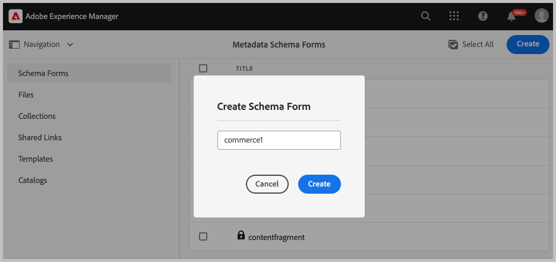

# 設定Experience Manager Assets

{{$include /help/_includes/aem-assets-integration-beta-note.md}}

若要使用Commerce的AEM Assets整合來管理商店的媒體資產，您的AEM Assets專案需要新增某些中繼資料，以確保您能輕鬆搜尋和管理Commerce資產。 此中繼資料也有助於在Adobe Commerce和Experience Manager Assets之間同步資產。 定義中繼資料欄位後，這些欄位的初始對應會在第一次與Experience Manager Assets共用Commerce資產時自動進行。

針對整合，您可以設定兩種中繼資料型別：

- **[中繼資料設定檔](https://experienceleague.adobe.com/en/docs/experience-manager-cloud-service/content/assets/manage/metadata-profiles)**&#x200B;可讓您將預設中繼資料套用至資料夾內的資產。 資料夾中的所有資產都會繼承設定檔中設定的預設中繼資料。

- **[中繼資料結構描述](https://experienceleague.adobe.com/en/docs/experience-manager-cloud-service/content/assets/manage/metadata-schemas)**&#x200B;定義屬性頁面的版面配置，以及可在AEM資產上當作中繼資料屬性使用的欄位集。

## 設定中繼資料

對於初始入門，將以下Commerce中繼資料新增到AEM Assets中繼資料設定檔和中繼資料結構。

| 欄位型別 | 標籤 | 屬性 | 預設值 |
|------ | ------- | ---------- | ------------- |
| 文字 | **它存在於Adobe Commerce中嗎？** | `./jcr:content/metadata/commerce:isCommerce` | 是 |
| 多值文字 | **個SKU** | `./jcr:content/metadata/commerce:skus` | 無 |
| 多值文字 | **職位** | `./jcr:content/metadata/commerce:positions` | 無 |
| 多值文字 | **角色** | `./jcr:content/metadata/commerce:roles` | 無 |

### 將Commerce欄位新增至中繼資料設定檔

1. 在Adobe Experience Manager工作區中，按一下Adobe Experience Manager圖示以前往AEM Assets的作者內容管理工作區。

   {width="600" zoomable="yes"}

1. 選取槌子圖示，開啟「管理員」工具。

   {width="600" zoomable="yes"}

1. 按一下&#x200B;**[!UICONTROL Metadata Profiles]**&#x200B;開啟設定檔設定頁面。

1. **[!UICONTROL Create]** Commerce整合的中繼資料設定檔。

   {width="600" zoomable="yes"}

1. 新增Commerce中繼資料的索引標籤。

   1. 按一下左側的&#x200B;**[!UICONTROL Settings]**。

   1. 按一下索引標籤區段中的&#x200B;**[!UICONTROL +]**，然後指定&#x200B;**[!UICONTROL Tab Name]**、`Commerce`。

1. 將[中繼資料欄位](#configure-metadata)新增至表單。

   {width="600" zoomable="yes"}

1. 儲存更新。

1. 將`Commerce integration`中繼資料設定檔套用至儲存Commerce資產的資料夾。

   1. 從[!UICONTROL  Metadata Profiles]頁面，選取Commerce整合設定檔。

   1. 從動作功能表中選取&#x200B;**[!UICONTROL Apply Metadata Profiles to Folder(s)]**。

   1. 選取包含Commerce資產的資料夾。

      建立Commerce資料夾（如果沒有）。

   1. 按一下&#x200B;**[!UICONTROL Apply]**。

### 將Commerce欄位新增至中繼資料結構表單

1. 從Assets的AEM Author Content管理面板中，開啟&#x200B;**[!UICONTROL Metadata Schemas]** ([!UICONTROL Manage metadata schema forms])。

   {width="600" zoomable="yes"}

1. **[!UICONTROL Create]** Commerce的中繼資料結構。

   {width="600" zoomable="yes"}

1. 在[!UICONTROL Metadata Schema Form]上，建立`Does Commerce exist?`和`Commerce mappings`欄位並對應屬性。

1. 按一下&#x200B;**[!UICONTROL Save]**。

## Publish資產

為Commerce資產設定AEM中繼資料和結構描述檔後，請建立第一個Commerce資產以對應Commerce中繼資料欄位。

1. 在Experience Manager中，移至[!UICONTROL Assets > Files]選取&#x200B;**Commerce**&#x200B;資料夾。

1. 將檔案拖曳至資料夾或按一下「**[!UICONTROL Add Assets]**」，上傳Commerce專案的影像。

1. 驗證中繼資料組態： **isCommerce**&#x200B;已設定為`true`，且`commerce:skus`屬性已設定為與影像相關聯之Commerce產品的SKU。

1. 核准資產。

## 將資產新增至Commerce資料夾

在AEM Assets Commerce資料夾中至少建立一個已指派Commerce中繼資料屬性的資產。

在您的Commerce執行個體與AEM Assets之間設定同步時，需要此資產。

## 對應資產的中繼資料

中繼資料會在第一次發佈Commerce資產時進行對應。  第一次從Commerce移除。 具有內建或自訂欄位的媒體資產，在首次將資產傳送到Experience Manager Assets時會自動對應到指定的欄位。

在開始資產對應之前，請先完成下列工作：

- [安裝並設定適用於Commerce的AEM Assets整合](aem-assets-configure-commerce.md)
- [啟用資產同步，以便在您的Adobe Commerce專案環境和AEM Assets專案環境之間傳輸資產](aem-assets-setup-synchronization.md)
