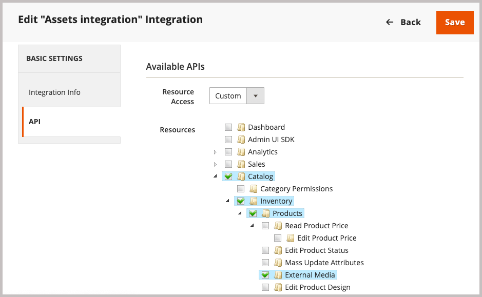

# 安裝並設定適用於Commerce的AEM Assets整合

{{$include /help/_includes/aem-assets-integration-beta-note.md}}

將擴充功能新增至AEM Assets應用程式、連線至Commerce SaaS服務、電子Adobe I/O事件服務，以及連線至Commerce SaaS，以安裝和設定Commerce的Commerce整合。

## 系統需求

**軟體需求**

- Adobe Commerce 2.4.5+
- PHP 8.1、8.2、8.3
- Composer： 2.x

## 必要條件

- Adobe Commerce必須設定為使用[Adobe IMS驗證](/help/getting-started/adobe-ims-config.md)。
- 帳戶布建和許可權 — 管理員必須擁有下列資源的存取權，才能設定Experience Manager Assets整合：
   - Commerce應用程式管理員 — 安裝必要的擴充功能，並從「管理員」或命令列設定Commerce應用程式伺服器
   - [Commerce管理員](https://experienceleague.adobe.com/en/docs/commerce-admin/start/guide-overview) — 更新存放區設定並管理Commerce使用者帳戶
   - [Experience Manager Assets](https://experienceleague.adobe.com/en/docs/experience-manager-assets-essentials/help/introduction)—Adobe IMS應用程式管理員或使用者帳戶。 帳戶必須具有建立和管理檔案夾以及建立公開收藏集、上傳資產、設定許可權和設定中繼資料的許可權。

## 設定概述

完成下列工作以啟用整合：

1. [安裝AEM Assets整合擴充功能(`aem-assets-integration`)](#install-the-aem-assets-integration-extension)。
1. [設定Commerce Service Connector](#configure-the-commerce-services-connector)，將您的Adobe Commerce執行個體與可讓資料在Adobe Commerce和AEM Assets之間傳輸的服務連線。
1. [設定Commerce的Adobe I/O事件](#configure-adobe-io-events-for-commerce)
1. [取得API存取的驗證認證](#get-authentication-credentials-for-api-access)

## 安裝AEM Assets整合擴充功能

>[!BEGINSHADEBOX]

**先決條件**

- 存取[repo.magento.com](https://repo.magento.com/admin/dashboard)以安裝擴充功能。 如需金鑰產生與取得必要許可權，請參閱[取得您的驗證金鑰](https://experienceleague.adobe.com/en/docs/commerce-operations/installation-guide/prerequisites/authentication-keys)。 如需雲端安裝，請參閱[雲端基礎結構上的Commerce指南](https://experienceleague.adobe.com/en/docs/commerce-cloud-service/user-guide/develop/authentication-keys)

- 存取Adobe Commerce應用程式伺服器的命令列。

>[!ENDSHADEBOX]

在執行AEM Assets 2.4.4或更新版本的Adobe Commerce上安裝最新版本的Adobe Commerce整合擴充功能(`aem-assets-integration`)。 AEM Asset Integration是以Composer中繼資料的形式從[repo.magento.com](https://repo.magento.com/admin/dashboard)存放庫提供。

>[!BEGINTABS]

>[!TAB 雲端基礎結構]

使用此方法來安裝Commerce Cloud執行個體的[!DNL AEM Assets Integration]延伸模組。

1. 在本機工作站上，變更至雲端基礎結構專案上Adobe Commerce的專案目錄。

   >[!NOTE]
   >
   >如需有關在本機管理Commerce專案環境的資訊，請參閱《雲端基礎結構使用手冊》中&#x200B;_Adobe Commerce的[使用CLI管理分支](https://experienceleague.adobe.com/en/docs/commerce-cloud-service/user-guide/develop/cli-branches)_。

1. 檢視環境分支，以使用Adobe Commerce Cloud CLI進行更新。

   ```shell
   magento-cloud environment:checkout <environment-id>
   ```

1. 新增Commerce擴充功能的AEM Assets整合。

   ```shell
   composer require "magento/aem-assets-integration" "<version-tbd>" --no-update
   ```

1. 更新套件相依性。

   ```shell
   composer update "magento/aem-assets-integration"
   ```

1. 認可並推播對`composer.json`和`composer.lock`檔案的程式碼變更。

1. 新增、認可並將`composer.json`和`composer.lock`檔案的程式碼變更推播到雲端環境。

   ```shell
   git add -A
   git commit -m "Install AEM Assets Integration extension for Adobe Commerce"
   git push origin <branch-name>
   ```

   推送更新會啟動[Commerce雲端部署程式](https://experienceleague.adobe.com/en/docs/commerce-cloud-service/user-guide/develop/deploy/process)以套用變更。 從[部署記錄](https://experienceleague.adobe.com/en/docs/commerce-cloud-service/user-guide/develop/test/log-locations#deploy-log)檢查部署狀態。

>[!TAB 內部部署]

使用此方法來安裝內部部署執行個體的[!DNL AEM Assets Integration]延伸模組。

1. 使用Composer將適用於Commerce的AEM Assets整合擴充功能新增至您的專案：

   ```shell
   composer require "magento/aem-assets-integration" --no-update
   ```

1. 更新相依性並安裝擴充功能：

   ```shell
   composer update  "magento/aem-assets-integration"
   ```

1. 升級Adobe Commerce：

   ```shell
   bin/magento setup:upgrade
   ```

1. 清除快取：

   ```shell
   bin/magento cache:clean
   ```

   >[!TIP]
   >
   >在某些情況下，特別是部署到生產時，您可能希望避免清除編譯的程式碼，因為可能需要一些時間。 在進行任何變更之前，請務必先備份系統。

>[!ENDTABS]

## 設定Commerce服務聯結器

Commerce服務聯結器可讓您在Commerce執行個體、資產規則引擎服務和其他支援服務之間同步資料和通訊。

>[!NOTE]
>
>Commerce服務聯結器設定是使用[Adobe Commerce SaaS服務](https://experienceleague.adobe.com/en/docs/commerce-merchant-services/user-guides/integration-services/saas#availableservices)所需的一次性程式。 如果您已設定其他服務的聯結器，您可以選取「**[!UICONTROL Systems]** > [!UICONTROL Services] > **[!UICONTROL Commerce Services Connector]**」，從Commerce管理員檢視現有設定。

若要在您的Adobe Commerce執行個體與啟用AEM Assets整合的服務之間傳輸資料，請使用下列專案設定Commerce服務聯結器：

- 使用用於驗證的生產和沙箱API金鑰設定您的Commerce執行個體。
- 指定用於安全雲端儲存的資料空間（SaaS識別碼）。
- 登入您用來存取AEM Assets的同一IMS組織，以建立您的資料集與Adobe Experience Platform之間的連線。

如需詳細指示，請參閱[Commerce服務聯結器](https://experienceleague.adobe.com/en/docs/commerce-merchant-services/user-guides/integration-services/saas#organizationid)。

當您設定Commerce服務聯結器時，系統會產生SaaS專案和資料庫ID。 在租使用者上線流程中，您需要這些ID。

用於AEM Assets整合的{width="600" zoomable="yes"}

## 設定Commerce的Adobe I/O事件

AEM Assets整合使用Adobe I/O事件服務，在Commerce執行個體和Experience Cloud之間傳送自訂事件資料。 事件資料可用來協調AEM Assets整合的工作流程。

>[!BEGINSHADEBOX]

**先決條件**

- 確認已啟用RabbitMQ並接聽事件。
   - [內部部署Adobe Commerce的RabbitMQ設定](https://experienceleague.adobe.com/en/docs/commerce-cloud-service/user-guide/configure/service/rabbitmq)
   - 在雲端基礎結構上為Adobe Commerce [RabbitMQ設定](https://experienceleague.adobe.com/en/docs/commerce-cloud-service/user-guide/configure/service/rabbitmq)

>[!ENDSHADEBOX]

>[!NOTE]
>
>如需CommerceAdobe I/O事件的詳細資訊，請參閱Adobe Developer網站上的[CommerceAdobe I/O事件](https://developer.adobe.com/commerce/extensibility/events/)檔案。

設定需要下列步驟。

1. 在應用程式伺服器上和「管理員」中設定Adobe I/O事件，以啟用Commerce事件架構。
1. 使用Adobe Commerce規則引擎服務API來設定連線，以啟用Assets與AEM Assets之間的資料同步
1. 在管理員中啟用AEM Assets整合

### 啟用Commerce事件架構

使用部署Commerce專案的環境指示，啟用Commerce事件架構。

>[!BEGINTABS]

>[!TAB 雲端基礎結構]

1. 從[!DNL Store Settings Configuration]功能表啟用Adobe I/O事件服務。

   1. 從Admin移至&#x200B;**[!UICONTROL Stores]** > [!UICONTROL Settings] > **[!UICONTROL Configuration]** > **[!UICONTROL Adobe Services]** > **Adobe I/O事件**。

   1. 展開&#x200B;**[!UICONTROL Commerce events]**。

   1. 將&#x200B;**[!UICONTROL Enabled]**&#x200B;設為`Yes`。

      {width="600" zoomable="yes"}

      >[!NOTE]
      >
      >[啟用cron](https://developer.adobe.com/commerce/extensibility/events/configure-commerce/#check-cron-and-message-queue-configuration)，讓Commerce可以傳送事件至API端點，以管理整合的通訊和工作流程。

1. 更新雲端專案設定。

   1. 將`app/etc/config.php`檔案新增至您的工作存放庫：

   ```shell
   git add app/etc/config.php
   ```

   1. 執行`composer info magento/ece-tools`命令以決定您的ece-tools版本。 如果版本小於`2002.1.13`，請[更新至最新版本](https://experienceleague.adobe.com/en/docs/commerce-cloud-service/user-guide/dev-tools/ece-tools/update-package)。

   1. 在`.magento.env.yaml`檔案中啟用事件：

      ```yaml
      stage:
         global:
            ENABLE_EVENTING: true
      ```

   1. 提交更新檔案並將其推播到雲端環境。

>[!TAB 內部部署]

1. 從[!DNL Store Settings Configuration]功能表啟用Adobe I/O事件服務。

   1. 從Admin移至&#x200B;**[!UICONTROL Stores]** > [!UICONTROL Settings] > **[!UICONTROL Configuration]** > **[!UICONTROL Adobe Services]** > **Adobe I/O事件**。

   1. 展開&#x200B;**[!UICONTROL Commerce events]**。

   1. 將&#x200B;**[!UICONTROL Enabled]**&#x200B;設為`Yes`。

      {width="600" zoomable="yes"}

      >[!NOTE]
      >
      >[啟用cron工作](https://developer.adobe.com/commerce/extensibility/events/configure-commerce/#check-cron-and-message-queue-configuration)，讓Commerce可以傳送事件來管理AEM資產與Commerce之間的通訊和工作流程。

>[!ENDTABS]

## 取得API存取的驗證認證

Commerce的AEM Assets整合需要OAuth驗證認證，才能允許API存取Commerce執行個體。 您需要這些認證，才能在租使用者上線期間向Commerce規則引擎服務註冊Assets專案，並提交API請求以管理Adobe Commerce與AEM Assets之間的資產。

您可以將整合新增至Commerce執行個體並加以啟用，以產生憑證。

### 將整合新增至Commerce環境

1. 從Admin，移至&#x200B;**系統** >擴充功能> **整合**，然後按一下&#x200B;**新增整合**。

1. 輸入整合的相關資訊。

   在&#x200B;**一般**&#x200B;區段中，僅指定整合&#x200B;**名稱**&#x200B;和&#x200B;**電子郵件**。 Adobe IMS帳戶使用此電子郵件，其可存取部署Commerce和Experience Manager Assets的組織。

   適用於Commerce管理員設定的{width="600" zoomable="yes"}

1. 按一下&#x200B;**確認身分**&#x200B;以驗證您的身分。

   系統會以您的AdobeID向Experience Cloud進行驗證以驗證您的身分。

1. 設定API資源。

   1. 從左側面板，按一下&#x200B;**[!UICONTROL API]**。
E
   1. 選取外部媒體資源(**[!UICONTROL Catalog > Inventory > Products > External Media]**。

   API資源的{width="600" zoomable="yes"}

1. 按一下&#x200B;**[!UICONTROL Save]**。

### 產生認證

在整合頁面上，按一下Assets整合的&#x200B;**啟動**&#x200B;以產生OAuth驗證認證。 您需要這些憑證才能透過Assets規則引擎服務註冊Commerce專案，以及提交API請求來管理Adobe Commerce與AEM Assets之間的資產。

1. 在整合頁面中，按一下&#x200B;**[!UICONTROL Activate]**&#x200B;產生認證。

   {width="600" zoomable="yes"}

1. 儲存消費者金鑰的認證和存取權杖以供稍後使用。

{width="600" zoomable="yes"}

1. 按一下&#x200B;**[!UICONTROL Done]**。

>[!NOTE]
>
>您也可以使用Adobe Commerce API產生驗證認證。 如需此程式的詳細資訊，以及Adobe Commerce的OAuth型驗證詳細資訊，請參閱Adobe Developer檔案中的[OAuth型驗證](https://developer.adobe.com/commerce/webapi/get-started/authentication/gs-authentication-oauth/)。


