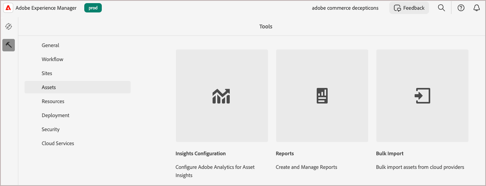

# 將媒體檔案移轉至AEM Assets DAM

Adobe Commerce和Adobe Experience Manager (AEM)皆提供內建功能，可簡化從Commerce到AEM Assets數位資產管理系統(DAM)的媒體檔案移轉。 您也可以從其他來源移轉媒體檔案。

## 先決條件

| 類別 | 要求 |
|----------|-------------|
| **系統需求** | <ul><li>已布建AEM Assets的AEM as a Cloud Service環境</li><li>足夠的儲存容量</li><li>大型檔案傳輸的網路頻寬</li></ul> |
| **必要的存取權和許可權** | <ul><li>AEM Assets as a Cloud Service的管理員存取權</li><li>存取儲存媒體檔案的來源系統(Adobe Commerce或外部系統)</li><li>存取雲端儲存服務的適當許可權</li></ul> |
| **雲端儲存空間帳戶** | <ul><li>AWS S3或Azure Blob儲存帳戶</li><li>私人容器/貯體設定</li><li>驗證認證</li></ul> |
| **Source內容** | <ul><li>可移轉的已整理媒體檔案</li><li>AEM Assets</a>支援的<a href="https://experienceleague.adobe.com/en/docs/experience-manager-cloud-service/content/assets/file-format-support#image-formats">格式影像和視訊檔案。</li><li>乾淨的重複資產</li></li> |
| **中繼資料準備** | <ul><li>為AEM Assets資產設定的<a href="https://experienceleague.adobe.com/en/docs/commerce-admin/content-design/aem-asset-management/getting-started/aem-assets-configure-aem">Commerce中繼資料設定檔</a></li><li>每個資產的映射中繼資料值</li><li>CSV文件編輯者（例如，Microsoft Excel）</li></ul> |

## 移轉最佳作法

1. 移轉前可透過移除未使用和重複的內容來組織資產。
1. 依大小、格式或使用案例以邏輯方式組織資產。
1. 請考慮將大型移轉分成較小的批次。
1. 排程非尖峰時間耗用大量資源的匯入。
1. 在完整匯入之前驗證中繼資料對應。

## 移轉工作流程

依照移轉工作流程從Adobe Commerce或其他外部系統匯出媒體檔案，並將其匯入AEM Assets DAM。

### 步驟1：從現有的資料來源匯出內容

對於Adobe Commerce商家而言，遠端儲存模組提供簡化的方式，可從Commerce匯出媒體檔案，並將其匯入至AEM Assets。 此模組可讓您在AWS S3等遠端儲存服務上儲存和管理媒體檔案，讓移轉程式更有效率。 若要設定Commerce執行個體的遠端儲存空間，請參閱&#x200B;*Commerce設定指南*&#x200B;中的[設定遠端儲存空間](https://experienceleague.adobe.com/en/docs/commerce-operations/configuration-guide/storage/remote-storage/remote-storage-aws-s3)。

如果您將媒體檔案儲存在Adobe Commerce外部，請直接將它們上傳到AEM as a Cloud Service支援的[資料來源](https://experienceleague.adobe.com/en/docs/experience-manager-cloud-service/content/assets/assets-view/bulk-import-assets-view#prerequisites)之一。

### 步驟2：建立中繼資料對應的CSV檔案

建立CSV格式的中繼資料對應檔案，並將其上傳至包含媒體檔案的來源資料夾。 此檔案會將基本中繼資料對應至每個資產，以便：

- 在DAM中組織和分類資產以輕鬆探索
- 啟用 Adobe Systems Commerce 和 AEM Assets 之間的適當同步
- 在遷移后維護資產和產品之間的關係

對於您計畫移轉的每個媒體檔案，請為Commerce資產](aem-assets-configure-aem.md)的[AEM Assets中繼資料設定檔中包含的中繼資料欄位提供值，如下表所述。

| 中繼資料 | 說明 | 值 |
|-------|-------------|--------|
| 資產路徑 | 資產將儲存於AEM Assets存放庫中的完整路徑。<br><br>使用路徑建立子資料夾以整理Commerce資產，例如`content/dam/commerce/<brand>/<type>`。 | `/content/dam/commerce/<sub-folder>/..<filename>` |
| dc：title | AEM Assets中資產的顯示標題 | 字串值（例如`Sample 1`） |
| dam：status | AEM Assets中資產的核准狀態 | `approved` |
| commerce：positions | 資產在產品相簿中的位置/順序 | 數值（例如「1」） |
| commerce：isCommerce | 表示資產是否用於商業的旗標 | `Yes` |
| commerce：sku | 與此資產相關聯的產品SKU | 字串值 （例如 `sample1`） |
| 商務：角色 | 資產的角色或影像類型 （例如、`thumbnail``main image`、`swatch`） | 以分號隔開的多個值 （例如 “thumbnail;圖像;色票_image;small_image”） |

+++CSV程式碼

使用這個範例CSV程式碼，在程式碼編輯器或試算表應用程式(如Microsoft Excel)中建立檔案。

```csv
assetPath,dc:title{{String}},dam:status{{String}},commerce:positions{{String: multi}},commerce:isCommerce{{String}},commerce:skus{{String: multi}},commerce:roles{{String: multi}}
/content/dam/commerce/sample1.jpg,Sample 1,approved,1,Yes,sample1,thumbnail; image; swatch_image; small_image
/content/dam/commerce/sample2.jpg,Sample 2,approved,1,Yes,sample2,thumbnail; image; swatch_image; small_image
/content/dam/commerce/sample3.jpg,Sample 3,approved,1,Yes,sample3,thumbnail; image; swatch_image; small_image
```

+++

### 步驟3：將Assets大量匯入AEM Assets

建立中繼資料對應檔案後，請使用AEM Assets大量匯入工具來匯入您的資產。

以下是使用該工具的高層級概觀。

1. [登入您的AEM Assets as a Cloud Service作者環境](https://experienceleague.adobe.com/en/docs/experience-manager-cloud-service/content/onboarding/journey/aem-users#login-aem)。

1. 從Experience Manager工具檢視中，選取&#x200B;**[!UICONTROL Assets]** > **[!UICONTROL Bulk Import]**。

   {width="600" zoomable="yes"}

1. 從大量匯入設定中，選取&#x200B;**[!UICONTROL Create]**&#x200B;以開啟設定表單。

   {width="600" zoomable="yes"}

1. 設定並儲存組態。

   您將需要：

   - 您的資料來源的驗證認證
   - AEM Assets中儲存匯入檔案的目標資料夾
   - 有關MIME型別、檔案大小和其他引數以自訂匯入組態的資訊（選擇性）
   - 中繼資料對應CSV檔案的路徑，您已上傳至雲端儲存空間執行個體。

   如需詳細步驟，請參閱&#x200B;*AEM Assets as a Cloud Service使用手冊*&#x200B;中的[設定大量匯入工具](https://experienceleague.adobe.com/en/docs/experience-manager-cloud-service/content/assets/manage/add-assets#configure-bulk-ingestor-tool)。

1. 儲存組態後，請使用大量匯入工具來測試及執行匯入作業。

>[!MORELIKETHIS]
>
>[大量匯入工具視訊示範](https://experienceleague.adobe.com/en/docs/experience-manager-cloud-service/content/assets/manage/add-assets#asset-bulk-ingestor)
>[秘訣、最佳作法和限制](https://experienceleague.adobe.com/en/docs/experience-manager-cloud-service/content/assets/manage/add-assets#tips-limitations)
>[使用 API 上傳或攝取資產](https://experienceleague.adobe.com/en/docs/experience-manager-cloud-service/content/assets/admin/developer-reference-material-apis#asset-upload)

