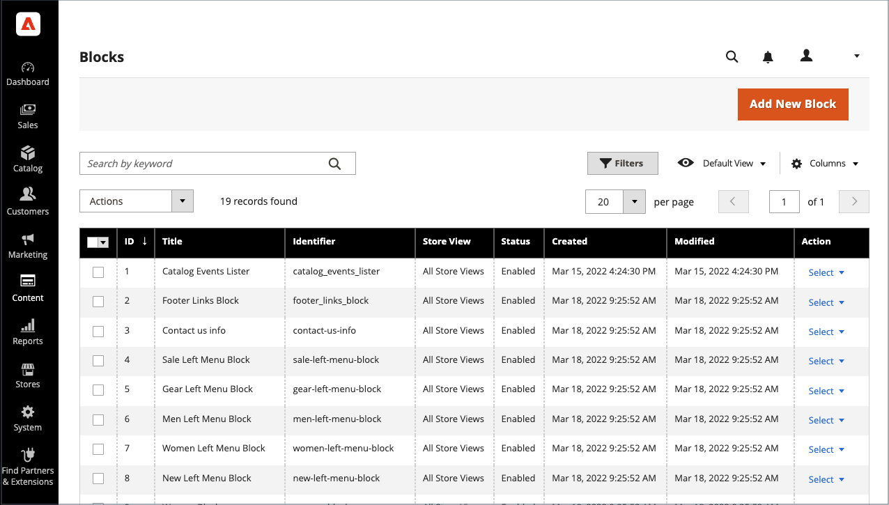
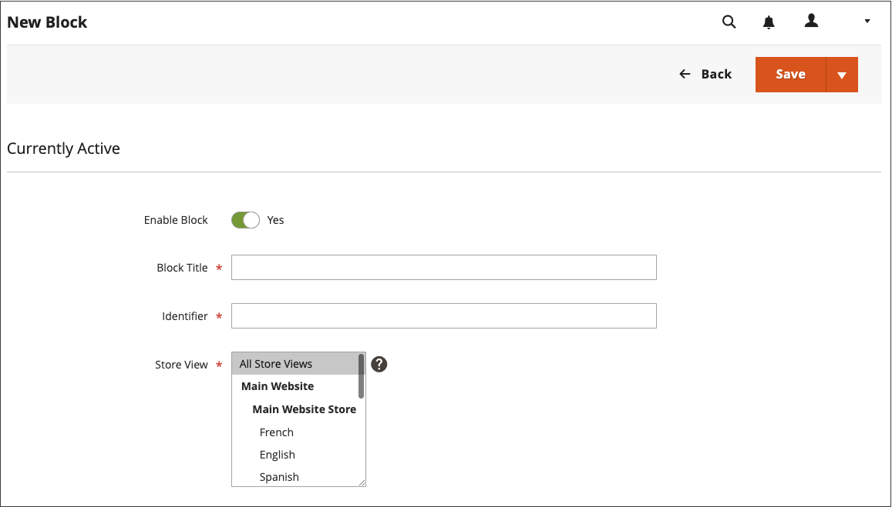
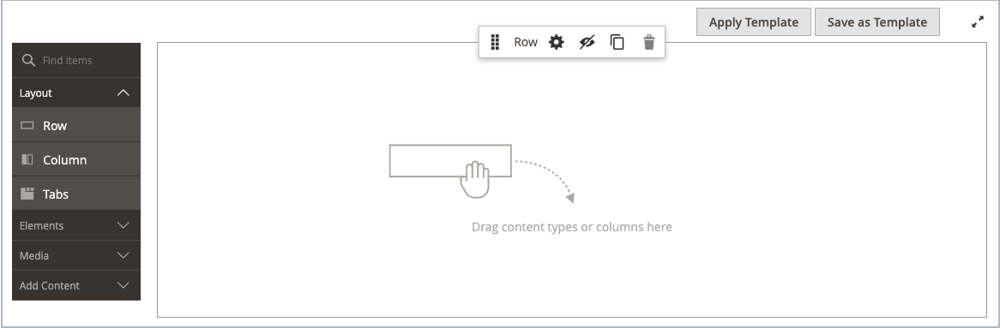
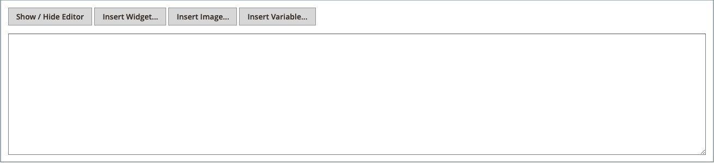

# 新增內容區塊

您可以建立內容的自訂區塊，然後新增至任何頁面、頁面群組，或甚至另一個區塊。 例如，您可以將影像滑桿放在區塊中，然後將區塊放在首頁上。 區塊工作區使用與[頁面](pages-workspace.md)工作區相同的&#x200B;_基本控制項_，協助您尋找可用的區塊並執行例行維護。 當區塊完成時，您可以使用[Widget](widget-static-block.md)工具將其放在商店中的特定頁面上。

{width="700" zoomable="yes"}

## 建立區塊

1. 在&#x200B;_管理員_&#x200B;側邊欄上，移至&#x200B;**[!UICONTROL Content]** > _[!UICONTROL Elements]_>**[!UICONTROL Blocks]**。

1. 按一下右上角的&#x200B;**新增區塊**。

   {width="500" zoomable="yes"}

1. 如果您想要變更新區塊的預設啟用狀態，請將&#x200B;**啟用區塊**&#x200B;設定為`No`。

1. 指派&#x200B;**區塊標題**&#x200B;以供內部參考。

1. 為區塊指派唯一的&#x200B;**識別碼**。

   請使用全部小寫字元搭配底線，而非空格。

1. 選取您希望區塊可用的每個&#x200B;**[!UICONTROL Store View]**。

1. 使用顯示的內容工具集新增區塊的內容：

   - 如果[頁面產生器](../page-builder/introduction.md)已啟用，請選取&#x200B;**[!UICONTROL Edit with Page Builder]**&#x200B;以在內容[工作區](../page-builder/workspace.md)中使用頁面產生器工具。

     {width="500" zoomable="yes"}

     >[!NOTE]
     >
     >如需有關使用頁面產生器新增區塊的資訊，請參閱[教學課程2：區塊](../page-builder/2-blocks.md)。

   - 使用[編輯器](editor.md)來格式化文字、建立連結，以及新增表格、影像、視訊和音訊。

     如果您偏好使用HTML程式碼，請按一下&#x200B;**顯示/隱藏編輯器**。

     {width="500" zoomable="yes"}

1. 完成後，按一下&#x200B;**[!UICONTROL Save]**&#x200B;箭頭，然後選擇&#x200B;**[!UICONTROL Save & Close]**。

   新區塊會顯示在「區塊」格線的清單底部。

1. 使用[Widget](widget-static-block.md)工具，將完成的區塊放置在商店中的特定頁面上。

## 刪除區塊

移除自訂區塊的方法有兩種。 您可以從&#x200B;_區塊_&#x200B;格線或編輯區塊頁面移除它。

### 方法1：從區塊格線中移除區塊

1. 在&#x200B;_管理員_&#x200B;側邊欄上，移至&#x200B;**[!UICONTROL Content]** > _[!UICONTROL Elements]_>**[!UICONTROL Blocks]**。
1. 使用格線上方的篩選條件來找出區塊，並選取一或多個要刪除區塊的核取方塊。
1. 在清單的左上角，將&#x200B;**[!UICONTROL Actions]**&#x200B;設定為`Delete`。
1. 若要確認動作，請按一下&#x200B;**[!UICONTROL OK]**。

### 方法2：從編輯頁面移除區塊

1. 在&#x200B;_管理員_&#x200B;側邊欄上，移至&#x200B;**[!UICONTROL Content]** > _[!UICONTROL Elements]_>**[!UICONTROL Blocks]**。
1. 尋找要刪除的區塊。
1. 在區塊的&#x200B;_動作_&#x200B;資料行中，按一下&#x200B;**[!UICONTROL Select]**&#x200B;並選擇&#x200B;**[!UICONTROL Edit]**。
1. 在功能表列中，按一下&#x200B;**[!UICONTROL Delete Block]**。
1. 若要確認動作，請按一下&#x200B;**[!UICONTROL OK]**。

## 儲存功能表

| 命令 | 說明 |
|----------|----------- |
| [!UICONTROL Save] | 儲存目前區塊並繼續運作。 |
| [!UICONTROL Save & Duplicate] | 儲存並關閉目前的區塊，然後開啟新的重複復本。 |
| [!UICONTROL Save & Close] | 儲存並關閉目前的區塊，然後返回「區塊」格線。 |

{style="table-layout:auto"}

## 新增燈箱或滑桿

- 使用[可輕鬆將](../page-builder/slider.md)滑桿[[!DNL Page Builder]](../page-builder/introduction.md)新增至您的商店。 滑桿可以設定為自動播放，或使用導覽按鈕手動控制。

  {width="600" zoomable="yes"}

  [[!DNL Commerce Marketplace]](https://marketplace.magento.com/extensions.html?q=lightbox)上也有各式各樣的jQuery影像燈箱，有些是免費的。

- 您也可以從[!DNL Commerce Marketplace]下載擴充功能。 如需其他說明，請參閱擴充功能開發人員提供的檔案。
