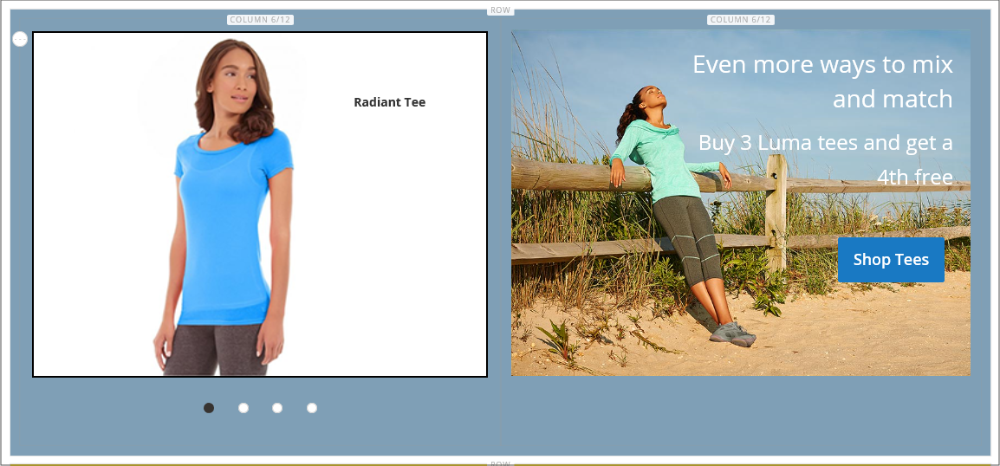

# 新增內容區塊

您可以建立內容的自訂區塊，然後新增至任何頁面、頁面群組，或甚至另一個區塊。 例如，您可以將影像滑桿放在區塊中，然後將區塊放在首頁上。 區塊工作區會使用相同的 [基本控制項](pages-workspace.md) 作為 _頁面_ 工作區可協助您尋找可用的區塊並執行例行維護。 區塊完成時，您可以使用 [Widget](widget-static-block.md) 工具，可將它放置在商店中的特定頁面上。

{width="700" zoomable="yes"}

## 建立區塊

1. 在 _管理員_ 側欄，前往 **[!UICONTROL Content]** > _[!UICONTROL Elements]_>**[!UICONTROL Blocks]**.

1. 在右上角，按一下 **新增區塊**.

   {width="500" zoomable="yes"}

1. 如果要變更新區塊的預設啟用狀態，請設定 **啟用區塊** 至 `No`.

1. 指派 **區塊標題** 以供內部參考。

1. 指派唯一 **識別碼** 區塊的。

   請使用全部小寫字元搭配底線，而非空格。

1. 選取每一個 **[!UICONTROL Store View]** 您希望區塊可用的位置。

1. 使用顯示的內容工具集新增區塊的內容：

   - 如果 [頁面產生器](../page-builder/introduction.md) 已啟用，請選取 **[!UICONTROL Edit with Page Builder]** 在內容中使用頁面產生器工具 [工作區](../page-builder/workspace.md).

     {width="500" zoomable="yes"}

     >[!NOTE]
     >
     >如需有關使用頁面產生器新增區塊的資訊，請參閱 [教學課程2：區塊](../page-builder/2-blocks.md).

   - 使用 [編輯者](editor.md) 設定文字格式、建立連結，以及新增表格、影像、視訊和音訊。

     如果您偏好使用HTML程式碼，請按一下 **顯示/隱藏編輯器**.

     {width="500" zoomable="yes"}

1. 完成後，按一下 **[!UICONTROL Save]** 箭頭並選擇 **[!UICONTROL Save & Close]**.

   新區塊會顯示在「區塊」格線的清單底部。

1. 使用 [Widget](widget-static-block.md) 工具，用於將完成的區塊放置在商店中的特定頁面上。

## 刪除區塊

移除自訂區塊的方法有兩種。 您可將其從 _個區塊_ 格線，或從「編輯區塊」頁面。

### 方法1：從區塊格線中移除區塊

1. 在 _管理員_ 側欄，前往 **[!UICONTROL Content]** > _[!UICONTROL Elements]_>**[!UICONTROL Blocks]**.
1. 使用格線上方的篩選條件來找出區塊，並選取一或多個要刪除區塊的核取方塊。
1. 在清單的左上角，設定 **[!UICONTROL Actions]** 至 `Delete`.
1. 若要確認動作，請按一下 **[!UICONTROL OK]**.

### 方法2：從編輯頁面移除區塊

1. 在 _管理員_ 側欄，前往 **[!UICONTROL Content]** > _[!UICONTROL Elements]_>**[!UICONTROL Blocks]**.
1. 尋找要刪除的區塊。
1. 在 _動作_ 區塊欄，按一下 **[!UICONTROL Select]** 並選擇 **[!UICONTROL Edit]**.
1. 在功能表列中，按一下 **[!UICONTROL Delete Block]**.
1. 若要確認動作，請按一下 **[!UICONTROL OK]**.

## 儲存功能表

| 命令 | 說明 |
|----------|----------- |
| [!UICONTROL Save] | 儲存目前區塊並繼續運作。 |
| [!UICONTROL Save & Duplicate] | 儲存並關閉目前的區塊，然後開啟新的重複復本。 |
| [!UICONTROL Save & Close] | 儲存並關閉目前的區塊，然後返回「區塊」格線。 |

{style="table-layout:auto"}

## 新增燈箱或滑桿

- 可以輕鬆新增 [滑桿](../page-builder/slider.md) 使用前往您的商店 [[!DNL Page Builder]](../page-builder/introduction.md). 滑桿可以設定為自動播放，或使用導覽按鈕手動控制。

  {width="600" zoomable="yes"}

  此外，上也提供各式各樣以jQuery為基礎的影像燈箱 [[!DNL Commerce Marketplace]][1]，有些是免費的。

- 您也可以從下載擴充功能 [!DNL Commerce Marketplace]. 如需其他說明，請參閱擴充功能開發人員提供的檔案。

[1]: https://marketplace.magento.com/extensions.html?q=lightbox
