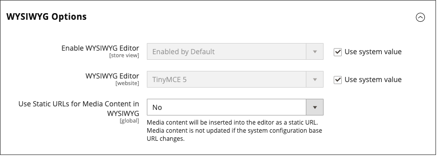

# 動態媒體URL

動態媒體URL是影像或其他媒體資產的相對參照。 啟用後，動態媒體URL可用於直接連結至您伺服器上的資產，或連結至儲存在[內容傳遞網路](media-storage-content-delivery-network.md)上的檔案。 使用動態媒體URL可能會影響目錄效能，而且可以將[編輯器](editor.md#configure-the-editor)設定為使用靜態或動態媒體URL。

和所有[標籤標籤](../systems/markup-tags.md)一樣，指示詞會以雙大括弧括住。 動態媒體URL的格式如下所示：

`\{\{media url="path/to/image.jpg"}}`

頁面在店面轉譯時，動態URL指示詞會從儲存的HTML內容進行處理。 每次呈現頁面時，都會掃描內容`\{\{media url="..."}}`，並將每個指示詞取代為對應的媒體URL。

{{$include /help/_includes/directives-caution.md}}

## 設定靜態媒體URL

依預設，從WYSIWYG編輯器插入目錄中的影像會有相對的動態URL。 如果您偏好使用靜態URL，可以變更組態設定。

1. 在&#x200B;_管理員_&#x200B;側邊欄上，移至&#x200B;**[!UICONTROL Stores]** > _[!UICONTROL Settings]_>**[!UICONTROL Configuration]**。

1. 在左側面板的&#x200B;_[!UICONTROL General]_下，選擇&#x200B;**[!UICONTROL Content Management]**。

1. 展開&#x200B;**[!UICONTROL WYSIWYG Options]**&#x200B;區段的。

   {width="600" zoomable="yes"}

1. 將&#x200B;**[!UICONTROL Use Static URLs for Media Content in WYSIWYG]**&#x200B;設定為下列其中一項：

   - `Yes` — 針對以WYSIWYG編輯器插入的媒體內容使用靜態URL。 靜態URL是絕對的，如果存放區的[基底URL](../stores-purchase/store-urls.md)變更，則會中斷。

   - `No` - （預設）根據`\{\{media url="..."}}`指示詞，對透過WYSIWYG編輯器插入的媒體內容使用動態URL。 動態URL是相對的，如果商店的基本URL有所變更，則不會中斷。

1. 完成時，按一下&#x200B;**[!UICONTROL Save Config]**。
