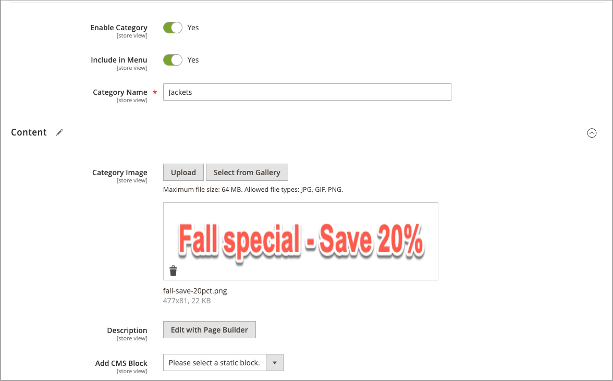

# 將專案新增至行銷活動

{{ee-feature}}

下列範例會在行銷活動期間將促銷影像新增至類別頁面。 您也可以對產品頁面或CMS頁面執行相同操作。

## 為類別新增行銷活動專案

1. 在&#x200B;_管理員_&#x200B;側邊欄上，移至&#x200B;**[!UICONTROL Catalog]** > **[!UICONTROL Categories]**。

1. 找到您要在行銷活動中使用的類別，並以編輯模式開啟。

1. 按一下&#x200B;**[!UICONTROL Schedule New Update]**。

1. 選取&#x200B;**[!UICONTROL Assign to Existing Campaign]**。

1. 在清單中，選取要修改的行銷活動。

   {width="600" zoomable="yes"}

1. 展開 **[!UICONTROL Content]**。

1. 針對&#x200B;**[!UICONTROL Category Image]**，按一下&#x200B;**[!UICONTROL Upload]**&#x200B;並選取行銷活動期間要顯示在類別頁面上的影像。

   {width="600" zoomable="yes"}

1. 完成時，按一下&#x200B;**[!UICONTROL Save]**。

## 驗證專案

1. 在&#x200B;_管理員_&#x200B;側邊欄上，移至&#x200B;**[!UICONTROL Content]** > _[!UICONTROL Content Staging]_>**[!UICONTROL Dashboard]**。

1. 在顯示的清單或時間軸中尋找促銷活動，並開啟它以存取詳細資訊：

   - 若要顯示清單，請按一下&#x200B;**[!UICONTROL Select]**，然後在&#x200B;_[!UICONTROL Action]_&#x200B;欄中按一下&#x200B;**[!UICONTROL View/Edit]**。
   - 若要顯示時間表，請按一下以顯示摘要，然後按一下&#x200B;**[!UICONTROL View/Edit]**。

   {width="600" zoomable="yes"}

1. 展開 **[!UICONTROL Categories]**&#x200B;以檢視指派類別的清單。

1. 若要在行銷活動作用中時檢閱類別的頁面，請返回儀表板，再次按一下行銷活動，然後按一下&#x200B;**[!UICONTROL Preview]**。
