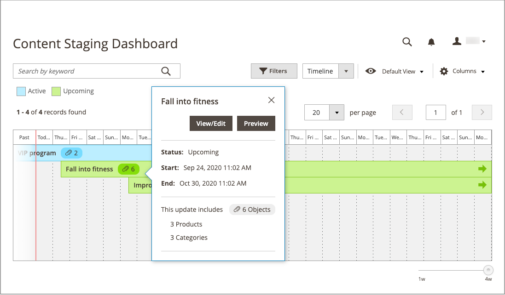

# 內容中繼儀表板

{{ee-feature}}

此 [!UICONTROL Content Staging] 控制面板提供所有作用中及即將發生的行銷活動的概覽。 圖示板的格式可從格線變更為時間軸。 您也可以使用篩選器來尋找行銷活動、自訂欄版面配置，以及儲存格線的不同檢視。 如需有關工作區控制項的詳細資訊，請參閱 [管理員工作區](../getting-started/admin-workspace.md).

{width="600" zoomable="yes"}

## 檢視測試儀表板

1. 在 _管理員_ 側欄，前往  **[!UICONTROL Content]** > _[!UICONTROL Content Staging]_>**[!UICONTROL Dashboard]**.

1. 若要變更圖示板的格式，請設定 **[!UICONTROL View As]** 控制項至 `list`， `Grid`，或 `Timeline`.

   {width="600" zoomable="yes"}

   顯示時間軸時，可使用右下角的滑桿將檢視從一週調整為四周。 每一欄代表一天。

1. 如果時間軸已顯示，請將滑桿拖曳至 `4w` 位於最右側，以檢視較長的時間範圍。

   {width="600" zoomable="yes"}

1. 若要顯示促銷活動的一般資訊，請按一下頁面上的任何專案。

   - 若要開啟行銷活動，請按一下 **[!UICONTROL View/Edit]**.

   - 若要檢視當日在商店中看到的行銷活動外觀，請按一下 **[!UICONTROL Preview]**.

   {width="600" zoomable="yes"}

## 中繼儀表板欄說明

| 欄 | 說明 |
|--- |--- |
| [!UICONTROL Status] | 行銷活動的狀態。 `Active` 或 `Upcoming`. |
| [!UICONTROL Update Name] | 行銷活動的名稱。 |
| [!UICONTROL Includes] | 定義行銷活動中包含多少物件。 |
| [!UICONTROL Start Time] | 行銷活動開始的日期。 |
| [!UICONTROL End Time] | 行銷活動結束的日期。 |
| [!UICONTROL Description] | 每個行銷活動的額外說明。 |
| [!UICONTROL Action] | 可套用至個別記錄的動作包括： **[!UICONTROL View/Edit]**— 以編輯模式開啟行銷活動。 **[!UICONTROL Preview]**  — 在預覽模式下顯示行銷活動。 |

{style="table-layout:auto"}

## 編輯行銷活動

除了沒有結束日期的價格規則行銷活動外，您都可以從測試儀表板編輯現有的行銷活動物件。

>[!NOTE]
>
>如果最初建立的行銷活動包含價格規則，但沒有結束日期，則無法在稍後編輯行銷活動以包含結束日期。 在這種情況下，必須建立重複的行銷活動並輸入所需的結束日期。

{width="600" zoomable="yes"}

此範例中的行銷活動包含兩個類別和三個個別產品。

請依照下列步驟，編輯此行銷活動中的任何物件。

1. 在 _管理員_ 側欄，前往  **[!UICONTROL Content]** > _[!UICONTROL Content Staging]_>**[!UICONTROL Dashboard]**.

1. 在顯示的清單或時間軸中尋找促銷活動，並開啟它以存取詳細資訊：

   - 若要顯示清單，請按一下 **[!UICONTROL Select]** 然後 **[!UICONTROL View/Edit]** 在 _[!UICONTROL Action]_欄。
   - 若要顯示時間軸，請按一下以顯示摘要，然後按一下 **[!UICONTROL View/Edit]**.

1. 更新中的任何設定 _[!UICONTROL General]_區段。

1. 展開  包含要編輯之專案的任何區段。

   {width="600" zoomable="yes"}

1. 按一下 **[!UICONTROL Save]**.
