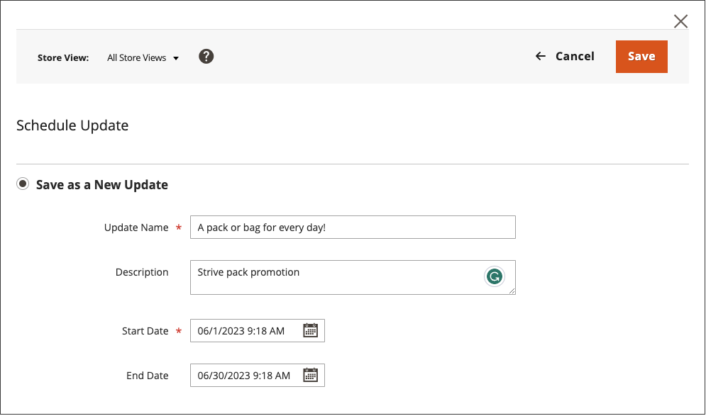
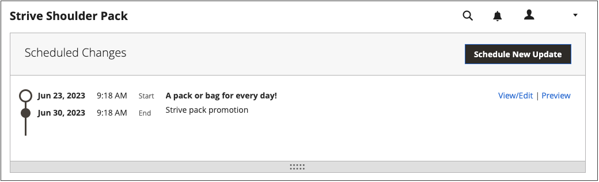

# 排程內容更新

{{ee-feature}}

下列範例說明如何排程產品的暫時價格變更。 其中包括排程和預覽變更，以及檢視行事曆上的排程更新。 雖然此範例僅包含單一變更，但行銷活動可能包括對產品、價格規則、CMS頁面和其他排程同時發生的實體進行多項變更。 按照類似的方法指定[!UICONTROL Set Product As New]屬性的起始/終止日期。

>[!NOTE]
>您必須建立排定的更新，以指定[!UICONTROL Set Product As New]的開始（和結束）日期。 對於[!UICONTROL Special Price]和[!UICONTROL Design Change]，起始/截止日期欄位會從Adobe Commerce中移除，且僅適用於Magento Open Source。
>
>所有排定的更新都會連續套用，這表示任何實體一次只能有一個排定的更新。 任何排定的更新都會套用至其時間範圍內的所有存放區檢視。 因此，實體無法同時針對不同的存放區檢視有不同的排程更新。 所有存放區檢視中的所有實體屬性值（不受目前排程更新影響）都是從預設值取得，而不是從先前的排程更新取得。

## 排程產品的更新

1. 從&#x200B;_[!UICONTROL Products]_&#x200B;格線中，以編輯模式開啟產品。

1. 在頁面頂端的&#x200B;_[!UICONTROL Scheduled Changes]_&#x200B;方塊中，按一下&#x200B;**[!UICONTROL Schedule New Update]**。

   {width="600" zoomable="yes"}

1. 選取&#x200B;**[!UICONTROL Save as a New Update]**&#x200B;選項後，設定更新的基本引數：

   - 針對&#x200B;**[!UICONTROL Update Name]**，輸入新內容預備行銷活動的名稱。

   - 請輸入簡短的更新&#x200B;**[!UICONTROL Description]**&#x200B;及其使用方式。

   - 使用行事曆（）工具為行銷活動選擇&#x200B;**開始日期**&#x200B;和&#x200B;**結束日期**。

     若要建立無限制的促銷活動，請勿指定結束日期（保留空白）。 在此範例中，促銷活動排程從新年的午夜開始（2021年1月1日太平洋標準時間凌晨12:00）。

     針對建立時不含結束日期的價格規則行銷活動，無法在稍後新增結束日期。 在這種情況下，必須建立行銷活動，並將開始日期設定為您想要舊行銷活動結束和新行銷活動開始的日期。 在該開始日期時，舊行銷活動會依定義結束，新行銷活動則會開始。

     {width="600" zoomable="yes"}

     >[!NOTE]
     >
     >行銷活動的開始日期和結束日期必須使用&#x200B;**_預設值_**&#x200B;管理時區來定義，該時區會從每個網站的當地時區轉換。 例如，如果您有多個網站位在不同時區，但您想要根據美國（預設）時區啟動促銷活動，則必須為每個當地時區排程個別的更新。 在此情況下，請將&#x200B;**[!UICONTROL Start Date]**&#x200B;和&#x200B;**[!UICONTROL End Date]**&#x200B;設為從每個本機網站時區轉換為預設管理時區。

1. 向下捲動至&#x200B;_[!UICONTROL Price]_&#x200B;並按一下&#x200B;**[!UICONTROL Advanced Pricing]**。

1. 在排定的行銷活動期間輸入產品的&#x200B;**[!UICONTROL Special Price]**，然後按一下&#x200B;**[!UICONTROL Done]**。

1. 完成時，按一下&#x200B;**[!UICONTROL Save]**。

   排定的變更會顯示在產品頁面的頂端，其中包含行銷活動的開始和結束日期。

   {width="600" zoomable="yes"}

## 編輯排定的變更

1. 在頁面頂端的&#x200B;_排程變更_&#x200B;方塊中，按一下&#x200B;**[!UICONTROL View/Edit]**。

1. 進行排程更新所需的任何變更。

1. 按一下&#x200B;**[!UICONTROL Save]**。

## 預覽排定的變更

在頁面頂端的&#x200B;_排程變更_&#x200B;方塊中，按一下&#x200B;**[!UICONTROL Preview]**。

預覽會開啟新的瀏覽器索引標籤，並顯示產品在排程行銷活動期間的顯示方式。

>[!NOTE]
>
>排程更新的預備預覽一律從&#x200B;**預設**&#x200B;存放區檢視開始，這模擬客戶瀏覽預備更新行銷活動的體驗。

如需使用預覽內容工具變更預覽日期和範圍的詳細資訊，請參閱[預覽行銷活動](content-staging-preview.md)。 您也可以與同事共用商店預覽的連結。
