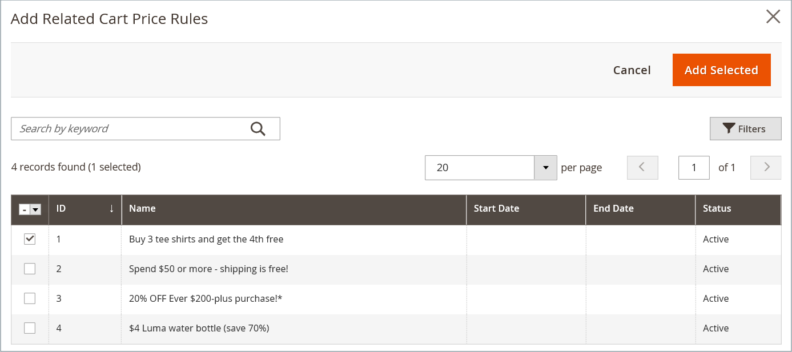

# 價格規則中的動態區塊

{{ee-feature}}

您建立的任何[動態區塊](dynamic-blocks.md)都可以與促銷活動相關聯。 若要建立關聯，您必須先建立動態區塊和[目錄價格規則](../merchandising-promotions/price-rules-catalog.md)或[購物車價格規則](../merchandising-promotions/price-rules-cart.md)。 您可以在處理價格規則或處理動態區塊時建立關聯。

>[!IMPORTANT]
>
>建立此關聯後，規則引發時動態區塊只會&#x200B;**顯示**。 如果促銷是以區段A為目標，則會顯示區塊以區段A為目標。如果促銷活動不在作用中，則不會顯示區塊。

## 將動態區塊與價格規則產生關聯

1. 在&#x200B;_管理員_&#x200B;側邊欄上，前往&#x200B;**[!UICONTROL Marketing]** > _[!UICONTROL Promotions]_並選擇下列其中一項：

   - **[!UICONTROL Catalog Price Rules]**
   - **[!UICONTROL Cart Price Rules]**

1. 在格線中，尋找要與動態區塊關聯的規則，並在編輯模式中開啟。

1. 向下捲動並展開 **[!UICONTROL Related Dynamic Blocks]**。

1. 在第一欄中，將篩選器設定為`Any`並按一下&#x200B;**[!UICONTROL Reset Filter]**。

   格線現在會列出所有可用的動態區塊。

1. 選取您想要與規則關聯的每個動態區塊的核取方塊。

   {width="600" zoomable="yes"}

1. 完成時，按一下&#x200B;**[!UICONTROL Save]**。

## 將價格規則與動態區塊產生關聯

1. 在&#x200B;_管理員_&#x200B;側邊欄上，移至&#x200B;**[!UICONTROL Content]** > _[!UICONTROL Elements]_>**[!UICONTROL Dynamic Blocks]**。

1. 在格線中尋找動態區塊，並在編輯模式中開啟。

1. 向下捲動並展開&#x200B;**[!UICONTROL Related Promotions]**。

   目前所有關聯的價格規則都會顯示在網格中。

1. 新增新的關聯規則或移除目前的關聯。

   - 若要關聯購物車促銷活動，請按一下&#x200B;**[!UICONTROL Add Cart Price Rules]**。

   - 若要關聯產品相關促銷活動，請按一下&#x200B;**[!UICONTROL Add Catalog Price Rules]**。

1. 在格線中，選取要與動態區塊產生關聯的每個規則的核取方塊。

1. 按一下&#x200B;**[!UICONTROL Add Selected]**。

   {width="600" zoomable="yes"}

1. 完成時，按一下&#x200B;**[!UICONTROL Save]**。
