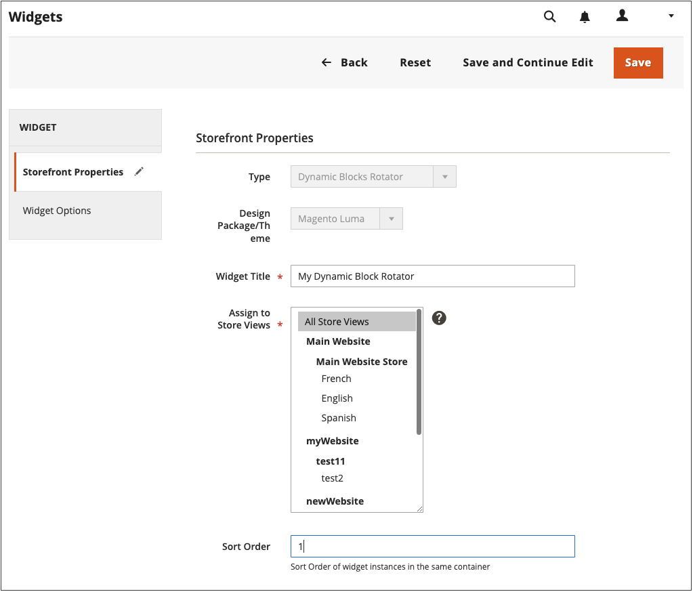
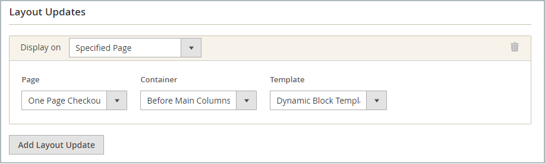
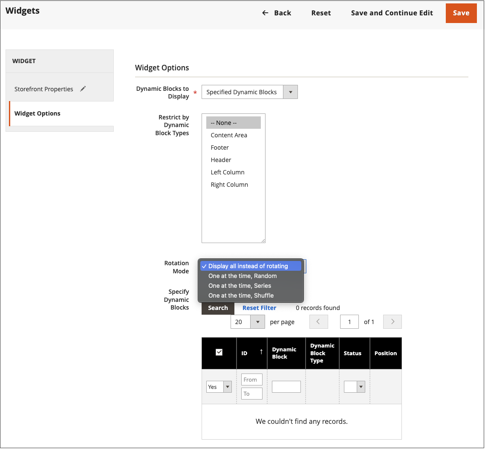

# 新增旋轉動態區塊

{{ee-feature}}

若要呈現互動式內容的投影片放映，您可以新增多個 [動態區塊](dynamic-blocks.md) 至旋轉器。 此 [Widget](widgets.md) 工具可用來將旋轉器放置在單一頁面上的特定位置，或是整個商店中的多個頁面上。

{width="700" zoomable="yes"}

## 步驟1：建立個別的動態區塊

至 [建立動態區塊](dynamic-blocks.md) 要放置在旋轉器中的物件，請遵循下列指示：

## 步驟2：新增動態區塊旋轉器Widget

1. 在 _管理員_ 側欄，前往 **[!UICONTROL Content]** > _[!UICONTROL Elements]_>**[!UICONTROL Widgets]**.

1. 在右上角，按一下 **[!UICONTROL Add Widget]**.

1. 在 _設定_，設定 **[!UICONTROL Type]** 至 `Dynamic Blocks Rotator`.

1. 選擇目前的 **[!UICONTROL Design Theme]** 存放區的。

   此設定會識別目前的封裝，或 [主題](themes.md) 決定商店的頁面配置。

1. 按一下 **[!UICONTROL Continue]**.

   {width="600" zoomable="yes"}

## 步驟3：完成選項

1. 在 _店面屬性_，設定選項：

   - 輸入 **[!UICONTROL Title]** 以取得旋轉體。

   - 在 **[!UICONTROL Assign to Store Views]** 清單中，選取 [存放區檢視](../getting-started/websites-stores-views.md) 旋轉器可用的位置。

   - （選擇性）輸入 **[!UICONTROL Sort Order]** 用於決定旋轉器在目標容器中的位置的編號。 此元件是相對於其他可指派給相同容器的Widget而定。

   {width="600" zoomable="yes"}

1. 在 _配置選項_，按一下 **[!UICONTROL Add Layout Update]** 並執行下列動作：

   - 設定 **[!UICONTROL Display on]** 至旋轉器將出現的頁面或頁面型別。

      - `Categories`  — 顯示旋轉器 [錨點](../catalog/navigation-layered.md) 或非錨點類別頁面。 選項：錨點類別/非錨點類別
      - `Products`  — 在特定型別的產品頁面上或所有產品頁面上顯示旋轉器。 選項：所有產品型別/ [簡單產品](../catalog/product-create-simple.md) /  [虛擬產品](../catalog/product-create-virtual.md) / [套裝產品](../catalog/product-create-bundle.md) / [可下載的產品](../catalog/product-create-downloadable.md) / [禮品卡](../catalog/product-gift-card-create.md) / [可設定的產品](../catalog/product-create-configurable.md) / [已分組的產品](../catalog/product-create-grouped.md)
      - `Generic Pages`  — 在所有頁面、特定頁面上，或只在具有特定版面的頁面上顯示旋轉器。 選項： `All Pages` / `Specified Page` / `Page Layouts`

     在此範例中，旋轉器將被放置在 `Specified Page`.

   - 選取特定 **[!UICONTROL Page]** 旋轉器的顯示位置。

   - 設定 **[!UICONTROL Container]** 至部分 [頁面配置](page-layout.md#standard-page-layouts) 旋轉器的顯示位置。

     如果將其他Widget指派給相同的容器，它們會根據排序順序依序出現。

   - Accept `Dynamic Block Template` 作為預設值 **[!UICONTROL Template]**.

     此設定會根據旋轉器是獨立或置於現有文字中來決定用來格式化旋轉器的範本。

     {width="600" zoomable="yes"}

   - 按一下 **[!UICONTROL Save and Continue Edit]**.

1. 在左側面板中，選擇 **[!UICONTROL Widget Options]**.

1. 對於 **[!UICONTROL Dynamic Blocks to Display]**，接受 `Specified Dynamic Blocks`.

   此設定決定旋轉器中包含的動態區塊型別。

   - `Specified Dynamic Blocks`  — 僅包含特定動態區塊。
   - `Cart Price Rule Related`  — 僅包含與購物車價格規則關聯的動態區塊。
   - `Catalog Price Rule Related`  — 僅包含與型錄價格規則相關聯的動態區塊。

1. 至 **[!UICONTROL Restrict the Dynamic Block Types]** 選取可與Widget搭配使用的 `Content Area`.

   此設定會將橫幅限制在頁面配置的特定部分。

   - `Content Area`  — 將動態區塊放置在頁面的主要內容區域中。
   - `Footer`  — 將動態區塊放置在頁尾中。
   - `Header`  — 將動態區塊放置在頁首中。
   - `Left Column`  — 將動態區塊放置在頁面配置的左欄（如果有的話）。
   - `Right Column`  — 將動態區塊放置在頁面配置的右欄（如果有的話）。

1. 設定 **[!UICONTROL Rotation Mode]** 變更為下列其中一項：

   - `Display all instead of rotating`  — 顯示動態區塊的棧疊，所有區塊皆可見。
   - `One at a time, Random`  — 以隨機順序顯示指定的動態區塊。 重新整理頁面時，會出現另一個（和隨機）動態區塊。
   - `One at the time, Series`  — 顯示新增順序中的指定動態區塊。 重新整理頁面時，序列中的下一個動態區塊就會出現。
   - `One at the time, Shuffle`  — 以隨機排列順序一次顯示一個動態區塊。 此選項類似於 `One at a time, Random` 選項，但不會重複相同的動態區塊。

     {width="600" zoomable="yes"}

1. 在 **[!UICONTROL Specify Dynamic Blocks]** 格點，選取每一個要包含在旋轉器中的動態區塊的核取方塊。

1. 完成後，按一下 **[!UICONTROL Save]**.
