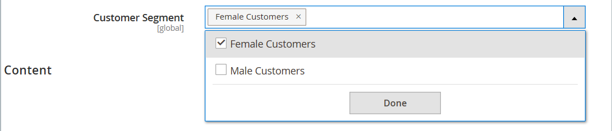
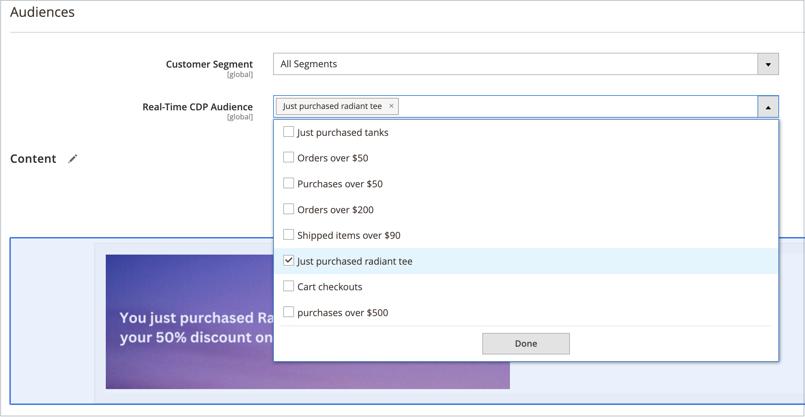

# 動態區塊

{{ee-feature}}

建立以[價格規則](../merchandising-promotions/introduction.md#price-rules)和[客戶區段](../customers/customer-segments.md)的邏輯驅動的豐富互動式內容。 現有的[動態區塊](../page-builder/dynamic-block.md)可直接新增至[!DNL Page Builder] [階段](../page-builder/workspace.md)。 如需使用動態區塊的詳細逐步範例，請參閱[教學課程2：區塊](../page-builder/2-blocks.md)。

>[!NOTE]
>
>[[!UICONTROL Content]功能表](content-menu.md)中的&#x200B;_[!UICONTROL Banner]_&#x200B;選項在2.3.1中已過時，在2.4.0中已移除。其功能已由動態區塊取代。

![[!DNL Page Builder] — 具有價格規則和客戶區段的動態區塊](../page-builder/assets/pb-tutorial2-dynamic-block-storefront.png){width="600" zoomable="yes"}

## 步驟1：建立動態區塊

1. 在&#x200B;_管理員_&#x200B;側邊欄上，移至&#x200B;**[!UICONTROL Content]** > _[!UICONTROL Elements]_>**[!UICONTROL Dynamic Blocks]**。

   {width="600" zoomable="yes"}

1. 按一下右上角的&#x200B;**[!UICONTROL Add Dynamic Block]**。

   {width="600" zoomable="yes"}

1. 如果適用，請將&#x200B;**[!UICONTROL Store View]**&#x200B;設定為要顯示動態區塊的特定存放區檢視。

1. 若要啟用動態區塊，請將&#x200B;**[!UICONTROL Enable Dynamic Block]**&#x200B;設為`Yes`。

1. 如需內部參考，請輸入描述性&#x200B;**[!UICONTROL Dynamic Block Name]**。

1. 將&#x200B;**[!UICONTROL Dynamic Block Type]**&#x200B;設定為您要顯示動態區塊的頁面區域，然後按一下&#x200B;**[!UICONTROL Done]**。

   {width="500" zoomable="yes"}

1. 在&#x200B;**[!UICONTROL Customer Segment]**&#x200B;清單中，選取您要檢視動態區塊之每個區段的核取方塊，然後按一下&#x200B;**[!UICONTROL Done]**&#x200B;以儲存設定。

   {width="500" zoomable="yes"}

   >[!NOTE]
   >
   >- 如果未建立任何區段，則每個人都可以看見動態區塊。
   >- 如果客戶不屬於任何區段，且已針對所有區段建立動態區塊，仍會顯示動態區塊的內容。
   >- 如果刪除指派給動態區塊的所有客戶區段，其內容便會顯示給每個人。

### 在動態區塊中使用Real-Time CDP對象

如果您[已安裝](../customers/audience-activation.md#install-the-extension)且[已設定](../customers/audience-activation.md#configure-the-extension) [!DNL Audience Activation]擴充功能，您會看到名為&#x200B;**[!UICONTROL Audiences]**&#x200B;的區段。

{width="600" zoomable="yes"}

在&#x200B;**[!UICONTROL Real-Time CDP Audience]**&#x200B;清單中，選取您要檢視動態區塊之每個對象的核取方塊，然後按一下&#x200B;**[!UICONTROL Done]**&#x200B;以儲存設定。

## 步驟2：完成內容

使用[!DNL Page Builder] [工作區](../page-builder/workspace.md)完成內容。

![[!DNL Page Builder] — 動態區塊工作區](../page-builder/assets/pb-dynamic-block-workspace.png){width="600" zoomable="yes"}

## 步驟3：選擇相關促銷活動

1. 向下捲動並展開 **[!UICONTROL Related Promotions]**。

1. 按一下您要與動態區塊關聯的促銷活動型別：

   - **[!UICONTROL Add Cart Price Rules]** （請參閱[購物車價格規則](../merchandising-promotions/price-rules-cart.md)）

   - **[!UICONTROL Add Catalog Price Rules]** （請參閱[目錄價格規則](../merchandising-promotions/price-rules-catalog.md)）

   >[!NOTE]
   >
   >Real-Time CDP受眾不支援目錄價格規則。

1. 在可用規則清單中，選取要使用的每個規則的核取方塊，然後按一下&#x200B;**[!UICONTROL Add Selected]**。

1. 當動態區塊完成時，按一下&#x200B;**[!UICONTROL Save]**。

## 步驟4：將動態區塊新增至頁面

1. 開啟您要顯示動態區塊的頁面。

1. 使用[[!UICONTROL Add Dynamic Block]](../page-builder/dynamic-block.md)內容型別將動態區塊新增至階段。

## 欄位和工具說明

| 欄位 | 說明 |
|--- |--- |
| [!UICONTROL Store View] | 指定動態區塊可用的存放區檢視。 |
| [!UICONTROL Enable Dynamic Block] | 啟用或停用動態區塊。 選項：是/否 |
| [!UICONTROL Dynamic Block Name] | 在Admin中識別動態區塊的描述性名稱。 |
| [!UICONTROL Dynamic Block Type] | 識別[標準頁面配置](layout-updates.md)中動態區塊放置的位置。 選項：  **[!UICONTROL Content Area]**— 將動態區塊置於頁面的主要[內容區域](layout-updates.md)。 **[!UICONTROL Footer]** — 將動態區塊放置在頁面[頁尾](page-setup.md#footer)中。  **[!UICONTROL Header]**— 將動態區塊放置在頁面[標頭](page-setup.md#header)中。 **[!UICONTROL Left Column]** — 將動態區塊放置在二或三欄配置之[左側邊欄](page-layout.md#standard-page-layouts)中。  **[!UICONTROL Right Column]**— 將動態區塊置於兩欄或三欄式佈局的[右側邊欄](page-layout.md#standard-page-layouts)中。 |
| 客戶區段 | 將客戶區段與動態區塊建立關聯，以決定哪些客戶可以看到它。 |
| Real-Time CDP對象 | 將[Real-Time CDP對象](../customers/audience-activation.md)與動態區塊建立關聯，以判斷哪些客戶可以看到它。 |

{style="table-layout:auto"}

### 內容

| 欄位 | 說明 |
|--- |--- |
| [!UICONTROL Layout] | 將列、欄或標籤新增至舞台。 |
| [!UICONTROL Elements] | 將文字、標題、按鈕、分隔線和HTML程式碼新增至「舞台」上的任何版面容器。 |
| [!UICONTROL Media] | 將影像、影片、橫幅、滑桿和Google地圖新增至「舞台」上任何現有的版面容器。 |
| [!UICONTROL Add Content] | 將現有區塊、動態區塊和產品新增到舞台。 |

{style="table-layout:auto"}

### 相關促銷活動

| 欄位 | 說明 |
|--- |--- |
| [!UICONTROL Related Cart Price Rule] | **[!UICONTROL Add Cart Price Rules]** — 將現有的[購物車價格規則](../merchandising-promotions/price-rules-cart.md)與動態區塊建立關聯，以作為促銷活動。 |
| [!UICONTROL Related Catalog Price Rule] | **[!UICONTROL Add Catalog Price Rules]** — 將現有的[目錄價格規則](../merchandising-promotions/price-rules-catalog.md)與動態區塊建立關聯，以作為促銷活動。 |

{style="table-layout:auto"}
