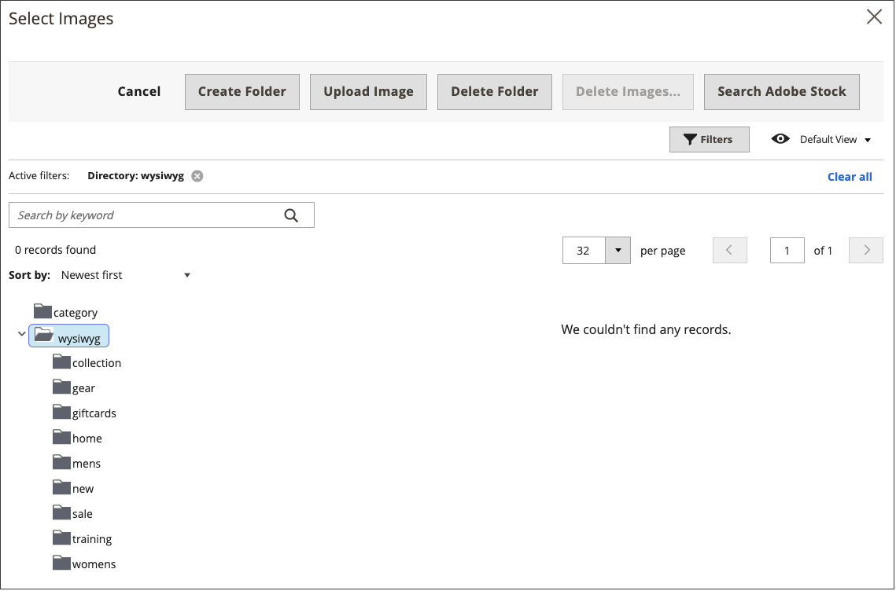

# 在編輯器中插入影像

在編輯器中，您可以使用三種來源型別插入影像：

- 新增已上傳至[媒體儲存空間](media-storage.md)的影像
- 連結至位於另一部伺服器上的影像
- 使用Adobe Stock整合來搜尋及使用Adobe Stock資產

{width="650" zoomable="yes"}

1. 在編輯模式中開啟頁面、區塊或動態區塊。

1. 移至&#x200B;_[!UICONTROL Content]_&#x200B;區段，然後按一下任何支援編輯器的元素。

1. 將游標放在您要顯示影像的位置。

1. 在編輯器工具列上，按一下&#x200B;_插入影像_&#x200B;圖示。

   {width="700" zoomable="yes"}

   此動作會開啟&#x200B;_[!UICONTROL Insert/edit image]_&#x200B;對話方塊。

1. 若為&#x200B;**Source**，請按一下&#x200B;_搜尋_&#x200B;圖示，並使用符合您要使用之影像資產位置的方法：

   {width="250" zoomable="yes"}

   - **上傳新影像**：使用此方法來上傳新影像檔案。

      - 在樹狀結構中選取要新增影像檔案的資料夾。

      - 按一下&#x200B;**[!UICONTROL Choose Files]**。

      - 找到並選擇影像檔案。

      - 按一下新檔案的縮圖，然後按一下&#x200B;**[!UICONTROL Add Selected]**。

   - **選取現有資產**：使用此方法從媒體儲存/媒體集選取現有影像資產。

      - 使用樹狀結構導覽至影像。

      - 按一下縮圖並按一下&#x200B;**[!UICONTROL Add Selected]**。

   - **搜尋並選取Adobe Stock影像**：使用此方法從Adobe Stock尋找影像。

     >[!NOTE]
     >
     >此方法需要為您的管理員設定[Adobe Stock整合](adobe-stock.md)。

      - 按一下&#x200B;**[!UICONTROL Search Adobe Stock]**&#x200B;並搜尋影像。

      - 將預覽或授權的影像儲存至相簿。

        如需使用[Adobe Stock](https://stock.adobe.com)資產的詳細資訊，請參閱[使用Adobe Stock影像](adobe-stock-manage.md)。

      - 選取相簿中的資產縮圖，然後按一下&#x200B;**[!UICONTROL Add Selected]**。

1. 針對&#x200B;**[!UICONTROL Image Description]**，輸入影像的簡短描述。

1. 輸入寬度和高度&#x200B;**[!UICONTROL Dimensions]** （以畫素為單位），以呈現頁面上的影像。

   保持選取&#x200B;**[!UICONTROL Constrain proportions]**&#x200B;核取方塊，以自動維持影像的外觀比例。

1. 按一下&#x200B;**[!UICONTROL Insert]**&#x200B;以完成程式。
