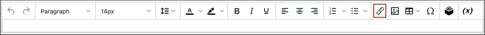

# 在編輯器中插入連結

插入連結的簡單方法是使用[編輯器](editor.md)工具列中的&#x200B;_連結_&#x200B;按鈕。 這不需要任何HTML知識，且結果相同。

1. 選取您要建立連結的文字。

1. 按一下編輯器工具列中的&#x200B;_插入/編輯連結_&#x200B;圖示。

   {width="700" zoomable="yes"}

   此動作會開啟&#x200B;_[!UICONTROL Insert link]_對話方塊。

   {width="250" zoomable="yes"}

1. 針對&#x200B;**[!UICONTROL Url]**，輸入下列其中一項：

   - 商店中頁面的URL索引鍵。

   - 要連結的外部頁面的完整URL。

1. 如有需要，請修改&#x200B;**[!UICONTROL Text to display]**。

   預設值是您為連結選取的文字。 您可以在文字方塊中加以變更。

1. 針對&#x200B;**[!UICONTROL Title]**，輸入當有人將滑鼠懸停在連結上時要顯示的工具提示文字。

1. 將&#x200B;**[!UICONTROL Target]**&#x200B;設定為下列其中一項：

   - `Open link in the same window`

   - `Open in a new window`

1. 若要建立連結，請按一下&#x200B;**[!UICONTROL OK]**。
