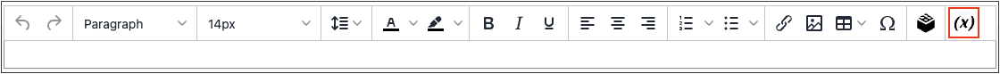

# 在編輯器中插入變數

您的存放區包含許多預先定義的[變數](../systems/variables-predefined.md)，這些變數可併入頁面內容和其他通訊中。 此外，您也可以包含您自己的[自訂變數](../systems/variables-custom.md)，這些變數是您的特定需求。

1. 在編輯模式中開啟頁面、區塊或動態區塊。

1. 移至&#x200B;_[!UICONTROL Content]_&#x200B;區段，然後按一下任何支援編輯器的元素。

1. 將游標放在您要變數出現的位置，然後按一下&#x200B;_插入變數_&#x200B;圖示。

   {width="700" zoomable="yes"}

   如果您未啟用[!UICONTROL Page Builder]，且偏好使用HTML程式碼，請按一下&#x200B;**[!UICONTROL Show / Hide Editor]**。 將插入點放置在要顯示變數的文字中。 然後，按一下&#x200B;**[!UICONTROL Insert Variable]**。

1. 在可用變數清單中，選擇您要的變數，然後按一下&#x200B;**[!UICONTROL Insert Variable]**。

   {width="600" zoomable="yes"}

1. 當您的內容編輯完成時，按一下&#x200B;**[!UICONTROL Save]**。
