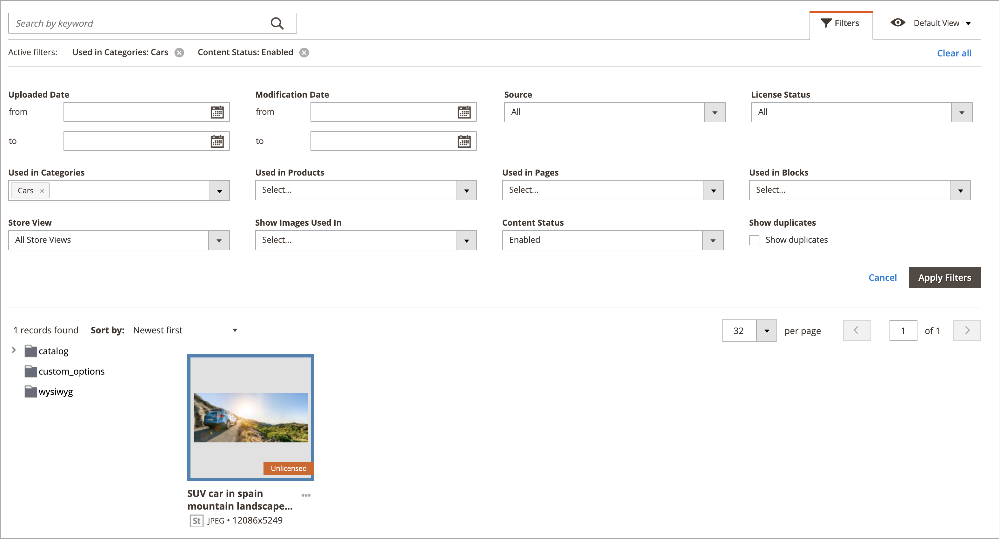

# 媒體集資產管理

新的 [媒體集](media-gallery.md) 提供管理工具，用於管理已上傳的媒體檔案，以及您透過 [Adobe Stock整合](adobe-stock.md). 如果您已儲存Adobe Stock [影像預覽](adobe-stock-save-preview.md)，您也可以 [授權](adobe-stock-license-image.md) 新媒體集中的影像。

## 上傳資產

1. 在 _管理員_ 側欄，前往 **[!UICONTROL Content]** > _[!UICONTROL Media]_>**[!UICONTROL Media Gallery]**.

1. 按一下 **[!UICONTROL Upload Image]**.

1. 選取要上傳的檔案。

   選取的資產會自動上傳至選取的資料夾（如果沒有選取資料夾，則會上傳至儲存根目錄）。

## 檢視資產詳細資訊

1. 在 _管理員_ 側欄，前往 **[!UICONTROL Content]** > _[!UICONTROL Media]_>**[!UICONTROL Media Gallery]**.

1. 按一下資產下方的三個點({width="10" zoomable="no"})，然後按一下 **[!UICONTROL View Details]**.

   {width="600" zoomable="yes"}

   資產詳細資訊會顯示在幻燈片面板上。 其中包含使用資產的資訊：

   - **[!UICONTROL Categories]**
   - **[!UICONTROL Products]**
   - **[!UICONTROL Pages]**
   - **[!UICONTROL Blocks]**

   {width="600" zoomable="yes"}

   若要檢視詳細資訊，請按一下 **[!UICONTROL Used In]** 連結。 下列範例中的格線顯示使用特定資產的所有類別。

   {width="600" zoomable="yes"}

   您也可以從以下位置刪除資產： _檢視詳細資料_ 區段。

## 編輯資產

1. 在 _管理員_ 側欄，前往 **[!UICONTROL Content]** > _[!UICONTROL Media]_>**[!UICONTROL Media Gallery]**.

1. 按一下資產下方的三個點({width="10" zoomable="no"})，然後按一下 **[!UICONTROL Edit]**.

   {width="600" zoomable="yes"}

1. 如有需要，請變更下列其中一個中繼資料值：

   - **[!UICONTROL Title]**
   - **[!UICONTROL Description]**
   - **[!UICONTROL Tags/Keywords]**

   此資料會儲存至資料庫和檔案中繼資料本身。 目前支援XMP和IPTC格式。

   您可以下載含有更新後中繼資料的影像。

## 使用資產

資產在整個管理員中皆可廣泛使用，例如 [新增或編輯頁面](page-add.md)， [建立或編輯類別](../catalog/category-create.md)，或 [從內容編輯器插入影像](editor-insert-image.md).

1. 從可讓您使用媒體資產的區域存取新的「媒體集」 。

1. 選取資產並按一下 **[!UICONTROL Add Selected]**.

{{$include /help/_includes/image-optimization-animated-gif-note.md}}

## 刪除資產

1. 在 _管理員_ 側欄，前往 **[!UICONTROL Content]** > _[!UICONTROL Media]_>**[!UICONTROL Media Gallery]**.

1. 按一下 **[!UICONTROL Delete Images...]** 並選取您要刪除之每個資產的核取方塊。

1. 在確認對話方塊中，按一下 **[!UICONTROL Delete Image]**.

   {width="500" zoomable="yes"}

## 搜尋資產

1. 在 _管理員_ 側欄，前往 **[!UICONTROL Content]** > _[!UICONTROL Media]_>**[!UICONTROL Media Gallery]**.

1. 使用 **[!UICONTROL Search by keywords]** 輸入以依據關鍵字/標籤執行影像搜尋。

   以下範例中的搜尋會尋找包含特定標籤(`mountain`)。

   {width="600" zoomable="yes"}

>[!NOTE]
>
>若要瞭解如何更新影像標籤，請參閱 _[編輯資產](#edit-an-asset)_ 區段。

## 篩選資產

>[!NOTE]
>
>此 _使用位置_ 功能需要 [!UICONTROL Media Gallery Image Optimization] 在中啟用 [組態設定](media-gallery-image-optimization.md).

1. 在 _管理員_ 側欄，前往 **[!UICONTROL Content]** > _[!UICONTROL Media]_>**[!UICONTROL Media Gallery]**.

1. 按一下 **[!UICONTROL Filters]** 標籤。

   {width="600" zoomable="yes"}

1. 設定篩選選項。

   您可以根據實體的使用情況來篩選資產：

   - **[!UICONTROL Used in Categories]**
   - **[!UICONTROL Used in Products]**
   - **[!UICONTROL Used in Pages]**
   - **[!UICONTROL Used in Blocks]**

   您也可以依據以下條件篩選資產： **[!UICONTROL Store View]**， **[!UICONTROL License Status]**、和 **[!UICONTROL Content Status]**. 設定日期範圍 **[!UICONTROL Uploaded Date]** 和/或 **[!UICONTROL Modification Date]** 以根據檔案日期篩選資產。

1. 按一下 **[!UICONTROL Apply Filters]** 以檢視結果。

   下列範例中的篩選會尋找用於特定類別(`cars`)和已啟用。

   {width="600" zoomable="yes"}

## 尋找影像重複專案

1. 按一下 **[!UICONTROL Filters]** 標籤並選取 **[!UICONTROL Show duplicates]** 核取方塊。

1. 若要檢視結果，請按一下 **[!UICONTROL Apply Filters]**.
