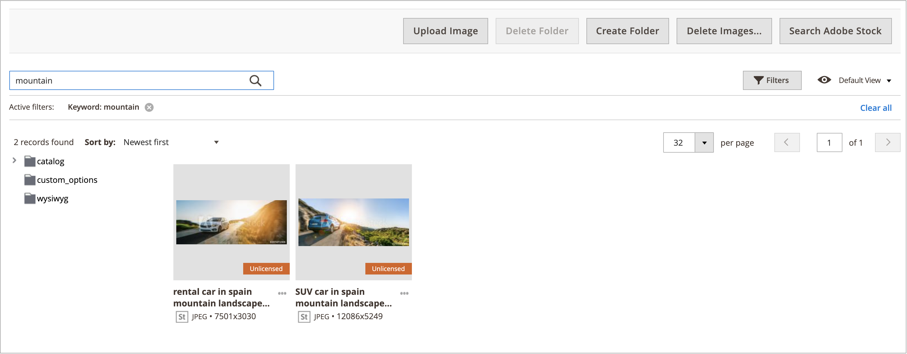

# 媒體集資產管理

新的[媒體集](media-gallery.md)提供管理已上傳媒體檔案的工具，以及您透過[Adobe Stock整合](adobe-stock.md)取得的資產。 如果您已儲存Adobe Stock [影像預覽](adobe-stock-save-preview.md)，您也可以在新的媒體集中授權[該影像](adobe-stock-license-image.md)。

## 上傳資產

1. 在&#x200B;_管理員_&#x200B;側邊欄上，移至&#x200B;**[!UICONTROL Content]** > _[!UICONTROL Media]_>**[!UICONTROL Media Gallery]**。

1. 按一下&#x200B;**[!UICONTROL Upload Image]**。

1. 選取要上傳的檔案。

   選取的資產會自動上傳至選取的資料夾（如果沒有選取資料夾，則會上傳至儲存根目錄）。

## 檢視資產詳細資訊

1. 在&#x200B;_管理員_&#x200B;側邊欄上，移至&#x200B;**[!UICONTROL Content]** > _[!UICONTROL Media]_>**[!UICONTROL Media Gallery]**。

1. 按一下資產下方的三個點（{width="10" zoomable="no"}），然後按一下&#x200B;**[!UICONTROL View Details]**。

   {width="600" zoomable="yes"}

   資產詳細資訊會顯示在幻燈片面板上。 其中包含使用資產的資訊：

   - **[!UICONTROL Categories]**
   - **[!UICONTROL Products]**
   - **[!UICONTROL Pages]**
   - **[!UICONTROL Blocks]**

   {width="600" zoomable="yes"}

   若要檢視詳細資料，請按一下&#x200B;**[!UICONTROL Used In]**&#x200B;連結。 下列範例中的格線顯示使用特定資產的所有類別。

   {width="600" zoomable="yes"}

   您也可以從&#x200B;_檢視詳細資料_&#x200B;區段中刪除資產。

## 編輯資產

1. 在&#x200B;_管理員_&#x200B;側邊欄上，移至&#x200B;**[!UICONTROL Content]** > _[!UICONTROL Media]_>**[!UICONTROL Media Gallery]**。

1. 按一下資產下方的三個點（{width="10" zoomable="no"}），然後按一下&#x200B;**[!UICONTROL Edit]**。

   {width="600" zoomable="yes"}

1. 如有需要，請變更下列其中一個中繼資料值：

   - **[!UICONTROL Title]**
   - **[!UICONTROL Description]**
   - **[!UICONTROL Tags/Keywords]**

   此資料會儲存至資料庫和檔案中繼資料本身。 目前支援XMP和IPTC格式。

   您可以下載含有更新後中繼資料的影像。

## 使用資產

Assets在整個系統管理員中皆可廣泛使用，例如[新增或編輯頁面](page-add.md)、[建立或編輯類別](../catalog/category-create.md)，或是[從內容編輯器插入影像](editor-insert-image.md)。

1. 從可讓您使用媒體資產的區域存取新的「媒體集」 。

1. 選取資產並按一下&#x200B;**[!UICONTROL Add Selected]**。

{{$include /help/_includes/image-optimization-animated-gif-note.md}}

## 刪除資產

1. 在&#x200B;_管理員_&#x200B;側邊欄上，移至&#x200B;**[!UICONTROL Content]** > _[!UICONTROL Media]_>**[!UICONTROL Media Gallery]**。

1. 按一下&#x200B;**[!UICONTROL Delete Images...]**&#x200B;並選取您要刪除之每個資產的核取方塊。

1. 在確認對話方塊中，按一下&#x200B;**[!UICONTROL Delete Image]**。

   {width="500" zoomable="yes"}

## 搜尋資產

1. 在&#x200B;_管理員_&#x200B;側邊欄上，移至&#x200B;**[!UICONTROL Content]** > _[!UICONTROL Media]_>**[!UICONTROL Media Gallery]**。

1. 使用&#x200B;**[!UICONTROL Search by keywords]**&#x200B;輸入，依關鍵字/標籤執行影像搜尋。

   下列範例中的搜尋會尋找包含特定標籤(`mountain`)的資產。

   {width="600" zoomable="yes"}

>[!NOTE]
>
>若要瞭解如何更新影像標籤，請參閱&#x200B;_[編輯資產](#edit-an-asset)_&#x200B;區段。

## 篩選資產

>[!NOTE]
>
>_用於_&#x200B;的功能需要在[組態設定](media-gallery-image-optimization.md)中啟用[!UICONTROL Media Gallery Image Optimization]。

1. 在&#x200B;_管理員_&#x200B;側邊欄上，移至&#x200B;**[!UICONTROL Content]** > _[!UICONTROL Media]_>**[!UICONTROL Media Gallery]**。

1. 按一下「**[!UICONTROL Filters]**」標籤。

   {width="600" zoomable="yes"}

1. 設定篩選選項。

   您可以根據實體的使用情況來篩選資產：

   - **[!UICONTROL Used in Categories]**
   - **[!UICONTROL Used in Products]**
   - **[!UICONTROL Used in Pages]**
   - **[!UICONTROL Used in Blocks]**

   您也可以依&#x200B;**[!UICONTROL Store View]**、**[!UICONTROL License Status]**&#x200B;和&#x200B;**[!UICONTROL Content Status]**&#x200B;篩選資產。 設定&#x200B;**[!UICONTROL Uploaded Date]**&#x200B;和/或&#x200B;**[!UICONTROL Modification Date]**&#x200B;的日期範圍，以根據檔案日期篩選資產。

1. 按一下&#x200B;**[!UICONTROL Apply Filters]**&#x200B;檢視結果。

   下列範例中的篩選會尋找用於特定類別(`cars`)且已啟用的資產。

   {width="600" zoomable="yes"}

## 尋找影像重複專案

1. 按一下「**[!UICONTROL Filters]**」標籤，然後選取「**[!UICONTROL Show duplicates]**」核取方塊。

1. 若要檢視結果，請按一下&#x200B;**[!UICONTROL Apply Filters]**。
