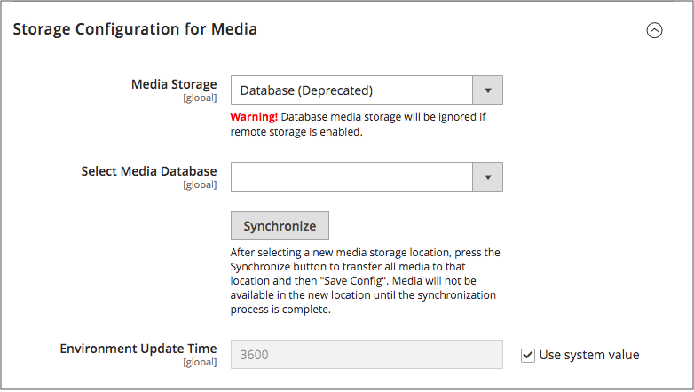

# 使用媒體資料庫

>[!IMPORTANT]
>
>自Adobe Commerce和Magento Open Source2.4.3起，資料庫媒體儲存方法已過時。

根據預設，[!DNL Commerce]執行個體的所有影像、編譯的CSS檔案和編譯的JavaScript檔案都儲存在網頁伺服器的檔案系統中。 您可以選擇將這些檔案儲存在資料庫伺服器上的資料庫中。 此方法的一個優點是在網頁伺服器檔案系統與資料庫之間自動同步和反向同步選項。 您可以使用預設資料庫來儲存媒體或建立資料庫。 若要能夠使用新建立的資料庫做為媒體儲存體，您必須將關於該資料庫及其存取認證的資訊新增至`env.php`檔案。

## 資料庫工作流程

1. **瀏覽器要求媒體** — 商店的頁面會在客戶的瀏覽器中開啟，且瀏覽器會要求HTML中指定的媒體。

1. **系統在檔案系統中尋找媒體** — 系統會在檔案系統中搜尋媒體，如果找到，會將它傳遞給瀏覽器。

1. **系統在資料庫**&#x200B;中找到媒體 — 如果在檔案系統中找不到媒體，則會傳送對媒體的要求到組態中指定的資料庫。

1. **系統在資料庫中尋找媒體** - PHP指令碼會將檔案從資料庫傳輸到檔案系統，並傳送給客戶的瀏覽器。 瀏覽器的媒體要求會觸發指令碼執行，如下所示：

   - 如果[!DNL Commerce]的網頁伺服器[rewrites](../merchandising-promotions/url-rewrite.md)已啟用，而且伺服器支援它，則只有在檔案系統中找不到要求的媒體時，PHP指令碼才會執行。
   - 如果為[!DNL Commerce]停用Web伺服器重寫，或伺服器不支援PHP指令碼，則即使檔案系統中有所需的媒體，PHP指令碼仍會執行。

## 使用資料庫儲存媒體

1. 在&#x200B;_管理員_&#x200B;側邊欄上，移至&#x200B;**[!UICONTROL Stores]** > _[!UICONTROL Settings]_>**[!UICONTROL Configuration]**。

1. 在左側面板中，展開&#x200B;**[!UICONTROL Advanced]**&#x200B;並選擇&#x200B;**[!UICONTROL System]**。

1. 在左上角，將&#x200B;**[!UICONTROL Store View]**&#x200B;設定為`Default Config`以在全域層級套用組態。

1. 展開 **[!UICONTROL Storage Configuration for Media]**&#x200B;區段，然後執行下列動作：

   {width="600" zoomable="yes"}

   - 將&#x200B;**[!UICONTROL Media Storage]**&#x200B;設為`Database`。

   - 將&#x200B;**[!UICONTROL Select Media Database]**&#x200B;設定為您要使用的資料庫。

   - 若要將現有媒體傳輸至新選取的資料庫，請按一下&#x200B;**[!UICONTROL Synchronize]**。

   - 以秒為單位輸入&#x200B;**[!UICONTROL Environment Update Time]**。

1. 完成時，按一下&#x200B;**[!UICONTROL Save Config]**。
