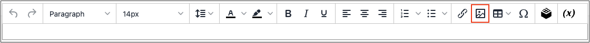
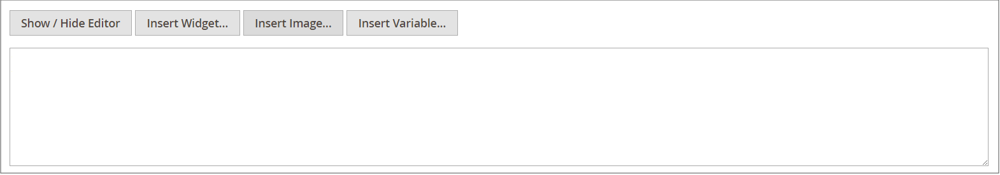

# 媒體儲存空間

媒體儲存可協助您組織並存取伺服器上儲存的媒體檔案。 檔案位置的路徑由 [基礎URL](../stores-purchase/store-urls.md) 設定。 處理頁面和靜態區塊時，可以從編輯器存取媒體儲存體中的檔案。 通常，媒體儲存裝置會位在與相同的伺服器上的檔案系統中 [!DNL Commerce] 程式檔案。

或者，媒體檔案也可以在 [資料庫](media-storage-database.md)，或在不同的伺服器上，或 [內容傳遞網路](media-storage-content-delivery-network.md). 使用替代儲存體的優點在於，它可儘量減少同步媒體所需的工作。 當系統的多個執行個體部署在不同伺服器上，而伺服器需要存取相同的影像、CSS檔案和其他媒體檔案時，同步處理效能尤其會受到影響。

編輯器可以設定為使用靜態或 [動態媒體URL](../catalog/catalog-urls.md#configure-catalog-media-url-format) 類別或產品說明中的目錄內容。

![[!DNL Commerce] 媒體儲存](./assets/media-storage.png){width="650" zoomable="yes"}

## 將檔案新增至媒體儲存空間

前兩個步驟與插入影像時相同。

1. 在 [編輯者](editor.md) 工具列，按一下 _插入影像_ 圖示。

   {width="700" zoomable="yes"}

   此動作會開啟 _[!UICONTROL Insert/edit image]_對話方塊。

1. 晚於 _[!UICONTROL Source]_，按一下_&#x200B;搜尋&#x200B;_圖示({width="10" zoomable="no"})。

1. 在左側的目錄樹狀結構中，執行下列任一項作業：

   - 導覽至您要儲存上傳影像的資料夾。

   - 導覽至您要建立資料夾的位置，然後按一下 **建立資料夾**.

     若要新增資料夾，請輸入資料夾名稱，然後按一下 **[!UICONTROL OK]**.

1. 若要將一或多個檔案新增至「媒體儲存體」，您可以從您的系統上傳檔案，或使用 [Adobe Stock整合](adobe-stock.md)：

   若要從系統上傳檔案，請按一下 **[!UICONTROL Choose Files]** 並執行下列動作：

   - 在本機電腦的目錄中，導覽至影像的位置。

   - 選取要上傳的每個影像。

   - 按一下 **[!UICONTROL Open]**.

   若要使用Adobe Stock中的資產，請使用 [整合](adobe-stock.md)：

   - 按一下 **[!UICONTROL Search Adobe Stock]**.

   - 從Adobe Stock新增預覽或授權的影像(請參閱 [使用Adobe Stock影像](adobe-stock-manage.md))。

影像會上傳至伺服器上目前的媒體儲存資料夾。

![[!DNL Commerce] 媒體儲存](./assets/media-storage.png){width="650" zoomable="yes"}

## 從媒體存放區插入影像

開啟要編輯的頁面或區塊。 然後，使用下列其中一種方法，從媒體儲存體插入影像：

### 方法1：WYSIWYG模式

1. 在 [編輯者](editor.md) 工具列，按一下 _插入影像_ 圖示。

1. 晚於 _[!UICONTROL Source]_，按一下_&#x200B;搜尋&#x200B;_圖示({width="10" zoomable="no"})。

   {width="250" zoomable="yes"}

1. 在左側的目錄樹狀結構中，導覽至儲存影像的資料夾。

1. 選取影像的圖磚，然後按一下 **[!UICONTROL Add Selected]**.

### 方法2：HTML模式

1. 將游標放置在程式碼中 `` 標籤中。

1. 按一下 **[!UICONTROL Insert Image]**.

   {width="600" zoomable="yes"}
