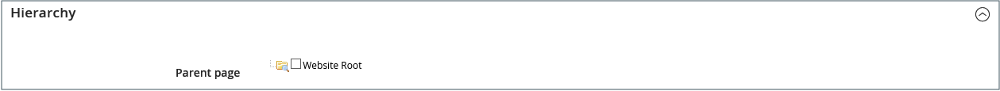

# 新增和移除頁面

對於您可能想要建立的任何型別的頁面，將內容頁面新增到存放區的程式基本上相同。 您可以包含文字、影像、內容區塊、變數和Widget。 大部分內容頁面都是先由搜尋引擎設計，以供人員次要閱讀。 選擇頁面標題和URL以及構成中繼資料和內容時，請記住這兩個不同對象中每一個的需求。 頁面完成後，可將其新增至商店導覽、連結至其他頁面、從商店頁尾連結，或用作新的[首頁](page-home-new.md)。

{width="700" zoomable="yes"}

## 新增頁面

下列指示會逐步引導您建立基本頁面。 有些進階功能會被略過，但會在其他主題中說明。

### 步驟1：建立頁面

1. 在&#x200B;_管理員_&#x200B;側邊欄上，移至&#x200B;**[!UICONTROL Content]** > _[!UICONTROL Elements]_>**[!UICONTROL Pages]**。

1. 按一下&#x200B;**[!UICONTROL Add New Page]**。

   {width="600" zoomable="yes"}

1. 如果您不想立即發佈頁面，請將&#x200B;**[!UICONTROL Enable Page]**&#x200B;設為`No`。

1. 輸入&#x200B;**[!UICONTROL Page Title]**。

   頁面標題會顯示在[階層連結](../catalog/navigation-breadcrumb-trail.md)導覽中。

### 步驟2：完成內容

根據您的[進階內容工具組態](../configuration-reference/general/content-management.md)，新增頁面內容。

#### 使用頁面產生器內容工具

1. 展開 **[!UICONTROL Content]**。

   {width="600" zoomable="yes"}

1. 在&#x200B;**[!UICONTROL Content Heading]**&#x200B;方塊中，輸入您要顯示在頁面頂端的標題。

   如果啟用，[頁面產生器](../page-builder/introduction.md)階段和面板會出現在內容標題下方。 如需詳細資訊，請參閱[Workspace](../page-builder/workspace.md)。 如果未啟用&#x200B;_頁面產生器_，編輯器會在WYSIWYG模式中開啟，工具列在頂端。

1. 完成內容，並視需要設定文字格式。

#### 使用編輯器工具列

1. 展開 **[!UICONTROL Content]**。

   {width="600" zoomable="yes"}

1. 在&#x200B;**[!UICONTROL Content Heading]**&#x200B;方塊中，輸入您要顯示在頁面頂端的標題。

1. 視需要填妥內容並設定文字格式。

   您可以視需要新增[影像](media-storage.md)、[變數](../systems/variables-predefined.md)和[介面工具集](widgets.md)。 如需詳細資訊，請參閱[使用編輯器](editor.md)。

### 步驟3：完成SEO資訊

1. 展開 **[!UICONTROL Search Engine Optimization]**。

   {width="600" zoomable="yes"}

1. 接受預設值，或輸入包含所有小寫字元的其他&#x200B;**[!UICONTROL URL Key]**，並使用連字型大小而非空格。

   預設URL金鑰是在儲存頁面時根據內容標題建立的。

1. 輸入頁面的&#x200B;**[!UICONTROL Meta Title]**。

   中繼標題應包含少於70個字元，並顯示在瀏覽器標題列和索引標籤中。

1. 輸入您選擇的高值&#x200B;**[!UICONTROL Meta Keywords]**，搜尋引擎可使用此選項為頁面編制索引。

   請使用逗號分隔多個字詞。 某些搜尋引擎會忽略中繼關鍵字，但其他搜尋引擎會使用中繼關鍵字。

1. 針對&#x200B;**[!UICONTROL Meta Description]**，輸入搜尋結果清單頁面的簡短說明。

   理想情況下，說明的長度應該是150到160個字元，上限為255個字元。

1. 按一下&#x200B;**[!UICONTROL Save]**。

### 步驟4：指定頁面的範圍

1. 展開 **[!UICONTROL Page in Websites]**。

   網站中的{width="600" zoomable="yes"}

1. 在&#x200B;**[!UICONTROL Store View]**&#x200B;清單中，選取頁面可用的每個檢視。

   如果安裝有多個網站，請選取可使用頁面的每個網站和商店檢視。

### 步驟5：識別上層頁面（如果適用）

{{ee-feature}}

1. 展開 **[!UICONTROL Hierarchy]**。

   {width="600" zoomable="yes"}

1. 如果此頁面是其他頁面的子頁面，請選取&#x200B;**[!UICONTROL Parent page]**&#x200B;的核取方塊。

### 步驟6：輸入設計變更（選擇性）

1. 若要變更頁面的版面，請展開 **[!UICONTROL Design]**。

   {width="600" zoomable="yes"}

1. 若要變更頁面的欄配置，請將&#x200B;**[!UICONTROL Layout]**&#x200B;設定為下列其中一項：

   - `Empty`
   - `1 column`
   - `2 columns with left bar`
   - `2 columns with right bar`
   - `3 columns`
   - `Page -- Full Width` （需要[頁面產生器](../page-builder/introduction.md)）
   - `Category -- Full Width` （需要頁面產生器）
   - `Product -- Full Width` （需要頁面產生器）

1. 若要套用&#x200B;**[!UICONTROL Custom Layout Update]**，請從清單中選擇檔案名稱。

   如需詳細資訊，請參閱[配置更新](layout-updates.md)。

1. 若要變更頁面主題，請將&#x200B;**[!UICONTROL New Theme]**&#x200B;設定為下列其中一項：

   - `Magento Black`
   - `Magento Luma`

1.  (僅限Magento Open Source)若要排程設計變更，請展開 **[!UICONTROL Custom Design Update]**，然後執行下列動作：

   {width="600" zoomable="yes"}

   - 使用行事曆（）來選擇要讓變更生效的&#x200B;**[!UICONTROL From]**&#x200B;和&#x200B;**[!UICONTROL To]**&#x200B;日期。

   - 若要套用不同的主題至頁面，請選取&#x200B;**[!UICONTROL New Theme]**&#x200B;的名稱。

   - 若要變更頁面的欄配置，請選擇您要套用的&#x200B;**[!UICONTROL Layout]**。

### 步驟7：預覽頁面

1. 按一下&#x200B;**[!UICONTROL Save]**&#x200B;箭頭，然後選擇&#x200B;**[!UICONTROL Save & Close]**&#x200B;以返回「頁面」格線。

1. 在格線中尋找頁面，並在&#x200B;_[!UICONTROL Action]_&#x200B;欄中選取&#x200B;**[!UICONTROL View]**。

1. 若要返回格線，請按一下瀏覽器視窗左上角的&#x200B;**[!UICONTROL Back]**。

### 步驟8：發佈頁面

1. 在網格的&#x200B;_[!UICONTROL Action]_&#x200B;欄中選取&#x200B;**[!UICONTROL Edit]**。

1. 將&#x200B;**[!UICONTROL Enable Page]**&#x200B;設為`Yes`。

1. 按一下&#x200B;**[!UICONTROL Save]**&#x200B;箭頭，然後選擇&#x200B;**[!UICONTROL Save & Close]**。

## 複製頁面

任何內容頁面都可當作範本使用，並儲存為重複專案。 您可以運用這項省時技巧，為整個網站的內容頁面建立一致的設計。 重複頁面會保留原始頁面的「頁面標題」，但「URL索引鍵」和「狀態」欄位必須更新。

{width="600" zoomable="yes"}

1. 在&#x200B;_管理員_&#x200B;側邊欄上，移至&#x200B;**[!UICONTROL Content]** > _[!UICONTROL Elements]_>**[!UICONTROL Pages]**。

1. 在網格中，找到您要複製的頁面，然後按一下&#x200B;_[!UICONTROL Action]_&#x200B;欄中的&#x200B;**[!UICONTROL Edit]**。

1. 按一下&#x200B;**[!UICONTROL Save]**&#x200B;箭頭，然後選擇&#x200B;**[!UICONTROL Save & Duplicate]**。

1. 當您看到頁面已儲存和重複的訊息時，請按一下頂端按鈕列中的&#x200B;**[!UICONTROL Back]**&#x200B;以返回網格。

1. 在格線中找到重複頁面，並注意下列事項：

   - 頁面標題與原始頁面相同。
   - 唯一但暫時的URL金鑰已指派。
   - 頁面的狀態為`Disabled`。

1. 以&#x200B;_編輯_&#x200B;模式開啟重複頁面，並執行下列動作：

   - 若要立即發佈頁面，請將&#x200B;**[!UICONTROL Enable Page]**&#x200B;設為`Yes`。

   - 視需要更新&#x200B;**[!UICONTROL Page Title]**。

   - 展開 **[!UICONTROL Search Engine Optimization]**&#x200B;區段，然後輸入您要用於重複頁面的唯一&#x200B;**[!UICONTROL URL Key]**。

     {width="600" zoomable="yes"}

   - 視需要更新其餘頁面內容。

1. 按一下&#x200B;**[!UICONTROL Save]**&#x200B;箭頭，然後選擇&#x200B;**[!UICONTROL Save & Close]**。

   格線中的重複頁面會反映您的變更。

## 儲存功能表

| 命令 | 說明 |
|--- |--- |
| [!UICONTROL Save] | 儲存目前頁面，然後繼續工作。 |
| [!UICONTROL Save & New] | 儲存並關閉目前頁面，然後開始新頁面。 |
| [!UICONTROL Save & Duplicate] | 儲存並關閉目前頁面，然後開啟新的重複復本。 |
| [!UICONTROL Save & Close] | 儲存並關閉目前頁面，然後返回「頁面」格線。 |

{style="table-layout:auto"}

## 刪除頁面

移除已建立頁面的方法有兩種。 您可以從&#x200B;_[!UICONTROL Pages]_&#x200B;格線或&#x200B;_[!UICONTROL Edit]_&#x200B;頁面移除它。

### 方法1：從「頁面」格線中移除頁面

1. 在&#x200B;_管理員_&#x200B;側邊欄上，移至&#x200B;**[!UICONTROL Content]** > _[!UICONTROL Elements]_>**[!UICONTROL Pages]**。

1. 使用格線上方的篩選條件來找出頁面，並選取一或多個要刪除頁面的核取方塊。

1. 在清單的左上角，將&#x200B;**[!UICONTROL Actions]**&#x200B;設定為`Delete`。

1. 若要確認動作，請按一下&#x200B;**[!UICONTROL OK]**。

### 方法2：從編輯頁面移除頁面

1. 在&#x200B;_管理員_&#x200B;側邊欄上，移至&#x200B;**[!UICONTROL Content]** > _[!UICONTROL Elements]_>**[!UICONTROL Pages]**。

1. 尋找要刪除的頁面。

1. 在頁面實體的&#x200B;_[!UICONTROL Actions]_&#x200B;欄中，按一下&#x200B;**[!UICONTROL Select]**&#x200B;並選擇&#x200B;**[!UICONTROL Edit]**。

1. 在按鈕列中按一下&#x200B;**[!UICONTROL Delete Page]**。

1. 若要確認動作，請按一下&#x200B;**[!UICONTROL OK]**。
