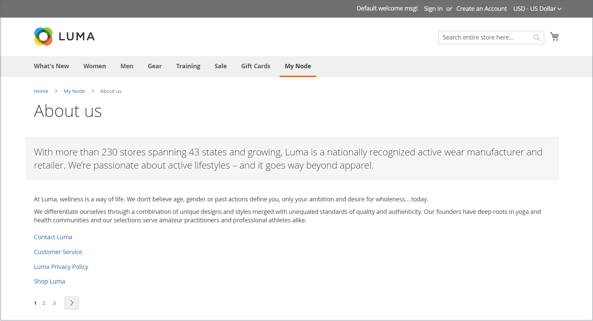

# 頁面階層

{{ee-feature}}

商店頁面階層系統可讓您組織內容頁面，以及新增分頁、導覽和功能表。 範例資料中的「隱私權原則」頁面是左側有功能表的頁面的範例。 如果您定期發佈大量內容，可使用頁面階層來組織您的內容，讓他人輕鬆找到感興趣的文章。

頁面階層系統使用節點來識別內容的相關片段，並將內容頁面組織成父/子關係。 父節點就像資料夾，其中可能包含子節點和頁面。 階層中每個節點和頁面的相對位置會顯示為&#x200B;_樹狀結構_&#x200B;結構。 節點可能包含其他節點和內容頁面，而單一內容頁面可能和父/子或芳鄰關係中的多個節點和其他內容頁面相關聯。

{width="600" zoomable="yes"}

## 設定頁面階層

組態設定會啟動頁面階層系統和中繼資料，並決定預設功能表配置。

{width="600" zoomable="yes"}

1. 在&#x200B;_管理員_&#x200B;側邊欄上，移至&#x200B;**[!UICONTROL Stores]** > _[!UICONTROL Settings]_>**[!UICONTROL Configuration]**。

1. 在左側面板的&#x200B;_[!UICONTROL General]_&#x200B;下，選擇&#x200B;**[!UICONTROL Content Management]**。

1. 展開 **[!UICONTROL CMS Page Hierarchy]**，並進行任何必要的變更。

1. 完成時，按一下&#x200B;**[!UICONTROL Save Config]**。

| 欄位 | 說明 |
|--- |--- |
| [!UICONTROL Enable Hierarchy Functionality] | 為您的內容頁面啟用頁面階層。 選項： `Yes` / `No` |
| [!UICONTROL Enable Hierarchy Metadata] | 啟用此選項後，您可以將中繼資料與階層中的頁面建立關聯。 選項： `Yes` / `No` |
| [!UICONTROL Default Layout for Hierarchy Menu] | 決定預設選單樣式。 選項： `Content` / `Left Column` / `Right Column` |

{style="table-layout:auto"}

## 新增階層節點

下列範例說明如何建立節點，並透過簡單導覽至相關內容頁面。 雖然節點沒有關聯的內容頁面，但它的確有URL金鑰，可在網站的其他位置參照。

例如，您可以建立名為&#x200B;_新聞稿_&#x200B;的節點，其可導覽至個別新聞稿。 然後，您可以在您的&#x200B;_關於我們_&#x200B;頁面上加入指向節點的連結。 或者，您可以為新聞稿的舊版集合建立一個節點。

若要連結至節點，請使用[Widget](widgets.md)工具建立CMS階層節點連結，並將該Widget置於內容區塊或頁面中。

{width="600" zoomable="yes"}

### 步驟1：建立節點

1. 在&#x200B;_管理員_&#x200B;側邊欄上，移至&#x200B;**[!UICONTROL Content]** > _[!UICONTROL Elements]_>**[!UICONTROL Hierarchy]**。

   {width="600" zoomable="yes"}

1. 在格線上方，按一下&#x200B;**[!UICONTROL Add Node...]**。

1. 在&#x200B;_[!UICONTROL Page Properties]_&#x200B;底下，輸入節點的&#x200B;**[!UICONTROL Title]**&#x200B;和適當的&#x200B;**[!UICONTROL URL Key]**。

   URL索引鍵會提供節點的唯一網址。 必須全部為小寫字元，使用連字型大小來分隔單字，而非空格。

   {width="500" zoomable="yes"}

1. 按一下&#x200B;**[!UICONTROL Save]**。

   節點會在頁面左側的樹狀結構中顯示為資料夾。

### 步驟2：將頁面新增至節點

1. 在階層樹狀結構中，按一下以選取節點。

1. 按一下&#x200B;**[!UICONTROL Add Selected Pages(s) to Tree]**。

   您可以向上捲動，檢視每個選取的頁面是否出現在節點資料夾下方的樹狀結構中。

### 步驟3：定義結構

1. 如有必要，請將頁面拖曳至適當位置，以反映它們在功能表中出現的順序。

   {width="500" zoomable="yes"}

1. 按一下階層頂端的節點。

   _[!UICONTROL Page Properties]_&#x200B;區段現在會顯示有關節點的資訊。

1. 在&#x200B;**[!UICONTROL Render Metadata in HTML Head]**&#x200B;底下，執行下列動作：

   {width="400" zoomable="yes"}

   - 若要將節點識別為階層的頂端，請將&#x200B;**[!UICONTROL First]**&#x200B;設為`Yes`。

   - 若要顯示分頁控制項，請將&#x200B;**[!UICONTROL Next/Previous]**&#x200B;設為`Yes`。

   - 若要將階層中的頁面組織成書冊，請將&#x200B;**[!UICONTROL Enable Chapter/Section]**&#x200B;設為`Yes`。

     如果您不想將節點加入書冊中，請保留預設值`No`。

   - 若要將節點指派給書冊的特定部分，請將&#x200B;**[!UICONTROL Chapter/Section]**&#x200B;設定為下列其中一項：

      - `No` — 未將節點定義為章節/區段。
      - `Chapter` — 將目前節點指派為章節。
      - `Section` — 將目前節點指派為區段。
      - `Both` — 將目前節點同時指派為章節和區段。

### 步驟4：新增分頁控制項

1. 在巢狀頁面的&#x200B;_分頁選項_&#x200B;下，將&#x200B;**[!UICONTROL Enable Pagination]**&#x200B;設定為`Yes`。

1. 針對&#x200B;**[!UICONTROL Frame]**，輸入您要在分頁控制項中包含的頁面連結數目。

   如果階層中有更多頁面可包含在分頁控制項中。

1. 針對&#x200B;**[!UICONTROL Frame Skip]**，輸入您要在下一組分頁連結中向前跳過（或向後跳過）的頁數。

### 步驟5：選擇功能表配置

如果要讓節點出現在選單中，請執行下列動作：

1. 在&#x200B;_頁面導覽功能表選項_&#x200B;下，將&#x200B;**[!UICONTROL Show in navigation menu]**&#x200B;設定為`Yes`。

   此設定決定是否產生頁面階層的導覽功能表。

   {width="300" zoomable="yes"}

1. 若要指定功能表相對於內容的位置，請設定&#x200B;**[!UICONTROL Menu Layout]**：

   - `Content` — 功能表配置在內容中。
   - `Use Default` — 使用[組態](../configuration-reference/general/content-management.md)中指定的功能表樣式。
   - `Left Column` — 功能表會出現在內容的左側。
   - `Right Column` — 功能表會出現在內容的右側。

1. 若要指定功能表中包含多少詳細資料，請將&#x200B;**[!UICONTROL Menu Detalization]**&#x200B;設定為下列其中一項：

   - `Only Children` — 僅包含功能表中的子頁面。
   - `Neighbours and Children` — 包含子頁面和位於階層中相同層級的其他頁面。

1. 若要判斷功能表的深度，請輸入&#x200B;**[!UICONTROL Maximal Depth]**&#x200B;以包含最大層級數目。

1. 若要格式化功能表，請選擇&#x200B;**[!UICONTROL List Type]**：

   - `Unordered` — 功能表選項未編號，無論是否有專案符號，都可以格式化。 未排序清單型別的選項：預設/圓形/磁碟/正方形
   - `Ordered` — 功能表選項會以數字編號，並可以大寫或小寫格式化為數字、字母或羅馬數字。

1. 將&#x200B;**[!UICONTROL List Style]**&#x200B;設定為下列其中一項：

   - `Circle`
   - `Disc`
   - `Square`

1. 如果您也想要在導覽功能表中顯示節點，請捲動至&#x200B;_主要導覽功能表選項_&#x200B;並將&#x200B;**[!UICONTROL Show in Navigation menu]**&#x200B;設定為`Yes`。

   {width="250" zoomable="yes"}

1. 按一下&#x200B;**[!UICONTROL Save]**。
