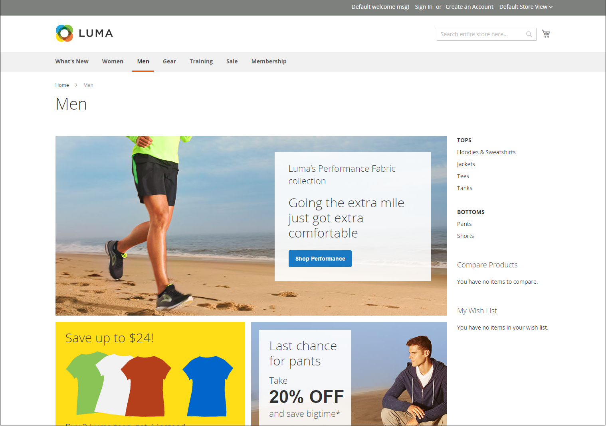

# 店面配置範例

欄尺寸由主題的樣式表決定。 有些佈景主題會將固定的畫素寬度套用至頁面版面，有些則使用百分比來讓頁面回應視窗或裝置的寬度。

大多數案頭主題的主欄都有固定的寬度，所有活動都發生在此封閉區域中。 根據您的熒幕解析度，主欄的兩側會有空白字元。

## 一欄

單欄配置的內容區域橫跨主欄的全部寬度。 此版面通常用於具有大型橫幅或滑桿的首頁，或不需要導覽的頁面，例如登入頁面、啟動頁面、視訊或整頁廣告。

{width="700" zoomable="yes"}

## 兩欄（含左列）

此配置的內容區域分為兩欄。 主要內容欄會向右浮動，而側邊列則會向左浮動。

{width="700" zoomable="yes"}

## 兩欄（含右列）

此配置是其他雙欄配置的映象影像。 此時，側邊欄會向右浮動，而主要內容欄則會向左浮動。

{width="700" zoomable="yes"}

## 三欄

三欄式配置有一個主要內容區域，其中包含兩個側欄。 左側列和主要內容欄包在一起，並以單位向左浮動。 另一個側邊欄會向右浮動。

{width="700" zoomable="yes"}
