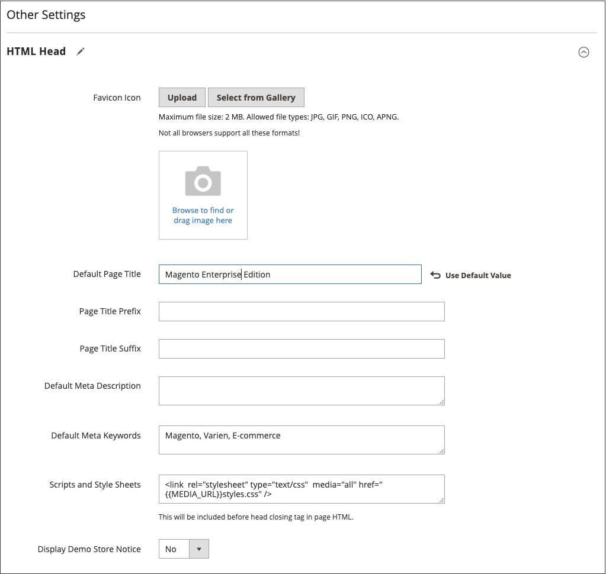
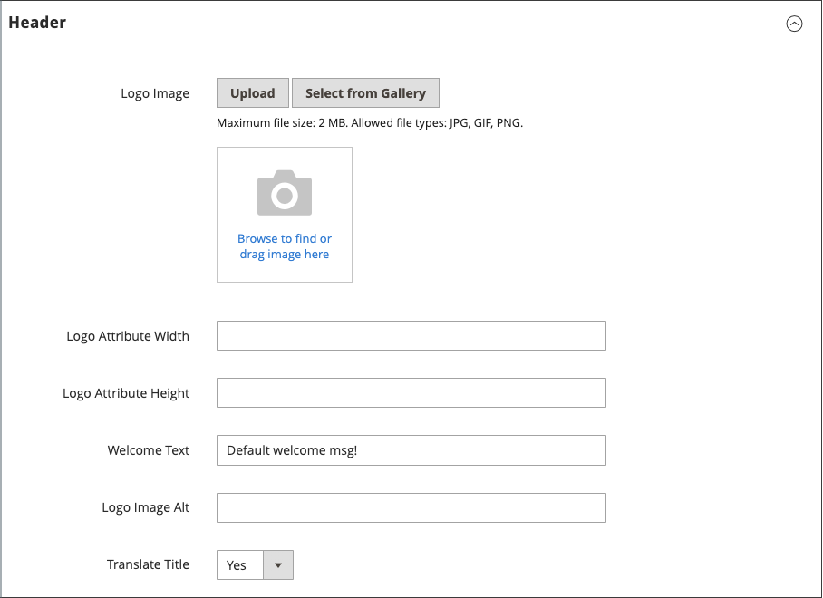

# 頁面設定

頁面的主要區段部分由一組標準HTML標籤控制。 其中一些標籤可用來決定頁面每個區段中所使用的字型、顏色、大小、背景顏色和影像的選取範圍。 其他設定可控制頁面元素，例如頁首中的標誌以及頁尾中的版權宣告。 這些區段會對應至HTML頁面的基礎結構，而許多基本屬性都可以從Admin設定。

- [HTML Head](#html-head)
- [頁首](#header)
- [頁尾](#footer)

{width="700" zoomable="yes"}

## HTML Head

HTML Head區段中的設定對應至HTML頁面的`<head>`標籤，可針對每個商店檢視進行設定。 除了頁面標題、說明和關鍵字的中繼資料之外，區段還包含指向Favicon的連結，以及其他指令碼。 搜尋引擎自動機制的指示以及商店示範通知的顯示也在本節中設定。

### 設定HTML Head

1. 在&#x200B;_管理員_&#x200B;側邊欄上，移至&#x200B;**[!UICONTROL Content]** > _[!UICONTROL Design]_>**[!UICONTROL Configuration]**。

1. 尋找您要設定的存放區檢視，然後按一下&#x200B;_[!UICONTROL Action]_欄中的&#x200B;**[!UICONTROL Edit]**。

1. 在&#x200B;_其他設定_&#x200B;下，展開 **[!UICONTROL HTML Head]**&#x200B;區段。

   {width="500" zoomable="yes"}

1. 視需要更新[favicon](../getting-started/storefront-branding.md#add-a-favicon)。

1. 視需要更新頁面標題設定：

   - **[!UICONTROL Default Page Title]**
   - **[!UICONTROL Page Title Prefix]**
   - **[!UICONTROL Page Title Suffix]**

   您可以使用字尾和/或字首搭配預設標題，建立兩部分或三部分的標題。 您可以在首碼或尾碼與預設標題之間新增垂直列或冒號作為分隔符號。

1. 新增或修改支援搜尋引擎最佳化(SEO)的中繼資料，並有助於引導客戶從搜尋結果前往您的商店：

   - **[!UICONTROL Default Meta Description]**
   - **[!UICONTROL Default Meta Keywords]**

1. 視需要輸入任何&#x200B;**[!UICONTROL Scripts and Style Sheets]**。

   >[!NOTE]
   >
   >在[!UICONTROL Scripts and Style Sheets]欄位中輸入的所有JavaScript都必須在內容安全性原則(CSP)設定中列入白名單，否則不會在「結帳」頁面上執行。 如需詳細資訊，請參閱[內容安全性原則](https://developer.adobe.com/commerce/php/development/security/content-security-policies)。

1. 視需要啟用或停用[示範存放區通知](../getting-started/storefront-branding.md#set-the-store-demo-notice)。

1. 完成時，按一下&#x200B;**[!UICONTROL Save Configuration]**。

### HTML Head欄位說明

| 欄位 | 範圍 | 說明 |
|--- |--- |--- |
| [!UICONTROL Favicon Icon] | 存放區檢視 | 上傳顯示在瀏覽器位址列和索引標籤中的小型圖形影像。 允許的檔案型別：ICO、PNG、APNG、GIF和JPG (JPEG)。 並非所有瀏覽器都支援這些格式。 |
| [!UICONTROL Default Page Title] | 存放區檢視 | 在瀏覽器中檢視時，每個頁面標題列所顯示的標題。 預設標題會用於所有頁面，除非為個別頁面指定其他標題。 |
| [!UICONTROL Page Title Prefix] | 存放區檢視 | 您可以在標題前加上前置詞，以建立兩部分或三部分的標題。 垂直列或冒號可用來做為首碼結尾的分隔符號，以區別於主要標題的文字。 |
| [!UICONTROL Page Title Suffix] | 存放區檢視 | 可在標題之後新增尾碼，以建立兩或三部分的標題。 垂直列或冒號可用來做為首碼結尾的分隔符號，以區別於主要標題的文字。 |
| [!UICONTROL Default Meta Description] | 存放區檢視 | 說明提供搜尋引擎清單的網站摘要，長度不應超過160個字元。 |
| [!UICONTROL Default Meta Keywords] | 存放區檢視 | 說明商店的一系列關鍵字，每個關鍵字以逗號分隔。 |
| [!UICONTROL Scripts and Style Sheets] | 存放區檢視 | 包含必須在結束`<head>`標籤之前包含在HTML中的指令碼。 例如，您可以在此處輸入任何必須放置在`<body>`標籤之前的第三方JavaScript。 |
| [!UICONTROL Display Demo Store Notice] | 存放區檢視 | 控制示範存放區通知在頁面頂端的顯示。 選項： `Yes` / `No` |

{style="table-layout:auto"}

## 頁首

Header設定可識別您商店標誌的路徑，並指定標誌替代文字和歡迎訊息。

{width="400" zoomable="yes"}

### 設定標題

1. 在&#x200B;_管理員_&#x200B;側邊欄上，移至&#x200B;**[!UICONTROL Content]** > _[!UICONTROL Design]_>**[!UICONTROL Configuration]**。

1. 尋找您要設定的存放區檢視，然後按一下&#x200B;_[!UICONTROL Action]_欄中的&#x200B;**[!UICONTROL Edit]**。

1. 在&#x200B;_其他設定_&#x200B;下，展開 **[!UICONTROL Header]**&#x200B;區段。

1. 進行存放區檢視所需的任何變更：

   - [標誌](../getting-started/storefront-branding.md#upload-your-logo)設定
   - [歡迎訊息](../getting-started/storefront-branding.md#change-the-welcome-message)設定

1. 完成時，按一下&#x200B;**[!UICONTROL Save Configuration]**。

### 標題欄位說明

| 欄位 | 範圍 | 說明 |
|--- |--- |--- |
| [!UICONTROL Logo Image] | 存放區檢視 | 識別顯示在標頭中的標誌路徑。 支援的檔案型別：PNG、GIF、JPG (JPEG) |
| [!UICONTROL Logo Attribute Width] | 存放區檢視 | 您標誌影像的寬度（畫素）。 |
| [!UICONTROL Logo Attribute Height] | 存放區檢視 | 您的標誌影像的高度（畫素）。 |
| [!UICONTROL Welcome Text] | 存放區檢視 | 歡迎訊息會顯示在頁面的標頭中，並包含已登入的客戶名稱。 |
| [!UICONTROL Logo Image Alt] | 存放區檢視 | 與標誌關聯的替代文字。 |
| [!UICONTROL Translate Title] | 存放區檢視 | 決定是否應轉譯`Page Title`或`Meta Title`。 |

{style="table-layout:auto"}

## 頁尾

頁尾設定區段是您更新出現在頁面底部的[版權宣告](../getting-started/storefront-branding.md#change-the-copyright-notice)的位置，並輸入必須在結束`<body>`標籤之前放置的其他指令碼。

{width="400" zoomable="yes"}

### 設定頁尾

1. 在&#x200B;_管理員_&#x200B;側邊欄上，移至&#x200B;**[!UICONTROL Content]** > _[!UICONTROL Design]_>**[!UICONTROL Configuration]**。

1. 尋找您要設定的存放區檢視，然後按一下&#x200B;_[!UICONTROL Action]_欄中的&#x200B;**[!UICONTROL Edit]**。

1. 在&#x200B;_其他設定_&#x200B;下，展開 **[!UICONTROL Footer]**&#x200B;區段。

1. 進行&#x200B;**[!UICONTROL Copyright]**&#x200B;和&#x200B;**[!UICONTROL Miscellaneous HTML]**&#x200B;設定所需的任何變更。

   >[!NOTE]
   >
   >在[!UICONTROL Miscellaneous HTML]欄位中輸入的所有JavaScript都必須在內容安全性原則(CSP)設定中列入白名單，否則不會在「結帳」頁面上執行。 如需詳細資訊，請參閱[內容安全性原則](https://developer.adobe.com/commerce/php/development/security/content-security-policies)。

1. 完成時，按一下&#x200B;**[!UICONTROL Save Configuration]**。

## 頁尾欄位說明

| 欄位 | 範圍 | 說明 |
|--- |--- |--- |
| [!UICONTROL Miscellaneous HTML] | 存放區檢視 | 一個輸入方塊，您可在其中將各種指令碼上傳到伺服器，這些指令碼必須放在結束`<body>`標籤之前。 |
| [!UICONTROL Copyright] | 存放區檢視 | 顯示在每頁底部的版權宣告。 若要包含版權符號，請使用HTML字元實體`\&copy;`，如下所示： `\&copy; 2021 Commerce Demo Store. All Rights Reserved.`請務必以您自己的取代範例版權宣告。 |
| [!UICONTROL Display Report Bugs Link] | 存放區檢視 | 判斷錯誤報表連結（某些主題支援）是啟用還是停用。 |

{style="table-layout:auto"}
