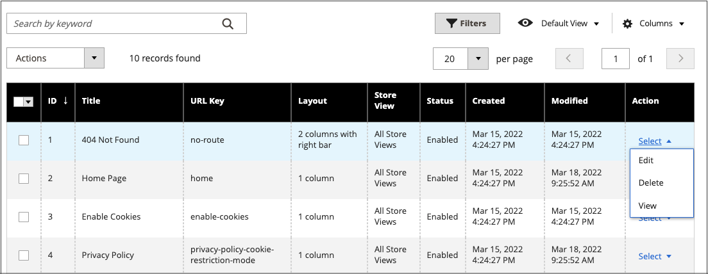
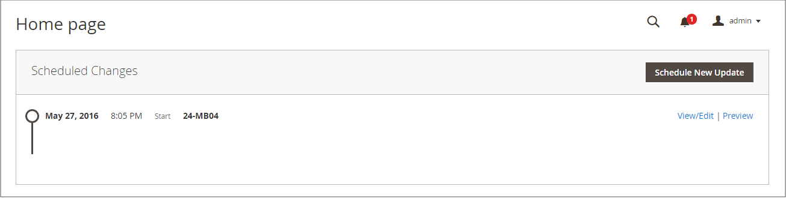

# 頁面工作區控制項

頁面工作區包含協助您快速尋找所需頁面的工具，以及在個別或多個頁面上執行例行維護的指令。 您也可以從格線快速更新頁面屬性。

{width="700" zoomable="yes"}

## 快速更新頁面屬性

1. 在&#x200B;_管理員_&#x200B;側邊欄上，移至&#x200B;**[!UICONTROL Content]** > _[!UICONTROL Elements]_>**[!UICONTROL Pages]**。
1. 按一下網格中的任何列。

   {width="600" zoomable="yes"}

   若要選取多個記錄，請選取要更新的每一列的核取方塊。

1. 更新下列任一屬性：

   - **[!UICONTROL Title]**
   - **[!UICONTROL URL Key]**
   - **[!UICONTROL Status]**
   - **[!UICONTROL Layout]**

1. 完成時，按一下&#x200B;**[!UICONTROL Save]**。

## Workspace控制項

| 控制 | 說明 |
|--- |--- |
| [!UICONTROL Add New Page] | 新增頁面。 |
| [!UICONTROL Search] | 根據目前的篩選器起始目錄搜尋。 |
| [!UICONTROL Actions] | 列出可套用至清單中選取專案的所有動作。 若要將動作套用至一個頁面或多個頁面，請核取該動作所針對之每個記錄的第一欄中的核取方塊。 選項： `Delete` / `Disable` / `Enable` / `Edit` |
| [!UICONTROL Select] | 第一欄標題中的控制項可用來選取多個記錄作為動作目標。 在您要選取的每筆記錄的第一欄中選取核取方塊。 選項： `Select All` / `Deselect All` |
| [!UICONTROL Save Edits] | 將目前的動作套用至選取的記錄。 |
| [!UICONTROL Edit] | 以編輯模式開啟記錄。 您可以按一下列上的任何位置，完成相同工作。 |

{style="table-layout:auto"}

## 欄

| 欄 | 說明 |
|--- |--- |
| [!UICONTROL Select] | 第一欄中的核取方塊可用來選取多個記錄。 選項： `Select All` / `Deselect All` |
| [!UICONTROL ID] | ID是指派給每個頁面的遞增數字。 |
| [!UICONTROL Title] | 顯示在頁面頂端的標題。 |
| [!UICONTROL URL Key] | URL金鑰類似於檔案名稱，可識別URL中的頁面。 |
| [!UICONTROL Layout] | 決定頁面在主內容區域的右邊或左邊顯示側邊欄。 選項： `1 column` / `2 columns with left bar` / `2 columns with right bar` / `3 columns` / `Empty` |
| [!UICONTROL Store View] | 用於將頁面與特定商店檢視相關聯。 |
| [!UICONTROL Status] | 指示頁面是線上還是離線。 選項： `Enabled` / `Disabled` |
| [!UICONTROL Created] | 建立頁面的日期。 |
| [!UICONTROL Modified] | 上次修改頁面的日期。 |
| [!UICONTROL Action] | 可套用至個別記錄的動作包括：  **[!UICONTROL Edit]**— 以編輯模式開啟頁面。 **[!UICONTROL Delete]** — 刪除頁面。 **[!UICONTROL View]**— 以預覽模式顯示頁面。 |

{style="table-layout:auto"}

## 其他欄

| 欄 | 說明 |
|--- |--- |
| [!UICONTROL Custom design from/to] | 指定將所選設計套用至頁面時的開始和結束日期。  (僅限Magento Open Source)。 |
| [!UICONTROL Custom Theme] | 套用自訂主題至頁面 |
| [!UICONTROL Custom Layout] | 決定頁面的自訂配置 |
| [!UICONTROL Meta Title] | 頁面的中繼標題 |
| [!UICONTROL Meta Keywords] | 頁面的中繼關鍵字 |
| [!UICONTROL Meta Description] | 頁面的中繼說明 |

{style="table-layout:auto"}

## 頁面搜尋

_[!UICONTROL Pages]_格線左上方的搜尋方塊可用來依關鍵字尋找特定頁面。 若要進行更進階的搜尋，您可以[篩選](../getting-started/admin-grid-controls.md)多個引數的搜尋。

### 依關鍵字搜尋

1. 在頁面搜尋方塊中輸入搜尋字詞。

1. 若要顯示結果，請按一下[搜尋] （）圖示。

   結果包括包含關鍵字的所有頁面。

### 篩選搜尋結果

1. 必要時，按一下&#x200B;**[!UICONTROL Clear All]**&#x200B;以清除先前的搜尋條件。

1. 若要顯示選取的搜尋篩選器，請按一下&#x200B;**[!UICONTROL Filters]**！（[漏斗圖示](../assets/icon-filter-search.png)）標籤。

1. 請視需要填寫許多篩選器，以說明您要尋找的頁面。

1. 按一下&#x200B;**[!UICONTROL Apply Filters]**&#x200B;以顯示結果。

### 搜尋篩選器

| 篩選 | 說明 |
|--- |--- |
| [!UICONTROL ID] | 依頁面記錄ID篩選搜尋。 |
| [!UICONTROL Title] | 根據頁面標題篩選搜尋。 |
| [!UICONTROL URL Key] | 依URL索引鍵篩選搜尋。 |
| [!UICONTROL Created] | 依建立頁面的日期篩選搜尋。 |
| [!UICONTROL Modified] | 根據上次修改頁面的日期篩選搜尋。 |
| [!UICONTROL Store View] | 根據商店檢視篩選搜尋。 選項： `All available` / `Store Views` |
| [!UICONTROL Layout] | 根據頁面版面配置篩選搜尋。 選項： `1 column` / `2 columns with left bar` / `2 columns with right bar` / `3 columns` / `Empty` |
| [!UICONTROL Status] | 篩選頁面狀態上的搜尋。 選項： `Disabled` / `Published` |
| [!UICONTROL Custom design from / to] | 將所選設計套用至頁面時，依開始和結束日期篩選搜尋。  (僅限Magento Open Source)。 |
| [!UICONTROL Asset] | 依頁面標題資產篩選搜尋 |
| [!UICONTROL Custom Layout] | 根據自訂配置篩選搜尋。 選項： `1 column` / `2 columns with left bar` / `2 columns with right bar` / `3 columns` / `Empty` / `Page -- Full Width` / `Category -- Full Width` / `Product -- Full Width` |
| [!UICONTROL Custom Theme] | 根據自訂主題篩選搜尋。 預設選項： `Magento Blank` / `Magento Luma` |
| [!UICONTROL Meta Keywords] | 根據頁面的中繼關鍵字篩選搜尋。 |
| [!UICONTROL Meta Title] | 根據頁面的中繼標題篩選搜尋。 |
| [!UICONTROL Meta Description] | 根據頁面的中繼說明篩選搜尋。 |

{style="table-layout:auto"}

### 搜尋工具

| 工具 | 說明 |
|--- |--- |
| [!UICONTROL Apply Filters] | 將所有篩選器套用至搜尋結果。 |
| [!UICONTROL Cancel] | 取消目前的搜尋。 |
| [!UICONTROL Clear All] | 清除所有搜尋篩選器。 |

{style="table-layout:auto"}

## 頁面動作

您可以編輯、停用、啟用和刪除頁面。 若要將動作套用至個別頁面，請選取第一欄中的核取方塊。 若要選取或取消選取所有頁面，請使用欄頂端的選取控制項。

{width="400" zoomable="yes"}

### 單一動作

使用最右邊的&#x200B;_[!UICONTROL Action]_欄，將下列任何動作套用至個別頁面：

- [!UICONTROL Edit] — 以編輯模式開啟頁面
- [!UICONTROL Delete] — 刪除頁面（需要確認）
- [!UICONTROL View] — 直接在店面開啟頁面

{width="600" zoomable="yes"}

### 整批動作

使用左上角的&#x200B;_[!UICONTROL Action]_選取器，將下列任一動作同時套用至數個選取的頁面：

- [!UICONTROL Delete] — 刪除頁面（需要確認）
- [!UICONTROL Disable] — 停用店面上的頁面
- [!UICONTROL Enable] — 啟用店面頁面
- [!UICONTROL Edit] — 以編輯模式（**[!UICONTROL Title]**、**[!UICONTROL URL Key]**、**[!UICONTROL Layout]**&#x200B;和&#x200B;**[!UICONTROL Status]**）開啟格線上的欄

## 頁面格線配置

欄的選取範圍及其在格線中的順序可根據您的偏好變更。 若要保留新的欄排列，您可以將其另存為檢視。

### 變更欄的選擇

按一下右上角的&#x200B;_欄_ （）控制項，然後執行下列動作：

- 選取您要新增至格線之任何欄的核取方塊。

- 清除您要從格線移除之任何欄的核取方塊。

### 移動欄

1. 按一下欄標題並按住。

1. 將欄拖曳到新位置並釋放。

### 儲存檢視

1. 按一下&#x200B;_檢視_ （）控制項，然後按一下&#x200B;**[!UICONTROL Save View As]**。

1. 輸入檢視的名稱。

1. 若要儲存檢視，請按一下&#x200B;_箭頭_ （）。

   檢視的名稱現在會顯示為目前的檢視。

### 變更檢視

按一下&#x200B;_檢視_ （）控制項，然後執行下列其中一項作業：

- 選擇您要使用的檢視。

- 按一下編輯（）圖示並更新名稱，以變更檢視的名稱。

  {width="600" zoomable="yes"}

## 排定的變更

{{ee-feature}}

頁面變更可以依排程套用，並和其他內容變更一起分組。 您可以根據排程變更至頁面來建立行銷活動，或將變更套用至現有的行銷活動。 如需詳細資訊，請參閱[內容暫存](content-staging.md)。

>[!NOTE]
>
>如果行銷活動連結到多個頁面，則只能從[內容中繼儀表板](content-staging-dashboard.md)編輯行銷活動。

>[!NOTE]
>
>[!UICONTROL Custom Design Update]索引標籤已在 Adobe Commerce中移除，無法直接在頁面上修改。 您必須為這些啟用建立排定的更新。

>[!NOTE]
>
>所有排定的更新都會連續套用，這表示任何實體在某一點只能有一個排定的更新。 任何排定的更新都會套用至其時間範圍內的所有存放區檢視。 因此，實體無法同時針對不同的存放區檢視有不同的排程更新。 所有存放區檢視中的所有實體屬性值（不受目前排程更新影響）都是從預設值取得，而不是從先前的排程更新取得。

{width="600" zoomable="yes"}

>[!NOTE]
>
>行銷活動開始日期和結束日期必須使用&#x200B;**_預設值_**&#x200B;管理時區來定義，該時區會從每個網站的當地時區轉換。 請考量下列範例：您有多個網站位在不同時區，但您想要根據美國時區啟動行銷活動。 在此情況下，您必須為每個當地時區排程個別的更新，並將&#x200B;**[!UICONTROL Start Date]**&#x200B;和&#x200B;**[!UICONTROL End Date]**&#x200B;從每個當地網站時區轉換為預設的管理時區。

此外，您也可以排程並預覽產品更新的變更。 如需詳細資訊，請參閱[排程更新](content-staging-scheduled-update.md)。
