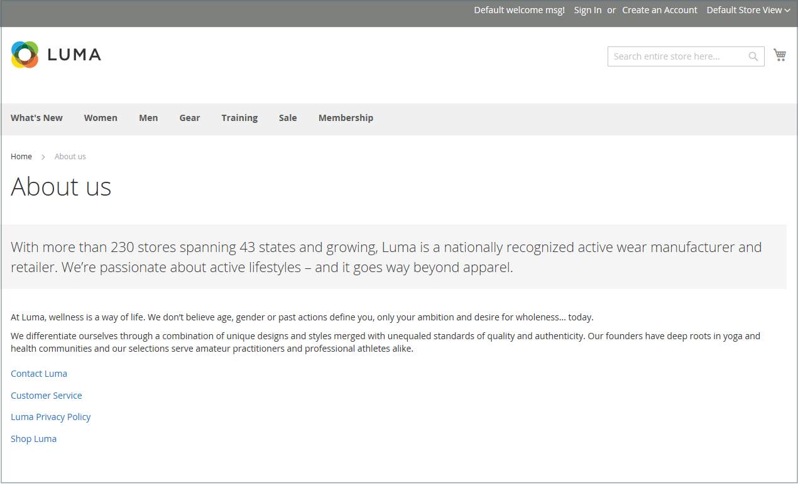
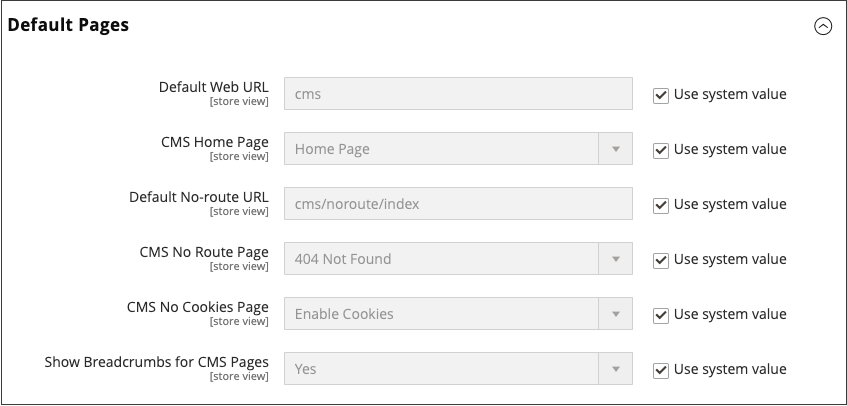

# 頁面

內容可以透過其儲存期來檢視，就像商店中的任何產品一樣。 您知道社群媒體內容的儲存期少於24小時嗎？ 您建立之內容的潛在儲存期限可協助您決定要將資源投入到何處。

保質期長的內容有時稱為&#x200B;_常青內容_。 歷久不衰的內容範例包括客戶成功案例、_如何_&#x200B;的指示，以及常見問題集(FAQ)。 相反地，容易腐爛的內容包括事件、產業新聞和新聞稿。

{width="700" zoomable="yes"}

## 核心內容頁面

[!DNL Commerce]示範存放區具有核心內容頁面的範例，可協助您開始使用。 您可以修改所有這些頁面以符合您的需求。 檢視您商店中的下列頁面，並確定內容傳達您的訊息、語音和品牌。

### 首頁

示範[首頁](../getting-started/storefront.md#home-page)頁面包含橫幅、影像輪播、數個具有連結的靜態區塊，以及新產品清單。

### 隱私權原則

存放區[隱私權原則](../getting-started/privacy-policy.md)頁面應使用您自己的資訊進行更新。 依據最佳做法的要求，您的隱私權政策應向您的客戶說明貴公司收集的資訊型別及其使用方式。

### 404找不到

404 Page Not Found頁面的名稱為找不到頁面時傳回的回應代碼。 URL重新導向可減少此頁面出現的次數。 不過，在必要時您也可以利用這個機會，提供一些客戶可能感興趣的產品連結。

### 存取遭拒

{{b2b-feature}}

當指派給公司使用者的許可權禁止存取頁面時，[拒絕存取](../b2b/account-company-roles-permissions.md)頁面會出現。

### 啟用Cookie

當您的網站訪客的瀏覽器未啟用Cookie時，[啟用Cookie](../getting-started/compliance-cookie-law.md)頁面就會顯示。 此頁面提供逐步說明，說明如何為最熱門的瀏覽器啟用Cookie。

### 服務無法使用

[503 Service Unavailable](../configuration-reference/general/general.md)頁面的名稱為伺服器無法使用時傳回的回應代碼。

### 關於我們

「關於我們」頁面是從商店的頁尾連結。 您可以包括影像、影片、新聞稿與公告連結。 範例頁面右側有一個影像，以及一個裝飾性影像，用於指出頁面的結尾。

### 客戶服務

「客戶服務」頁面是頁面階層中的另一個節點。 頁面上的兩個標頭包含的內容，只有在客戶按一下標頭時才會顯示。

店面上的{width="700" zoomable="yes"}

## 設定預設頁面

_預設頁面_&#x200B;設定會決定與[基底URL](../stores-purchase/store-urls.md)關聯的登陸頁面，以及對應的首頁。 它也會決定發生&#x200B;_找不到頁面_&#x200B;錯誤時顯示的頁面，以及每頁頂端是否顯示[階層連結路徑](../catalog/navigation-breadcrumb-trail.md)。

1. 在&#x200B;_管理員_&#x200B;側邊欄上，移至&#x200B;**[!UICONTROL Stores]** > _[!UICONTROL Settings]_>**[!UICONTROL Configuration]**。

1. 在左側面板的&#x200B;_[!UICONTROL General]_下，選擇&#x200B;**[!UICONTROL Web]**。

1. 展開&#x200B;**[!UICONTROL Default Pages]**&#x200B;區段的。

   {width="500" zoomable="yes"}

   | 欄位 | [領域](../getting-started/websites-stores-views.md#scope-settings) | 說明 |
   |--- |--- |--- |
   | [!UICONTROL Default Web URL] | 存放區檢視 | 表示與基底URL關聯的登入頁面。 依預設，此欄位設為`cms`表示來自[!DNL Commerce]內容管理系統的頁面。 您也可以使用不同型別的登陸頁面，例如部落格。 例如，如果部落格安裝在位於`magento/blog`的伺服器上，您可以輸入資料夾名稱`blog`作為選取頁面的相對路徑。 |
   | [!UICONTROL CMS Home Page] | 存放區檢視 | 若要選擇商店的首頁，只要從清單中選取CMS頁面即可。 依預設，CMS首頁會列出商店可用的完整CMS頁面選項。 |
   | [!UICONTROL Default No-route URL] | 存放區檢視 | 包含您要在發生`404 Page not Found`錯誤時顯示的預設頁面URL。 預設值為`cms/noroute/index`。 |
   | [!UICONTROL CMS No Route Page] | 存放區檢視 | 識別發生「404找不到頁面」錯誤時，您想要顯示的特定CMS頁面。 預設頁面為`404 Not Found`。 |
   | [!UICONTROL CMS No Cookies Page] | 存放區檢視 | 會識別未針對瀏覽器啟用Cookie時所顯示的特定CMS頁面。 本頁面說明為何使用Cookie，以及如何為每個瀏覽器啟用。 預設頁面為`Enable Cookies`。 |
   | [!UICONTROL Show Breadcrumbs for CMS Pages] | 存放區檢視 | 判斷階層連結軌跡是否出現在目錄中的所有CMS頁面上。 選項： `Yes` / `No` |

   {style="table-layout:auto"}

1. 針對&#x200B;**[!UICONTROL Default Web URL]**，輸入包含登入頁面之[!DNL Commerce]安裝中的資料夾相對路徑。

   預設設定`cms`表示來自[!DNL Commerce]內容管理系統的頁面。

   >[!NOTE]
   >
   >針對特定商店檢視，請清除「_[!UICONTROL Default Web URL]_」旁邊的「**[!UICONTROL Use Default]**」核取方塊，以及任何其他要變更的預設設定。

1. 將&#x200B;**[!UICONTROL CMS Home Page]**&#x200B;設為要當作首頁使用的CMS頁面。 其他建立的頁面則可作為首頁使用，例如：

   - 歡迎使用專屬線上商店
   - 獎勵點數
   - 關於我們
   - 客戶服務
   - 啟用Cookie
   - 隱私權原則
   - 公司：存取遭拒

1. 針對&#x200B;**[!UICONTROL Default No-route URL]**，輸入在[!DNL Commerce]安裝中，當發生&#x200B;_404找不到頁面_&#x200B;錯誤時重新導向頁面的資料夾相對路徑。

   預設值為`cms/index/noRoute`。

1. 將&#x200B;**[!UICONTROL CMS No Route Page]**&#x200B;設為發生&#x200B;_404找不到頁面_&#x200B;錯誤時顯示的CMS頁面。

1. 將&#x200B;**[!UICONTROL CMS No Cookies Page]**&#x200B;設為瀏覽器中停用Cookie時顯示的CMS頁面。 本頁面說明為何使用Cookie，以及如何為每個瀏覽器啟用。 預設頁面為`Enable Cookies`。

1. 如果您希望階層連結軌跡出現在所有CMS頁面的頂端，請將&#x200B;**[!UICONTROL Show Breadcrumbs for CMS Pages]**&#x200B;設為`Yes`。

1. 完成時，按一下&#x200B;**[!UICONTROL Save Config]**。
