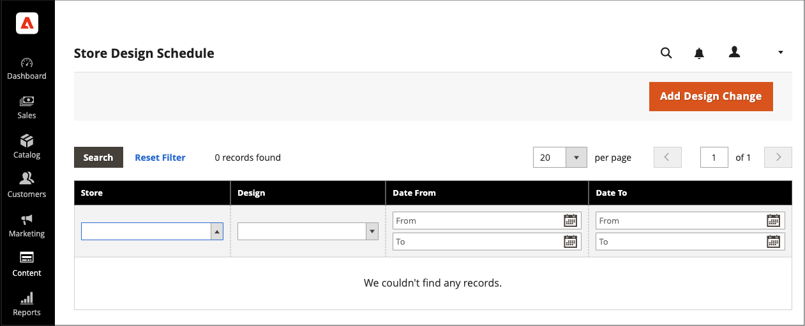
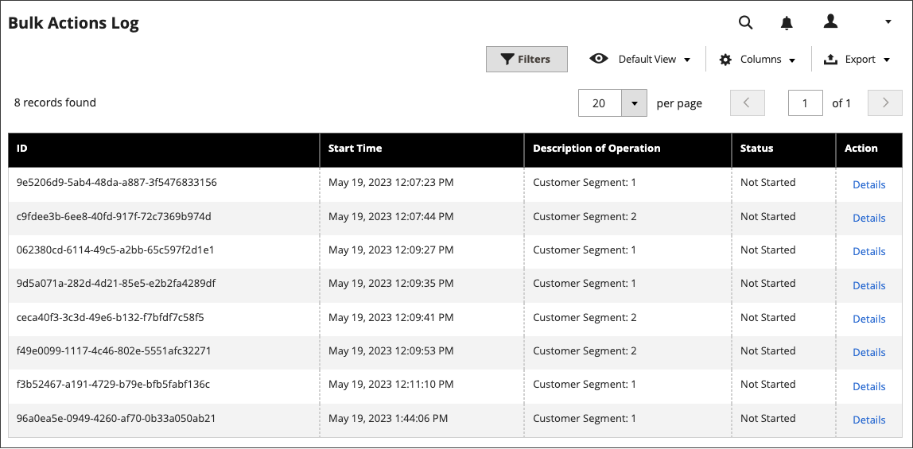

# 排程設計變更

提前排程您的主題設計變更，以便根據您的業務週期和事件生效。 您可以將排程的設計變更用於季節性變更、促銷活動，或只是為了新增變數。

{width="700" zoomable="yes"}

## 新增排程的設計變更

1. 在&#x200B;_管理員_&#x200B;側邊欄上，移至&#x200B;**[!UICONTROL Content]** > _[!UICONTROL Design]_>**[!UICONTROL Schedule]**。

1. 按一下&#x200B;**[!UICONTROL Add Design Change]**。

   {width="600" zoomable="yes"}

1. 將&#x200B;**[!UICONTROL Store]**&#x200B;設定為您要套用變更的存放區檢視。

1. 將&#x200B;**[!UICONTROL Custom Design]**&#x200B;設定為要使用的佈景主題或佈景主題的變數。

1. 針對&#x200B;**[!UICONTROL Date From]**&#x200B;和&#x200B;**[!UICONTROL Date To]**，按一下&#x200B;_行事曆_ （）圖示，以選擇變更生效期間的開始和結束值。

1. 完成時，按一下&#x200B;**[!UICONTROL Save]**。

## 編輯排程的設計變更

1. 在&#x200B;_管理員_&#x200B;側邊欄上，移至&#x200B;**[!UICONTROL Content]** > _[!UICONTROL Design]_>**[!UICONTROL Schedule]**。

1. 選取您要編輯的專案。

1. 進行必要的變更。

1. 完成時，按一下&#x200B;**[!UICONTROL Save]**。

## 刪除排定的設計變更

1. 在&#x200B;_管理員_&#x200B;側邊欄上，移至&#x200B;**[!UICONTROL Content]** > _[!UICONTROL Design]_>**[!UICONTROL Schedule]**。

1. 選取您要刪除的專案。

1. 在頁面頂端的按鈕列中，按一下&#x200B;**[!UICONTROL Delete]**。

1. 若要確認動作，請按一下&#x200B;**[!UICONTROL OK]**。
