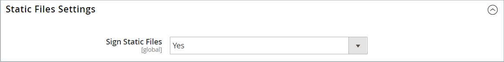

# 佈景主題資產

此 _靜態檔案_ 是佈景主題所使用的資產（例如CSS、字型、影像和JavaScript）集合。 靜態檔案的位置指定於 [基礎URL](../stores-purchase/store-urls.md) 設定。 您可以將數位簽章新增至每個靜態檔案的URL，讓瀏覽器能在較新版本可用時偵測到。 如果簽章與瀏覽器快取中儲存的簽章不同，則會使用較新版本的檔案。

對於標準安裝，與主題關聯的資產會整理在 `web` 資料夾（位於以下位置） [!DNL Commerce] 根。

`[commerce_root]/app/design/frontend/Magento/[theme_name]/web`

## 將數位簽章新增至靜態檔案URL

1. 在 _管理員_ 側欄，前往 **[!UICONTROL Stores]** > _[!UICONTROL Settings]_>**[!UICONTROL Configuration]**.

1. 在左側面板中，展開 **[!UICONTROL Advanced]** 並選擇 **[!UICONTROL Developer]**.

1. 展開  此 **[!UICONTROL Static Files Settings]** 區段。

   {width="500" zoomable="yes"}

1. 設定 **[!UICONTROL Sign Static Files]** 至 `Yes`.

1. 完成後，按一下 **[!UICONTROL Save Config]**.

| 檔案型別 | 說明 |
|--- |--- |
| CSS | 控制與外觀關聯的視覺樣式。 伺服器上的位置範例： `[commerce]/app/design/frontend/Magento/[theme]/web/css` |
| 字型 | 提供主題可用的字型。 伺服器上的位置： `[commerce]/app/design/frontend/Magento/[theme]/web/fonts` |
| 影像 | 提供主題使用的圖形資產，包括按鈕、背景紋理等。 伺服器上的位置範例： `[commerce]/app/design/frontend/Magento/[theme]/web/images` |
| JS | 主題特定的JavaScript常式和可呼叫函式。 伺服器上的位置範例： `[commerce]/app/design/frontend/Magento/[theme]/web/js` |

{style="table-layout:auto"}

## 合併CSS檔案

為了將網站最佳化並減少頁面載入時間，您可以將CSS檔案合併成單一壓縮檔案，以減少個別CSS檔案的數量。 如果您開啟合併的CSS檔案，您會看到一個連續的文字串流，其中已移除分行符號。 您無法編輯合併的檔案，因此最好等到您退出開發模式且不再頻繁變更CSS為止。

>[!NOTE]
>
>CSS檔案可透過以下方式合併： _管理員_ 面板（僅在使用時） [開發人員模式](../systems/developer-tools.md#operation-modes).

1. 在 _管理員_ 側欄，前往 **[!UICONTROL Stores]** > _[!UICONTROL Settings]_>**[!UICONTROL Configuration]**.

1. 在左側面板中， **[!UICONTROL Advanced]** 並選擇 **[!UICONTROL Developer]**.

1. 展開  此 **[!UICONTROL CSS Settings]** 區段。

   {width="500" zoomable="yes"}

   如需這些組態選項的詳細說明，請參閱 [CSS設定](../configuration-reference/advanced/developer.md#css-settings) 在 _設定參考_.

1. 設定 **[!UICONTROL Merge CSS Files]** 至 `Yes`.

1. 完成後，按一下 **[!UICONTROL Save Config]**.

## 合併JavaScript檔案

多個JavaScript檔案可以合併為單一壓縮檔案，以減少頁面載入時間。 如果您開啟合併的JavaScript檔案，您會看到一個連續的文字串流，其中已移除分行符號。 如果您已完成開發程式，且程式碼不含任何錯誤，則可考慮合併檔案。

>[!NOTE]
>
>JavaScript檔案可合併自 _管理員_ 面板（僅在使用時） [開發人員模式](../systems/developer-tools.md#operation-modes).

1. 在 _管理員_ 側欄，前往 **[!UICONTROL Stores]** > _[!UICONTROL Settings]_>**[!UICONTROL Configuration]**.

1. 在左側面板中， **[!UICONTROL Advanced]** 並選擇 **[!UICONTROL Developer]**.

1. 展開  此 **[!UICONTROL JavaScript Settings]** 區段。

   {width="600" zoomable="yes"}

   如需這些組態選項的詳細說明，請參閱 [JavaScript設定](../configuration-reference/advanced/developer.md#javascript-settings) 在 _設定參考_.

1. 設定 **[!UICONTROL Merge JavaScript Files]** 至 `Yes`.

1. 完成後，按一下 **[!UICONTROL Save Config]**.
