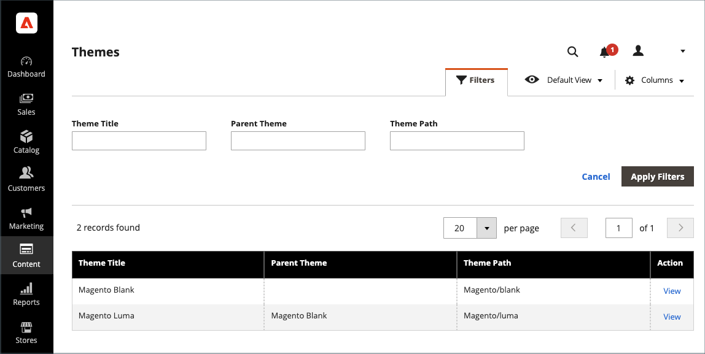

# 主題

佈景主題是決定商店視覺呈現方式的檔案集合。 第一次安裝[!DNL Commerce]時，商店的設計元素是以&#x200B;_預設_&#x200B;主題為基礎。 除了[!DNL Commerce]安裝隨附的初始預設主題之外，還有各種可用的主題可供您使用&#x200B;_as_&#x200B;或視需要加以修改。

回應式主題會調整頁面版面以符合裝置的檢視埠。 範例&#x200B;_Luma_&#x200B;佈景主題具有彈性、回應式版面，可從案頭、平板電腦或行動裝置檢視。

[!DNL Commerce]主題包含版面配置檔案、範本檔案、翻譯檔案和外觀元素。 外觀元素是支援CSS、影像和JavaScript檔案的集合，這些檔案可共同建立視覺化展示方式，以及客戶造訪您的商店時所體驗的互動。 熟悉Commerce主題設計且可存取您伺服器的開發人員或設計專業人員，可以修改及自訂主題和外觀。 若要進一步瞭解，請參閱&#x200B;[_前端開發人員指南_](https://developer.adobe.com/commerce/frontend-core/guide/themes/)。

{width="600" zoomable="yes"}

## 預設主題

`Magento Blank`回應式主題可呈現不同裝置的店面顯示，並整合案頭、表格和行動裝置的最佳實務。 有些佈景主題僅供特定裝置使用。 當[!DNL Commerce]偵測到特定瀏覽器識別碼或使用者代理時，它會使用為特定瀏覽器設定的主題。 搜尋字串也可以包含Perl相容的規則運算式(PCRE)。

{width="700" zoomable="yes"}

### 篩選佈景主題格線

1. 在&#x200B;_管理員_&#x200B;側邊欄上，移至&#x200B;**[!UICONTROL Content]** > _[!UICONTROL Design]_>**[!UICONTROL Themes]**。

1. 按一下&#x200B;**[!UICONTROL Filters]**。

1. 輸入ID範圍、佈景主題名稱（或標題）、資料夾路徑或父佈景主題。

1. 按一下&#x200B;**[!UICONTROL Apply Filters]**&#x200B;以更新主題清單。

## 檢視目前的主題設定

1. 在&#x200B;_管理員_&#x200B;側邊欄上，移至&#x200B;**[!UICONTROL Content]** > _[!UICONTROL Design]_>**[!UICONTROL Themes]**。

1. 在安裝的主題清單中，找到您要檢查的主題，然後按一下該列以顯示設定。

1. 若要檢視範例頁面，請按一下&#x200B;**[!UICONTROL Theme Preview Image]**。

{width="600" zoomable="yes"}

## 套用預設主題

1. 在&#x200B;_管理員_&#x200B;側邊欄上，移至&#x200B;**[!UICONTROL Content]** > _[!UICONTROL Design]_>**[!UICONTROL Configuration]**。

1. 尋找您要設定的存放區檢視，然後按一下&#x200B;_[!UICONTROL Action]_&#x200B;欄中的&#x200B;**[!UICONTROL Edit]**。

1. 在&#x200B;_[!UICONTROL Default Theme]_&#x200B;底下，將&#x200B;**[!UICONTROL Applied Theme]**&#x200B;設定為您要用於目前檢視的檢視。

   {width="600" zoomable="yes"}

1. 完成時，按一下&#x200B;**[!UICONTROL Save Configuration]**。

## 新增使用者代理程式規則

1. 在&#x200B;_管理員_&#x200B;側邊欄上，移至&#x200B;**[!UICONTROL Content]** > _[!UICONTROL Design]_>**[!UICONTROL Configuration]**。

1. 在&#x200B;_[!UICONTROL Design Rule]_&#x200B;底下，按一下&#x200B;**[!UICONTROL Add New User Agent Rule]**。

   {width="600" zoomable="yes"}

1. 針對&#x200B;**[!UICONTROL Search String]**，輸入特定裝置的瀏覽器識別碼。

   搜尋字串會依照輸入順序進行比對。 例如，對於Firefox，請輸入：

   `/^mozilla/i`

1. 若要輸入其他裝置，請重複此程式。

1. 完成時，按一下&#x200B;**[!UICONTROL Save Configuration]**。
