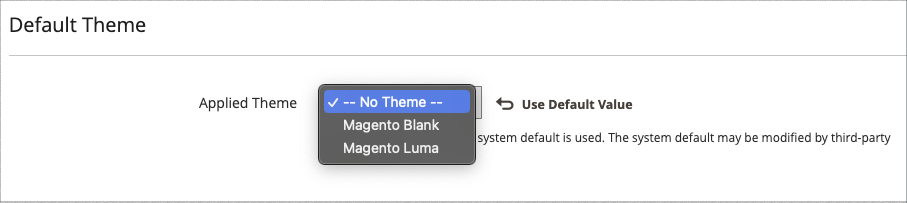

# 主題

佈景主題是決定商店視覺呈現方式的檔案集合。 當您第一次安裝時 [!DNL Commerce]，商店的設計元素是根據 _預設_ 主題。 除了您的電腦隨附的初始預設主題之外， [!DNL Commerce] 安裝，有多種可用的主題可供您使用 _原樣_ 或修改您的需求。

回應式主題會調整頁面版面以符合裝置的檢視埠。 範例 _Luma_ 佈景主題具有彈性、回應式版面，可從案頭、平板電腦或行動裝置檢視。

[!DNL Commerce] 佈景主題包括版面配置檔案、範本檔案、翻譯檔案及外觀元素。 外觀元素是支援CSS、影像和JavaScript檔案的集合，這些檔案可共同建立視覺化展示方式，以及客戶造訪您的商店時所體驗的互動。 瞭解Commerce主題設計並擁有伺服器存取權的開發人員或設計專業人員可以修改和自訂主題和外觀。 若要進一步瞭解，請參閱 [_前端開發人員指南_](https://developer.adobe.com/commerce/frontend-core/guide/themes/).

{width="600" zoomable="yes"}

## 預設主題

此 `Magento Blank` 回應式主題會針對不同裝置呈現店面的顯示，並結合桌上型電腦、表格和行動裝置的最佳實務。 有些佈景主題僅供特定裝置使用。 時間 [!DNL Commerce] 會偵測特定的瀏覽器ID （或使用者代理），其會使用為特定瀏覽器設定的主題。 搜尋字串也可以包含Perl相容的規則運算式(PCRE)。

{width="700" zoomable="yes"}

### 篩選佈景主題格線

1. 在 _管理員_ 側欄，前往 **[!UICONTROL Content]** > _[!UICONTROL Design]_>**[!UICONTROL Themes]**.

1. 按一下 **[!UICONTROL Filters]**.

1. 輸入ID範圍、佈景主題名稱（或標題）、資料夾路徑或父佈景主題。

1. 按一下 **[!UICONTROL Apply Filters]** 更新主題清單。

## 檢視目前的主題設定

1. 在 _管理員_ 側欄，前往 **[!UICONTROL Content]** > _[!UICONTROL Design]_>**[!UICONTROL Themes]**.

1. 在安裝的主題清單中，找到您要檢查的主題，然後按一下該列以顯示設定。

1. 若要檢視範例頁面，請按一下 **[!UICONTROL Theme Preview Image]**.

{width="600" zoomable="yes"}

## 套用預設主題

1. 在 _管理員_ 側欄，前往 **[!UICONTROL Content]** > _[!UICONTROL Design]_>**[!UICONTROL Configuration]**.

1. 尋找要設定的存放區檢視，然後按一下 **[!UICONTROL Edit]** 在 _[!UICONTROL Action]_欄。

1. 在 _[!UICONTROL Default Theme]_，設定&#x200B;**[!UICONTROL Applied Theme]**到您要用於目前檢視的檢視。

   {width="600" zoomable="yes"}

1. 完成後，按一下 **[!UICONTROL Save Configuration]**.

## 新增使用者代理程式規則

1. 在 _管理員_ 側欄，前往 **[!UICONTROL Content]** > _[!UICONTROL Design]_>**[!UICONTROL Configuration]**.

1. 在 _[!UICONTROL Design Rule]_，按一下&#x200B;**[!UICONTROL Add New User Agent Rule]**.

   {width="600" zoomable="yes"}

1. 的 **[!UICONTROL Search String]**，輸入特定裝置的瀏覽器ID。

   搜尋字串會依照輸入順序進行比對。 例如，對於Firefox，請輸入：

   `/^mozilla/i`

1. 若要輸入其他裝置，請重複此程式。

1. 完成後，按一下 **[!UICONTROL Save Configuration]**.
