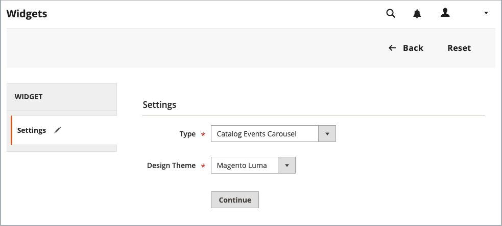
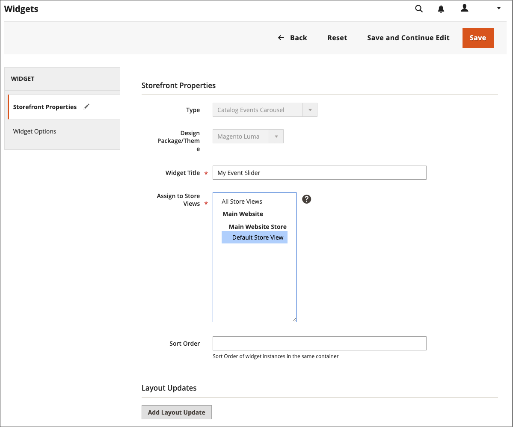
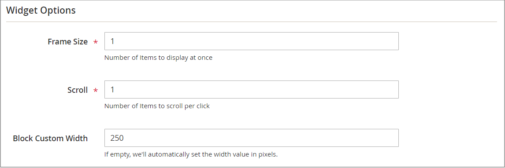

# 目錄事件輪播Widget

{{ee-feature}}

目錄事件轉盤Widget會顯示即將發生事件的滑桿，其中會包含每個事件的倒數計時記號。 您可以選擇要轉盤顯示所在之頁面版面配置的頁面和區域，並控制同時顯示的事件寬度和數量。 您得到的結果取決於您的主題、主題在頁面上出現的位置以及您選擇的選項。

在左側邊欄中{width="700" zoomable="yes"}

## 步驟1：啟用目錄輪播Widget

開始之前，請依照[指示](../merchandising-promotions/event-configure.md)設定&#x200B;_目錄事件_ Widget，使其針對店面啟用。

{width="500" zoomable="yes"}

## 步驟2：建立Widget

1. 在&#x200B;_管理員_&#x200B;側邊欄上，移至&#x200B;**[!UICONTROL Content]** > _[!UICONTROL Elements]_>**[!UICONTROL Widgets]**。

1. 按一下右上角的&#x200B;**[!UICONTROL Add Widget]**。

1. 在&#x200B;_[!UICONTROL Settings]_&#x200B;區段中，執行下列動作：

   - 將&#x200B;**[!UICONTROL Type]**&#x200B;設為`Catalog Events Carousel`。

   - 選擇存放區使用的&#x200B;**[!UICONTROL Design Theme]**。

1. 按一下&#x200B;**[!UICONTROL Continue]**。

   {width="500" zoomable="yes"}

1. 在&#x200B;_[!UICONTROL Storefront Properties]_&#x200B;區段中，執行下列動作：

   - 針對&#x200B;**[!UICONTROL Widget Title]**，輸入Widget的描述性標題。

     此標題只會從&#x200B;_管理員_&#x200B;中顯示。

   - 針對&#x200B;**[!UICONTROL Assign to Store Views]**，選取您要顯示Widget的存放區檢視。

     您可以選取特定的商店檢視，或`All Store Views`。 若要選取多個檢視，請按住Ctrl鍵(PC)或Command鍵(Mac)並按一下每個選項。

   - （選擇性）針對&#x200B;**[!UICONTROL Sort Order]**，輸入數字以決定此專案在頁面相同部分與其他專案一起出現的順序。 （`0` =第一個，`1` =第二個，`3` =第三個，依此類推。）

     {width="600" zoomable="yes"}

## 步驟3：選擇位置

1. 在&#x200B;_配置更新_&#x200B;區段中，按一下&#x200B;**[!UICONTROL Add Layout Update]**。

1. 將&#x200B;**[!UICONTROL Display On]**&#x200B;設為`Specified Page`。

1. 將&#x200B;**[!UICONTROL Page]**&#x200B;設為`CMS Home Page`。

1. 設定&#x200B;**[!UICONTROL Container]**&#x200B;下列其中一項：

   - `Main Content Area`
   - `Sidebar Additional`
   - `Sidebar Main`

   >[!NOTE]
   >
   >結果會因主題和頁面版面配置而異。 您也必須指定類別組態中的&#x200B;_[!UICONTROL Catalog Events Carousel Default Template]_。

1. 如果您希望事件轉盤出現在店面的其他位置，請按一下&#x200B;**[!UICONTROL Add Layout Update]**，然後對該位置重複這些步驟。

   {width="600" zoomable="yes"}

1. 按一下&#x200B;**[!UICONTROL Save and Continue Edit]**。

   現在，您可以忽略訊息以重新整理快取。

## 步驟4：設定選項

1. 在左側面板中選擇&#x200B;**[!UICONTROL Widget Options]**。

1. 針對&#x200B;**[!UICONTROL Frame Size]**，輸入您要同時列在滑桿中的事件數。

   若要一次僅檢視一個事件，請輸入`1`。

1. 針對&#x200B;**[!UICONTROL Scroll]**，輸入您每次點按要捲動的事件清單數目。

   若要捲動到下一個事件，請輸入`1`。

1. 對於自訂寬度，請輸入&#x200B;**[!UICONTROL Block Custom Width]**&#x200B;的畫素數。

   在下列範例頁面上，自訂寬度設定為250畫素。

   {width="400" zoomable="yes"}

1. 完成時，按一下&#x200B;**[!UICONTROL Save]**。

1. 當提示重新整理快取時，請按一下頁面頂端訊息中的連結，然後依照指示進行。
