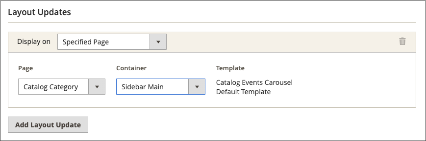

# 目錄事件輪播Widget

{{ee-feature}}

目錄事件轉盤Widget會顯示即將發生事件的滑桿，其中會包含每個事件的倒數計時記號。 您可以選擇要轉盤顯示所在之頁面版面配置的頁面和區域，並控制同時顯示的事件寬度和數量。 您得到的結果取決於您的主題、主題在頁面上出現的位置以及您選擇的選項。

{width="700" zoomable="yes"}

## 步驟1：啟用目錄輪播Widget

開始之前，請遵循 [指示](../merchandising-promotions/event-configure.md) 以設定 _目錄事件_ Widget，以便為店面啟用。

{width="500" zoomable="yes"}

## 步驟2：建立Widget

1. 在 _管理員_ 側欄，前往 **[!UICONTROL Content]** > _[!UICONTROL Elements]_>**[!UICONTROL Widgets]**.

1. 在右上角，按一下 **[!UICONTROL Add Widget]**.

1. 在 _[!UICONTROL Settings]_區段，請執行下列動作：

   - 設定 **[!UICONTROL Type]** 至 `Catalog Events Carousel`.

   - 選擇 **[!UICONTROL Design Theme]** 由商店使用。

1. 按一下 **[!UICONTROL Continue]**.

   {width="500" zoomable="yes"}

1. 在 _[!UICONTROL Storefront Properties]_區段，請執行下列動作：

   - 的 **[!UICONTROL Widget Title]**，輸入Widget的描述性標題。

     此標題只會從 _管理員_.

   - 的 **[!UICONTROL Assign to Store Views]**，選取您希望Widget顯示的商店檢視。

     您可以選取特定的商店檢視，或 `All Store Views`. 若要選取多個檢視，請按住Ctrl鍵(PC)或Command鍵(Mac)並按一下每個選項。

   - （選用） For **[!UICONTROL Sort Order]**，請輸入數字以決定此專案在頁面相同部分與其他專案一起出現的順序。 (`0` =第一個， `1` =秒， `3` =第三個，依此類推。)

     {width="600" zoomable="yes"}

## 步驟3：選擇位置

1. 在 _版面配置更新_ 區段，按一下 **[!UICONTROL Add Layout Update]**.

1. 設定 **[!UICONTROL Display On]** 至 `Specified Page`.

1. 設定 **[!UICONTROL Page]** 至 `CMS Home Page`.

1. 設定 **[!UICONTROL Container]** 下列其中一項：

   - `Main Content Area`
   - `Sidebar Additional`
   - `Sidebar Main`

   >[!NOTE]
   >
   >結果會因主題和頁面版面配置而異。 您也必須指定 _[!UICONTROL Catalog Events Carousel Default Template]_在類別設定中。

1. 如果您希望事件轉盤出現在店面的其他位置，請按一下 **[!UICONTROL Add Layout Update]** 然後對該位置重複這些步驟。

   {width="600" zoomable="yes"}

1. 按一下 **[!UICONTROL Save and Continue Edit]**.

   現在，您可以忽略訊息以重新整理快取。

## 步驟4：設定選項

1. 在左側面板中，選擇 **[!UICONTROL Widget Options]**.

1. 的 **[!UICONTROL Frame Size]**，輸入您要同時在滑桿中列出的事件數。

   若要一次僅檢視一個事件，請輸入 `1`.

1. 的 **[!UICONTROL Scroll]**，輸入您每次點按要捲動的事件清單數目。

   若要捲動至下一個事件，請輸入 `1`.

1. 對於自訂寬度，請輸入 **[!UICONTROL Block Custom Width]**.

   在下列範例頁面上，自訂寬度設定為250畫素。

   {width="400" zoomable="yes"}

1. 完成後，按一下 **[!UICONTROL Save]**.

1. 當提示重新整理快取時，請按一下頁面頂端訊息中的連結，然後依照指示進行。
