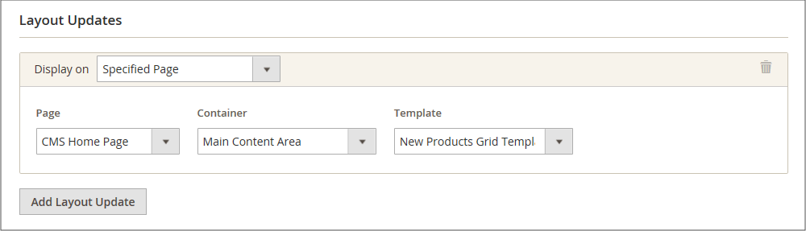
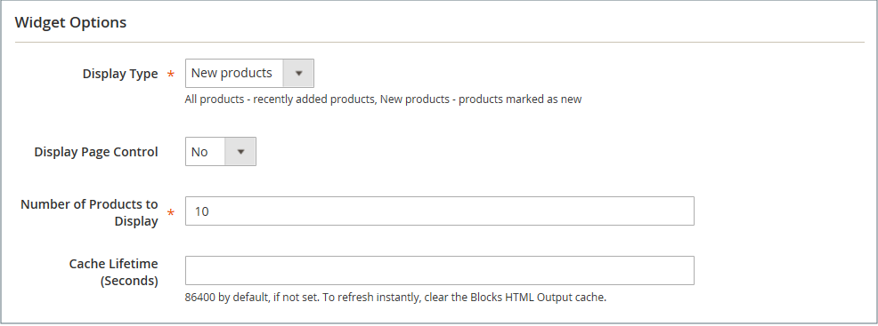

# 新產品清單Widget

新產品清單是動態內容的範例，由從產品目錄提取的即時資料組成。 根據預設，_新產品_&#x200B;清單包含最近新增的前8個產品。 不過，您也可以將其設定為僅包含指定日期範圍內的產品。

{width="700" zoomable="yes"}

## 步驟1：將每項產品設為新產品

此步驟僅適用於Magento Open Source。

若為Adobe Commerce商店，請參閱[排程更新](content-staging-scheduled-update.md)，然後繼續此頁面上的步驟2。

_[!UICONTROL Set Product as New]_&#x200B;日期範圍設定只能在排程更新中設定。

將產品設定為新產品會將產品新增到&#x200B;_新產品_&#x200B;清單。 當您不再想要將設定加入清單時，隨時都可以變更回設定。

1. 在&#x200B;_管理員_&#x200B;側邊欄上，移至&#x200B;**[!UICONTROL Catalog]** > **[!UICONTROL Products]**。

1. 尋找您想要功能的每項產品，並在編輯模式中開啟。

1. 針對&#x200B;**[!UICONTROL Set Product as New]**，切換是否將產品設定為新產品的選項。

   {width="400" zoomable="yes"}

1. 完成時，按一下&#x200B;**[!UICONTROL Save]**。

1. 當系統提示您重新索引和重新整理頁面快取時，請按一下頁面頂端的連結，然後依照指示進行。

## 步驟2：建立Widget

決定新產品清單內容及其在商店中的位置的程式碼，會由Widget工具產生。

1. 在&#x200B;_管理員_&#x200B;側邊欄上，移至&#x200B;**[!UICONTROL Content]** > _[!UICONTROL Elements]_>**[!UICONTROL Widgets]**。

1. 按一下右上角的&#x200B;**[!UICONTROL Add Widget]**。

1. 在&#x200B;_[!UICONTROL Settings]_&#x200B;區段中，執行下列動作：

   - 將&#x200B;**[!UICONTROL Type]**&#x200B;設為`Catalog New Products List`。

   - 選擇存放區使用的&#x200B;**[!UICONTROL Design Theme]**。

1. 按一下&#x200B;**[!UICONTROL Continue]**。

   {width="600" zoomable="yes"}

1. 在&#x200B;_[!UICONTROL Storefront Properties]_&#x200B;區段中，執行下列動作：

   - 針對&#x200B;**[!UICONTROL Widget Title]**，輸入Widget的描述性標題。 （此標題只會從&#x200B;_管理員_&#x200B;中顯示。）

   - 針對&#x200B;**[!UICONTROL Assign to Store Views]**，選取顯示介面工具集的存放區檢視。

     您可以選取特定的商店檢視，或`All Store Views`。 若要選取多個檢視，請按住Ctrl鍵(PC)或Command鍵(Mac)並按一下每個選項。

   - （選擇性）針對&#x200B;**[!UICONTROL Sort Order]**，輸入數字以決定此專案在頁面相同部分與其他專案一起出現的順序。 （`0` =第一個，`1` =第二個，`3` =第三個，依此類推。）

   {width="600" zoomable="yes"}

## 步驟3：選擇位置

1. 在&#x200B;_[!UICONTROL Layout Updates]_&#x200B;區段中，按一下&#x200B;**[!UICONTROL Add Layout Update]**。

1. 將&#x200B;**[!UICONTROL Display On]**&#x200B;設為`Specified Page.`

1. 將&#x200B;**[!UICONTROL Page]**&#x200B;設為`CMS Home Page`。

1. 將&#x200B;**[!UICONTROL Block Reference]**&#x200B;設為`Main Content Area`。

1. 將&#x200B;**[!UICONTROL Template]**&#x200B;設定為下列其中一項：

   - `New Product List Template`
   - `New Products Grid Template`

     {width="600" zoomable="yes"}

1. 按一下&#x200B;**[!UICONTROL Save and Continue Edit]**。

   現在，您可以忽略訊息以重新整理快取。

## 步驟4：設定清單

1. 在左側面板中選擇&#x200B;**[!UICONTROL Widget Options]**。

1. 將&#x200B;**[!UICONTROL Display Products]**&#x200B;設定為下列其中一項：

   - `All Products` — 依序列出產品，從最近新增的產品開始。
   - `New Products` — 僅列出識別為&#x200B;_new_&#x200B;的產品。 在&#x200B;_[!UICONTROL Set Product As New From/To]_&#x200B;中指定的日期範圍內將產品視為新產品。 如果日期範圍到期，但未定義任何新產品，則清單為空白。

1. 若要為具有多個頁面的清單提供導覽控制項，請將&#x200B;**[!UICONTROL Display Page Control]**&#x200B;設為`Yes`。

   針對&#x200B;**[!UICONTROL Number of Products per Page]**，輸入您要在每個頁面上顯示的產品數目。

1. 將&#x200B;**[!UICONTROL Number of Products to Display]**&#x200B;選項設定為您要納入清單的新產品數目。

   預設設定為`10`。

1. 針對&#x200B;**[!UICONTROL Cache Lifetime (Seconds)]**，選擇您重新整理新產品清單的頻率。

   快取預設為86,400秒（24小時）。

   {width="600" zoomable="yes"}

1. 完成時，按一下&#x200B;**[!UICONTROL Save]**。

1. 當提示重新整理快取時，請按一下頁面頂端訊息中的連結，然後依照指示進行。

## 步驟5：預覽您的工作

1. 在&#x200B;_管理員_&#x200B;側邊欄上，移至&#x200B;**[!UICONTROL Content]** > _[!UICONTROL Elements]_>**[!UICONTROL Pages]**。

1. 在網格中尋找要顯示&#x200B;_新產品_&#x200B;清單的頁面，然後按一下&#x200B;_[!UICONTROL Action]_&#x200B;欄中的&#x200B;**[!UICONTROL Preview]**&#x200B;連結。
