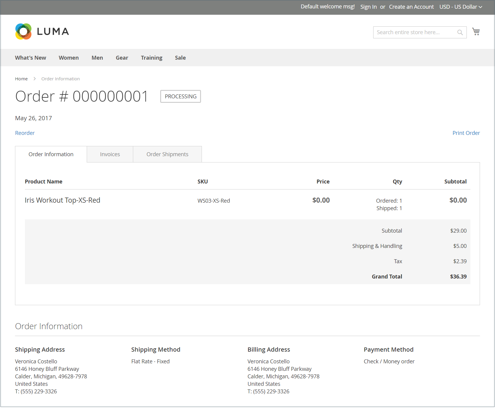

# 訂單與退貨Widget

_訂單與退貨_ Widget可讓來賓檢查其訂單狀態、列印發票及追蹤出貨。 將Widget新增至店面時，唯有未登入其帳戶的來賓和客戶才能看到它。 來賓可以透過提供訂單ID、帳單姓氏以及電子郵件地址或郵遞區號來尋找訂單。

店面側邊欄中的{width="600" zoomable="yes"}

## 店面上的訂單與退貨Widget

1. 客戶可以使用&#x200B;**[!UICONTROL Find Order By]**&#x200B;選項來選擇要用來尋找訂單的下列其中一個引數：

   - 電子郵件地址
   - 郵遞區號

1. 客戶進入&#x200B;**[!UICONTROL Order ID]**&#x200B;和&#x200B;**[!UICONTROL Billing Last Name]**。

1. 輸入與訂單關聯的帳單&#x200B;**[!UICONTROL Email Address]**&#x200B;或&#x200B;**[!UICONTROL ZIP Code]**。

1. 按一下&#x200B;**[!UICONTROL Search]**&#x200B;以擷取訂單。

   {width="700" zoomable="yes"}

## 設定訂單與退貨Widget

1. 在&#x200B;_管理員_&#x200B;側邊欄上，移至&#x200B;**[!UICONTROL Content]** > _[!UICONTROL Elements]_>**[!UICONTROL Widgets]**。

1. 按一下右上角的&#x200B;**[!UICONTROL Add Widget]**。

1. 在&#x200B;_[!UICONTROL Settings]_&#x200B;區段中，執行下列動作：

   - 將&#x200B;**[!UICONTROL Type]**&#x200B;設為`Orders and Returns`。

   - 選擇存放區使用的&#x200B;**[!UICONTROL Design Theme]**。

1. 按一下&#x200B;**[!UICONTROL Continue]**。

1. 在&#x200B;_[!UICONTROL Storefront Properties]_&#x200B;區段中，執行下列動作：

   - 針對&#x200B;**[!UICONTROL Widget Title]**，輸入Widget的描述性標題。

     此標題只會從管理員看到。

   - 針對&#x200B;**[!UICONTROL Assign to Store Views]**，選取顯示介面工具集的存放區檢視。

     您可以選取特定的商店檢視，或`All Store Views`。 若要選取多個檢視，請按住Ctrl鍵(PC)或Command鍵(Mac)並按一下每個選項。

   - （選擇性）針對&#x200B;**[!UICONTROL Sort Order]**，輸入數字以決定此專案在頁面相同部分與其他專案一起出現的順序。 （`0` =第一個，`1` =第二個，`3` =第三個，依此類推。）

1. 在&#x200B;_[!UICONTROL Layout Updates]_&#x200B;區段中，按一下&#x200B;**[!UICONTROL Add Layout Update]**&#x200B;並執行下列動作：

   - 將&#x200B;**[!UICONTROL Display On]**&#x200B;設定為您要顯示Widget的頁面型別。

   - 若要確定Widget在頁面上顯示的位置，請完成其餘的版面更新資訊。

1. 完成時，按一下&#x200B;**[!UICONTROL Save]**。

1. 當提示重新整理快取時，請按一下頁面頂端訊息中的連結，然後依照指示進行。
