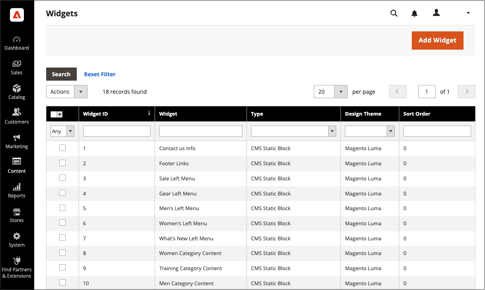
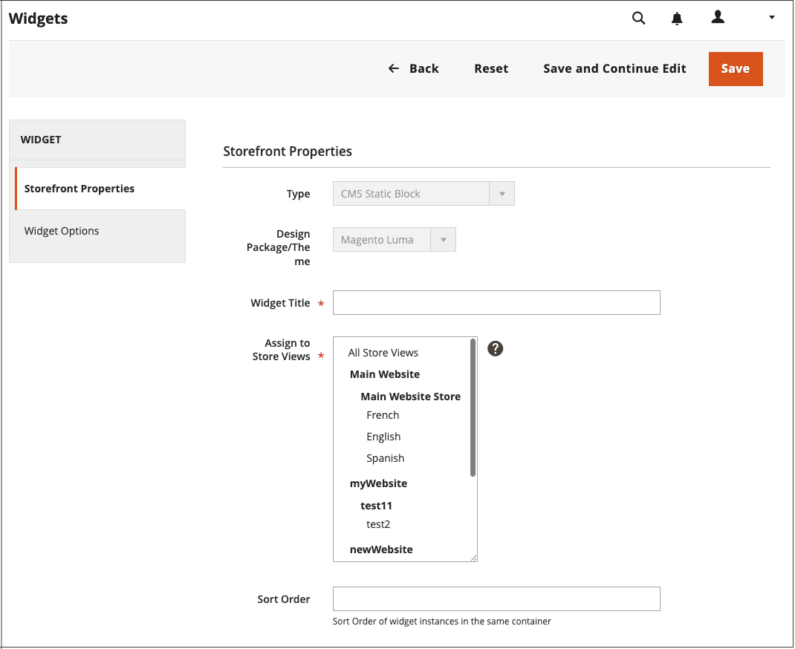

# 使用Widget來定位區塊

_CMS靜態區塊_ [Widget](widgets.md)可讓您將現有的[內容區塊](blocks.md)放置到幾乎您商店中的任何地方。

{width="700" zoomable="yes"}

## 步驟1：選擇Widget型別

1. 在&#x200B;_管理員_&#x200B;側邊欄上，移至&#x200B;**[!UICONTROL Content]** > _[!UICONTROL Elements]_>**[!UICONTROL Widgets]**。

1. 按一下右上角的&#x200B;**[!UICONTROL Add Widget]**。

1. 在&#x200B;_設定_&#x200B;區段中，將&#x200B;**[!UICONTROL Type]**&#x200B;設為`CMS Static Block`並按一下&#x200B;**[!UICONTROL Continue]**。

1. 確認&#x200B;**[!UICONTROL Design Theme]**&#x200B;已設定為目前的主題，然後按一下&#x200B;**[!UICONTROL Continue]**。

   {width="600" zoomable="yes"}

1. 在&#x200B;_[!UICONTROL Storefront Properties]_&#x200B;區段中，執行下列動作：

   - 針對&#x200B;**[!UICONTROL Widget Title]**，輸入Widget的描述性標題。

     此標題只會從&#x200B;_管理員_&#x200B;中顯示。

   - 針對&#x200B;**[!UICONTROL Assign to Store Views]**，選取顯示介面工具集的存放區檢視。

     您可以選取特定的商店檢視，或`All Store Views`。 若要選取多個檢視，請按住Ctrl鍵(PC)或Command鍵(Mac)並按一下每個選項。

   - （選擇性）針對&#x200B;**[!UICONTROL Sort Order]**，輸入數字以決定此專案在頁面相同部分與其他專案一起出現的順序。 （`0` =第一個，`1` =第二個，`3` =第三個，依此類推。）

     {width="600" zoomable="yes"}

## 步驟2：完成Widget配置更新

1. 在&#x200B;_[!UICONTROL Layout Updates]_&#x200B;區段中，按一下&#x200B;**[!UICONTROL Add Layout Update]**。

1. 將&#x200B;**[!UICONTROL Display On]**&#x200B;設定為您要顯示區塊的類別、產品或頁面。

1. 若要將區塊放置在特定頁面上，請執行下列動作：

   - 選擇您要顯示區塊的&#x200B;**[!UICONTROL Page]**。

   - 選擇可識別區塊在頁面上顯示位置的&#x200B;**[!UICONTROL Block Reference]**。

   - 接受&#x200B;**[!UICONTROL Template]**&#x200B;的預設設定，此設定設為`CMS Static Block Default Template`。

     {width="600" zoomable="yes"}

### 版面配置更新選項

| 欄位 | 說明 |
|--- |--- |
| **_[!UICONTROL Categories]_** |  |
| [!UICONTROL Anchor Categories] | 在錨點類別頁面上顯示Widget。 **[!UICONTROL Categories]**— 顯示錨點的類別。 選項： `All` /`Specific Categories` **[!UICONTROL Container]** — 將容器設定為您要顯示Widget的頁面配置部分。 **[!UICONTROL Template]**— 決定配置主題。 |
| [!UICONTROL Non-Anchor Categories] | 在非錨點類別頁面上顯示Widget。 **[!UICONTROL Categories]**— 顯示錨點的類別。 選項： `All` /`Specific Categories` **[!UICONTROL Container]** — 將容器設定為您要顯示Widget的頁面配置部分。 **[!UICONTROL Template]**— 決定配置主題。 |
| **_[!UICONTROL Products]_** |  |
| 所有產品型別 | 在特定產品頁面型別或所有產品頁面上顯示Widget。  **[!UICONTROL Products]**— 顯示Widget的產品。 選項： `All` /` Specific Products` **[!UICONTROL Container]** — 將容器設定為您要顯示Widget的頁面配置部分。 **[!UICONTROL Template]**— 決定配置主題。 |
| **_[!UICONTROL Generic Pages]_** |  |
| [!UICONTROL All Pages] | 在所有頁面上顯示Widget。  **[!UICONTROL Container]**— 將容器設定為您要顯示Widget的頁面配置部分。 **[!UICONTROL Template]** — 決定配置主題。 |
| [!UICONTROL Specified Page] | 顯示特定頁面上的Widget。 選項： **[!UICONTROL Page]**— 顯示Widget的頁面。 **[!UICONTROL Container]** — 將容器設定為您要顯示Widget的頁面配置部分。 **範本** — 決定配置主題。 |
| [!UICONTROL Page Layouts] | 在具有特定版面的頁面上顯示Widget。  **[!UICONTROL Page]**— 顯示介面工具集的頁面。 **[!UICONTROL Container]** — 將容器設定為您要顯示Widget的頁面配置部分。 **[!UICONTROL Template]**— 決定配置主題。 |

{style="table-layout:auto"}

## 步驟3：放置區塊

1. 在左側面板中，選取&#x200B;**[!UICONTROL Widget Options]**。

1. 按一下&#x200B;**[!UICONTROL Select Block…]**，然後從清單中選擇要置入的區塊。

1. 完成時，按一下&#x200B;**[!UICONTROL Save]**。

   應用程式現在會出現在清單中。

1. 出現提示時，請依照頁面頂端的指示，更新索引和頁面快取。

1. 返回您的店面，確認區塊出現在正確的位置。

   若要移動區塊，您可以重新開啟Widget，或嘗試不同的頁面或區塊參照。
