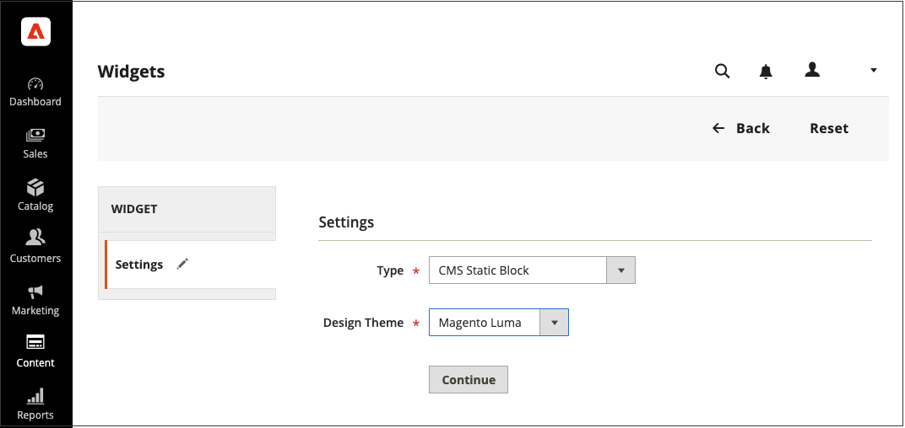

# 使用Widget來定位區塊

此 _CMS靜態區塊_ [Widget](widgets.md) 可讓您放置現有的 [內容區塊](blocks.md) 幾乎在您的商店中的任何地方。

{width="700" zoomable="yes"}

## 步驟1：選擇Widget型別

1. 在 _管理員_ 側欄，前往 **[!UICONTROL Content]** > _[!UICONTROL Elements]_>**[!UICONTROL Widgets]**.

1. 在右上角，按一下 **[!UICONTROL Add Widget]**.

1. 在 _設定_ 部分，設定 **[!UICONTROL Type]** 至 `CMS Static Block` 並按一下 **[!UICONTROL Continue]**.

1. 確認 **[!UICONTROL Design Theme]** 設定為目前佈景主題，然後按一下 **[!UICONTROL Continue]**.

   {width="600" zoomable="yes"}

1. 在 _[!UICONTROL Storefront Properties]_區段，請執行下列動作：

   - 的 **[!UICONTROL Widget Title]**，輸入Widget的描述性標題。

     此標題只會從 _管理員_.

   - 的 **[!UICONTROL Assign to Store Views]**，選取顯示Widget的商店檢視。

     您可以選取特定的商店檢視，或 `All Store Views`. 若要選取多個檢視，請按住Ctrl鍵(PC)或Command鍵(Mac)並按一下每個選項。

   - （選用） For **[!UICONTROL Sort Order]**，請輸入數字以決定此專案在頁面相同部分與其他專案一起出現的順序。 (`0` =第一個， `1` =秒， `3` =第三個，依此類推。)

     {width="600" zoomable="yes"}

## 步驟2：完成Widget配置更新

1. 在 _[!UICONTROL Layout Updates]_區段，按一下&#x200B;**[!UICONTROL Add Layout Update]**.

1. 設定 **[!UICONTROL Display On]** 至您要顯示區塊的類別、產品或頁面。

1. 若要將區塊放置在特定頁面上，請執行下列動作：

   - 選擇 **[!UICONTROL Page]** 您希望區塊出現的位置。

   - 選擇 **[!UICONTROL Block Reference]** 可識別區塊在頁面上顯示的位置。

   - 接受預設設定 **[!UICONTROL Template]**，設為 `CMS Static Block Default Template`.

     {width="600" zoomable="yes"}

### 版面配置更新選項

| 欄位 | 說明 |
|--- |--- |
| **_[!UICONTROL Categories]_** |  |
| [!UICONTROL Anchor Categories] | 在錨點類別頁面上顯示Widget。 **[!UICONTROL Categories]**— 顯示錨點的類別。 選項： `All` /`Specific Categories` **[!UICONTROL Container]**  — 將容器設為頁面配置中要顯示Widget的部分。 **[!UICONTROL Template]**— 決定版面配置的主題。 |
| [!UICONTROL Non-Anchor Categories] | 在非錨點類別頁面上顯示Widget。 **[!UICONTROL Categories]**— 顯示錨點的類別。 選項： `All` /`Specific Categories` **[!UICONTROL Container]**  — 將容器設為頁面配置中要顯示Widget的部分。 **[!UICONTROL Template]**— 決定版面配置的主題。 |
| **_[!UICONTROL Products]_** |  |
| 所有產品型別 | 在特定產品頁面型別或所有產品頁面上顯示Widget。  **[!UICONTROL Products]**— 顯示介面工具集的產品。 選項： `All` /` Specific Products` **[!UICONTROL Container]**  — 將容器設為頁面配置中要顯示Widget的部分。 **[!UICONTROL Template]**— 決定版面配置的主題。 |
| **_[!UICONTROL Generic Pages]_** |  |
| [!UICONTROL All Pages] | 在所有頁面上顯示Widget。  **[!UICONTROL Container]**— 將容器設為頁面配置中要顯示Widget的部分。 **[!UICONTROL Template]**  — 決定版面配置的主題。 |
| [!UICONTROL Specified Page] | 顯示特定頁面上的Widget。 選項： **[!UICONTROL Page]**— 顯示Widget的頁面。 **[!UICONTROL Container]**  — 將容器設為頁面配置中要顯示Widget的部分。 **範本**  — 決定版面配置的主題。 |
| [!UICONTROL Page Layouts] | 在具有特定版面的頁面上顯示Widget。  **[!UICONTROL Page]**— 顯示Widget的頁面。 **[!UICONTROL Container]**  — 將容器設為頁面配置中要顯示Widget的部分。 **[!UICONTROL Template]**— 決定版面配置的主題。 |

{style="table-layout:auto"}

## 步驟3：放置區塊

1. 在左側面板中，選取 **[!UICONTROL Widget Options]**.

1. 按一下 **[!UICONTROL Select Block…]** 並從清單中選擇要置入的區塊。

1. 完成後，按一下 **[!UICONTROL Save]**.

   應用程式現在會出現在清單中。

1. 出現提示時，請依照頁面頂端的指示，更新索引和頁面快取。

1. 返回您的店面，確認區塊出現在正確的位置。

   若要移動區塊，您可以重新開啟Widget，或嘗試不同的頁面或區塊參照。
