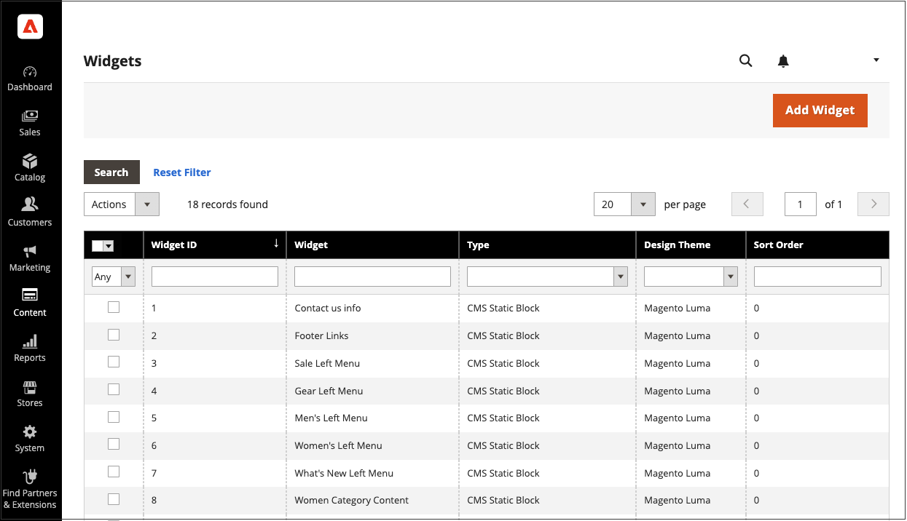

# Widget

Widget是程式碼片段，可顯示廣泛的內容，並將其置於商店中的特定區塊參考中。 許多Widget會顯示即時、動態的資料，並為客戶創造與商店互動的機會。 Widget工具可讓您在現有內容中輕鬆放置Widget，例如含有影像和文字的區塊，以及存放區中大部分的互動元素。

您可以使用Widget建立行銷活動的登陸頁面，並在整個商店的特定位置顯示促銷內容。 Widget也可用來為外部稽核系統、視訊聊天、投票和訂閱表單新增互動元素和動作區塊，或為標籤雲和影像滑桿提供導覽元素。

{{$include /help/_includes/directives-caution.md}}

{width="700" zoomable="yes"}

## Widget型別

當您[建立Widget](widget-create.md)時，您必須設定型別。 此型別會決定Widget的運作方式。

| 型別 | 說明 |
|--- |--- |
| [!UICONTROL CMS Hierarchy Node Link] | 使用此選項可顯示頁面階層中可併入其他內容之特定節點的連結。 |
| [!UICONTROL CMS Page Link] | 使用此選項可指定自訂文字和連結至特定CMS頁面的標題。 連結完成時，可用於內容頁面和區塊。 |
| [!UICONTROL CMS Static Block] | 使用此選項可在頁面上的特定位置顯示內容區塊。 |
| [!UICONTROL Catalog Category Link] | 使用此選項可顯示所選目錄類別的內嵌或區塊樣式連結。 連結完成時，可用於內容頁面和區塊。 |
| [!UICONTROL Catalog Events Carousel] | 使用此選項來顯示即將到來的目錄事件清單。 |
| [!UICONTROL Catalog New Products List] | 在產品記錄中指定的時間內，使用此選項來顯示已指定為新的產品區塊。 |
| [!UICONTROL Catalog Product Link] | 使用此選項可顯示所選目錄產品的內嵌或區塊樣式連結。 連結完成時，可用於內容頁面和區塊。 |
| [!UICONTROL Catalog Products List] | 使用此選項可顯示目錄中的產品清單。 |
| [!UICONTROL Dynamic Blocks Rotator] | 使用此選項可顯示單一動態區塊，或數列、隨機順序或隨機排列動態區塊的分類。 動態區塊可以透過價格規則觸發，並放置在特定的頁面和位置，或設定為出現在所有頁面上。 |
| [!UICONTROL Gift Registry Search] | 使用此選項可讓購物者依名稱或登入ID搜尋公共禮品登入。 |
| [!UICONTROL Order by SKU] | 排序的SKU可以在商店中顯示，方便所有購物者，或僅供特定客戶群組使用。 購物者可以直接在「依SKU訂購」區塊中輸入SKU和數量資訊，或是從其客戶帳戶上傳CSV檔案。 |
| [!UICONTROL Orders and Returns] | 使用此選項可讓來賓檢查其訂單狀態並提交退貨請求。 此Widget僅會對未登入其帳戶的來賓和客戶顯示。 |
| [!UICONTROL Recently Compared Products] | 顯示最近比較的產品的區塊。 您可以指定包含的產品數量，並將其格式化為清單或產品格線。 |
| [!UICONTROL Recently Viewed Products] | 使用此選項可顯示最近檢視之產品的區塊。 您可以指定包含的產品數量，並將其格式化為清單或產品格線。 Widget可能不會顯示即時價格更新。 購物者必須按一下產品，才能在產品頁面上檢視目前定價。 |
| [!UICONTROL Wish List Search] | 使用此選項可讓客戶依希望清單擁有者的名稱或電子郵件地址，搜尋公開可用的希望清單。 商店客戶可以找到屬於其他客戶的願望清單、檢視他們並向他們訂購產品，或將產品新增到他們自己的願望清單中。 |

{style="table-layout:auto"}

<!-- Last updated from includes: 2022-08-30 15:36:09 -->
