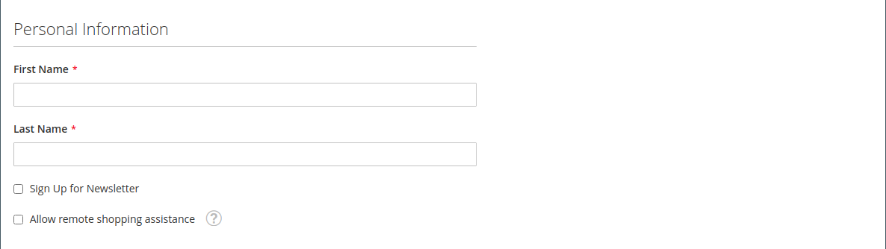
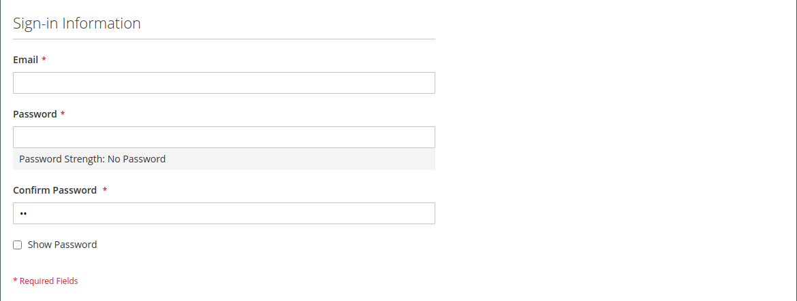

# 建立個別客戶帳戶

您商店的訪客可以開立帳戶來管理他們的購買和活動。 客戶通常會在您的商店中建立自己的帳戶。 不過，您也可以直接從管理員建立客戶帳戶，這對透過電話協助客戶非常有用。

下列指示代表預設的客戶帳戶設定。 若要變更表單中某些欄位的選取範圍和行為，請參閱 [設定客戶帳戶](../customers/customer-account-scope.md).

身為商店管理員，您也可以設定 [新帳戶選項](../customers/account-options-new.md) 傳送確認電子郵件給新的註冊客戶，有助於確保註冊帳戶有效。

>[!NOTE]
>
>從2.4.7版開始，無論瀏覽器為何，客戶都必須在電子郵件確認後，重新輸入電子郵件和密碼以登入其帳戶。

## 從店面建立帳戶

商店客戶在店面建立帳戶。

1. 從店面，按一下 **[!UICONTROL Create an Account]** 標題右上角的。

   {width="700" zoomable="yes"}

1. 在 **[!UICONTROL Personal Information]**，輸入其 **[!UICONTROL First Name]** 和 **[!UICONTROL Last Name]**.

   {width="600" zoomable="yes"}

1. 如果他們想要將其姓名和電子郵件地址新增到Newsletter訂閱者清單，客戶會選取 **[!UICONTROL Sign Up for Newsletter]** 核取方塊。

   >[!INFO]
   >
   > 即使商店未發佈Newsletter，也會出現此選項。

1. 如果他們想要商店支援人員 [檢視他們看到的內容](../customers/login-as-customer.md) 並提供遠端協助，客戶會選擇 **[!UICONTROL Allow remote shopping assistance]** 核取方塊。

1. 在 **[!UICONTROL Sign-in Information]**，輸入其 **[!UICONTROL Email]** 位址。

   >[!INFO]
   >
   > 此電子郵件地址會成為其登入憑證的一部分，且無法與任何其他客戶帳戶相關聯。

   {width="600" zoomable="yes"}

1. 輸入 **[!UICONTROL Password]** 包含下列三種資訊型別：

   - 小寫字母
   - 大寫字
   - 數字
   - 特殊字元

   按下之後 **[!UICONTROL Enter]**，則會評估密碼的強度，並顯示在欄位下方。 如果密碼被認為是 _弱_，請嘗試其他值，直到評估為 _強_.

   {width="600" zoomable="yes"}

1. 然後，客戶再次輸入 **[!UICONTROL Confirm Password]**.

1. 如有需要，請按一下 **[!UICONTROL Show Password]** 以檢視您輸入的密碼。

1. 完成後，按一下 **建立帳戶**.

然後，客戶可以使用其電子郵件地址和密碼來 [登入](../customers/customer-sign-in.md) 並填妥地址資訊。

## 從管理員建立帳戶

身為商家，您可以從管理員建立客戶帳戶。

1. 在 _管理員_ 側欄，前往 **[!UICONTROL Customers]** > **[!UICONTROL All Customers]**.

1. 按一下 **[!UICONTROL Add New Customer]**.

### 步驟1：完成帳戶資訊

{width="700" zoomable="yes"}

1. 在 **[!UICONTROL Account Information]** 區段，請執行下列動作：

   - 若為多站台安裝，請設定 **[!UICONTROL Associate to Website]** 至客戶帳戶適用的網站。
   - 如果適用，將客戶指派給其他客戶 **[!UICONTROL Customer Group]**.
   - 如果您使用 [VAT ID驗證](../stores-purchase/vat.md) 並希望 **[!UICONTROL Disable Automatic Group Change Based on VAT ID]**，選取核取方塊。

1. 填寫必填欄位：

   - **[!UICONTROL First Name]**
   - **[!UICONTROL Last Name]**
   - **[!UICONTROL Email]**

1. 視需要填寫選用欄位：

   - **[!UICONTROL Name Prefix]**
   - **[!UICONTROL Middle Name/Initial]**
   - **[!UICONTROL Name Suffix]**
   - **[!UICONTROL Date of Birth]**
   - **[!UICONTROL Tax/VAT Number]**
   - **[!UICONTROL Gender]**

   >[!WARNING]
   >
   >為了遵循目前的安全性和隱私權最佳實務，請注意任何與儲存客戶完整出生日期（月、日、年）和其他個人識別碼相關的潛在法律和安全風險。 建議您限制客戶完整出生日期的儲存量，並建議使用客戶出生年作為替代方法。

1. 設定 **[!UICONTROL Send Welcome Email From]** 至存放區檢視 _歡迎_ 電子郵件將寄出。

   >[!INFO]
   >
   > 如果存放區有不同的檢視 [語言](../stores-purchase/store-localize.md)，此設定會決定歡迎電子郵件的語言。

1. 按一下 **[!UICONTROL Save and Continue Edit]** ，位於頁面頂端。

   >[!INFO]
   >
   >儲存客戶帳戶後，完整的選項集會顯示在左側面板和頁面頂端的功能表中。 此 _[!UICONTROL Customer View]_索引標籤會顯示帳戶的摘要。

   {width="600" zoomable="yes"}

### 步驟2：完成地址資訊

1. 在左側面板中，選擇 **[!UICONTROL Addresses]** 並按一下 **[!UICONTROL Add New Addresses]**.

1. 如果帳單和送貨使用相同地址，請切換兩個選項。

   - **[!UICONTROL Default Billing Address]**
   - **[!UICONTROL Default Shipping Address]**

   {width="600" zoomable="yes"}

1. 向下捲動並填入第二欄中的必填位址欄位。

   - **[!UICONTROL Street Address]**
   - **[!UICONTROL City]**
   - **[!UICONTROL Country]**
   - **[!UICONTROL State/Province]**
   - **[!UICONTROL ZIP/Postal Code]**

1. 輸入 **[!UICONTROL Phone Number]** 此地址的。

1. 如果適用，請輸入 **[!UICONTROL VAT Number]** 與客戶相關聯。

1. 如果此位址是帳戶唯一需要的位址，請按一下 **[!UICONTROL Save]**.

   否則，按一下 **[!UICONTROL Save and Continue Edit]** 並重複上述步驟以新增其他地址。

   新地址會顯示在 [!UICONTROL Addresses] 已選取的頁面 _[!UICONTROL Default Billing]_和_[!UICONTROL Default Shipping]_ 位址在完整清單上方。

   {width="600" zoomable="yes"}

### 步驟3：重設密碼

從Admin建立的客戶帳戶最初不會指派密碼。

1. 在網格中尋找新的客戶帳戶。

1. 按一下 **[!UICONTROL Edit]** 在 _[!UICONTROL Action]_欄。

1. 在頁面頂端的功能表列中，按一下 **[!UICONTROL Reset Password]**.

1. 通知會傳送給帳戶擁有者，並附上設定密碼的說明。

## 按鈕列

第一次儲存設定檔時，會有其他按鈕可供使用。 若要深入瞭解，請參閱 [更新客戶設定檔](../customers/update-account.md).

| 按鈕 | 說明 |
|--- |--- |
| **[!UICONTROL Back]** | 返回至 _[!UICONTROL Customers]_頁面，而不儲存變更。 |
| **[!UICONTROL Delete Customer]** | 刪除目前的客戶。 不會移除與客戶關聯的已完成訂單。 |
| **[!UICONTROL Reset]** | 將客戶表單中未儲存的變更重設為先前的值。 |
| **[!UICONTROL Create Order]** | 建立客戶的訂單。 |
| **[!UICONTROL Reset Password]** | 傳送 [重設密碼](../customers/password-reset.md) 透過電子郵件連結至客戶。 |
| **[!UICONTROL Force Sign-in]** | 撤銷與客戶帳戶相關聯的OAuth存取權杖。 只有已將OAuth權杖指派為Web API一部分的客戶帳戶才能使用此函式 [整合](../systems/integrations.md). 若要深入瞭解，請參閱 [OAuth型驗證](https://developer.adobe.com/commerce/webapi/get-started/authentication/gs-authentication-oauth/) 在開發人員檔案中。 |
| **[!UICONTROL Manage Shopping Cart]** | 允許管理員管理客戶的購物車。 |
| **[!UICONTROL Save and Continue Edit]** | 儲存變更並保持客戶設定檔開啟。 |
| **[!UICONTROL Save Customer]** | 儲存變更並關閉客戶設定檔。 |

{style="table-layout:auto"}

## 欄位說明

### [!UICONTROL Account Information]

| 欄位 | 說明 |
|--- |--- |
| **[!UICONTROL Associate to Website]** | 識別與客戶帳戶相關聯的網站。 |
| **[!UICONTROL Group]** | 識別 [客戶群組](../customers/customer-groups.md) 其中客戶為成員。 如果適用，請選取核取方塊以停用根據VAT的自動群組變更。 |
| **[!UICONTROL Name Prefix]** | 若已使用，則為與客戶名稱相關聯的前置詞（例如Mr、Ms.或Dr）。 前置詞值由 [設定](../configuration-reference/customers/customer-configuration.md). 視組態而定，輸入控制項可能是文字欄位或選項清單。 |
| **[!UICONTROL First Name]** | 客戶的名字。 |
| **[!UICONTROL Middle Name / Initial]** | 客戶的中間名或首字母。 此欄位僅包含在 [設定](../configuration-reference/customers/customer-configuration.md) 主題。 |
| **[!UICONTROL Last Name]** | 客戶的姓氏。 |
| **[!UICONTROL Name Suffix]** | 若已使用，則是與客戶名稱相關聯的尾碼（例如Jr.、Sr.或III）。 尾碼值由以下專案決定 [設定](../configuration-reference/customers/customer-configuration.md). 視組態而定，輸入控制項可能是文字欄位或選項的下拉式清單。 |
| **[!UICONTROL Email]** | 客戶的電子郵件地址。 |
| **[!UICONTROL Date of Birth]** | 客戶的出生日期。 出生日期包括在 [設定](../configuration-reference/customers/customer-configuration.md) 主題。   為了遵循目前的安全性和隱私權最佳實務，請注意任何與儲存客戶完整出生日期（月、日、年）和其他個人識別碼相關的潛在法律和安全風險。 建議您限制客戶完整出生日期的儲存量，並建議使用客戶出生年作為替代方法。 |
| **[!UICONTROL Tax / VAT Number]** | 客戶的「稅捐」或「增值稅」編號（若適用）。 |
| **[!UICONTROL Gender]** | 識別客戶的性別。 性別會包含在中（若指定） [設定](../configuration-reference/customers/customer-configuration.md). 選項： `Male` / `Female` / `Not Specified` |
| **[!UICONTROL Send Welcome Email From]** | 如果您有多個存放區檢視，此設定會識別從中傳送歡迎訊息的存放區檢視。 如果商店檢視用於不同的語言，此設定會決定歡迎電子郵件的語言。 |

### [!UICONTROL Addresses]

| 欄位 | 說明 |
|--- |--- |
| **[!UICONTROL New Addresses]** | 識別新位址的型別。 選項： `Default Billing Address` / `Default Shipping Address` |
| **[!UICONTROL Add New Addresses]** | 顯示另一個新地址區段，以識別要輸入的地址型別。 |
| **[!UICONTROL Company]** | 適用於此地址的公司名稱。 |
| **[!UICONTROL Street Address]** | 客戶的街道地址。 若在 [設定](../configuration-reference/customers/customer-configuration.md) 主題。 |
| **[!UICONTROL City]** | 客戶地址所在的城市。 |
| **[!UICONTROL Country]** | 客戶地址所在的國家/地區。 |
| **[!UICONTROL State/Province]** | 客戶地址所在的州或省。 |
| **[!UICONTROL Zip/Postal Code]** | 客戶地址所在的郵遞區號。 |
| **[!UICONTROL Phone Number]** | 客戶與地址相關聯的電話號碼。 |
| **[!UICONTROL VAT Number]** | 適用於此地址之客戶的增值稅編號（若適用）。 |
