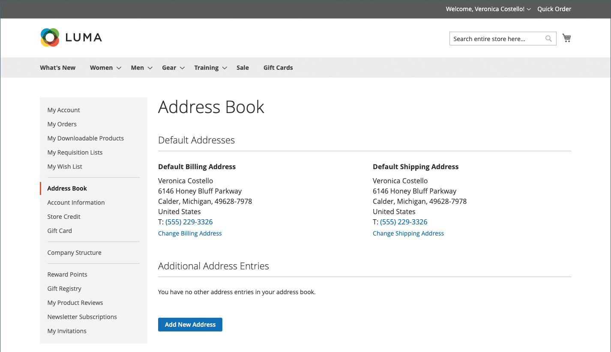

# 客戶通訊錄

保持通訊錄為最新狀態的客戶，可加速結帳程式。 通訊錄包含客戶的預設帳單和送貨地址，以及他們經常使用的任何其他地址。 從格線存取及維護其他位址專案相當容易。 每個客戶通訊錄可以管理超過3,000個通訊錄專案，而不會影響效能。

{width="700" zoomable="yes"}

## 新增地址

1. 在其客戶帳戶的左側導覽中，客戶選擇&#x200B;**[!UICONTROL Address Book]**。

1. 在&#x200B;_其他地址專案_&#x200B;下的&#x200B;_[!UICONTROL Address Book]_頁面上，按一下&#x200B;**[!UICONTROL Add New Address]**。

   {width="600" zoomable="yes"}

1. 定義新的地址專案。

1. 完成連絡人和地址資訊。

   >[!INFO]
   >
   >依預設，客戶的名字和姓氏最初會顯示在表單中。

1. 選取下列核取方塊以指示如何使用地址。

   如果帳單和送貨使用相同地址，則選取兩個核取方塊。

   * [!UICONTROL Use as my default billing address]
   * [!UICONTROL Use as my default shipping address]

1. 完成後，按一下&#x200B;**[!UICONTROL Save Address]**。

   >[!INFO]
   >
   >新地址列在[!UICONTROL Additional Address Entries]下。

   {width="700" zoomable="yes"}

## 編輯地址

1. 在其客戶帳戶的左側導覽中，客戶選取&#x200B;**[!UICONTROL Address Book]**。

1. 尋找要編輯的地址專案。

1. 按一下&#x200B;**[!UICONTROL Edit]**。

1. 進行任何需要的變更。

   >[!INFO]
   >
   >客戶可以選取&#x200B;_使用作為我的預設帳單地址_&#x200B;核取方塊，將此地址設定為預設&#x200B;**[!UICONTROL Shipping or Billing]**&#x200B;地址。

1. 變更完成後，按一下&#x200B;**[!UICONTROL Save Address]**。

## 變更預設地址

1. 在其客戶帳戶的左側導覽中，客戶選取&#x200B;**[!UICONTROL Address Book]**。

1. 選擇其中一個編輯方法：

   * 在&#x200B;_[!UICONTROL Default Addresses]_區段中按一下&#x200B;**[!UICONTROL Change Billing/Shipping Address]**。

   * 在&#x200B;_[!UICONTROL Additional Address Entries]_格線中按一下&#x200B;**[!UICONTROL Edit]**。

1. 進行必要的變更，然後按一下&#x200B;**[!UICONTROL Save Address]**。

## 刪除地址

1. 在其客戶帳戶的左側導覽中，客戶選取&#x200B;**[!UICONTROL Address Book]**。

1. 尋找要刪除的位址專案。

1. 在&#x200B;_[!UICONTROL Additional Address Entries]_格線中按一下&#x200B;**[!UICONTROL Delete]**。

1. 若要確認動作，請按一下&#x200B;**[!UICONTROL OK]**。

   >[!IMPORTANT]
   >
   >無法刪除預設帳單和送貨地址。
