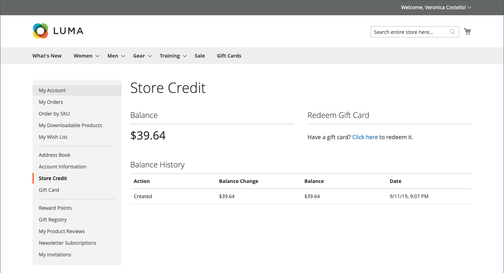

# 在客戶帳戶儀表板中儲存銷退折讓

{{ee-feature}}

此 _[!UICONTROL Store Credit]_「客戶帳戶」控制面板的頁面列出可套用至未來採購的退貨與退款金額。 客戶也可以兌換禮品卡的價值。

{width="700" zoomable="yes"}

## 結帳時套用商店評價

1. 客戶決定可用的商店信用金額。

   期間 _稽核與付款_ 步驟，可用的數量會顯示在下方 **[!UICONTROL Store Credit]**.

1. 若要將金額套用至訂單，客戶按一下 **[!UICONTROL Use Store Credit]**.

   {width="600" zoomable="yes"}

1. 系統會重新計算訂單總計，且套用的商店貸方金額會顯示在「訂單彙總」中。

   {width="600" zoomable="yes"}

1. 準備就緒後，按一下 **[!UICONTROL Place Order]**.

## 檢視商店貸方餘額和歷史記錄

檢視信用餘額與歷史記錄的方法有兩種：

方法1： **從客戶帳戶儀表板**

1. 客戶從店面登入帳戶。

1. 選擇 **[!UICONTROL Store Credit]** 在左側面板中。

方法2： **從 _稽核與付款_ 頁面**

1. 客戶新增產品至購物車。

1. 前往結帳頁面。

1. 傳遞 **[!UICONTROL Shipping]** 步驟。

1. 如果有商店點數可用，則客戶按一下 **使用商店點數**.

1. 如果客戶改變使用商店點數的想法，請按一下 **[!UICONTROL Remove]** 在 _[!UICONTROL Order Summary]_區段。
